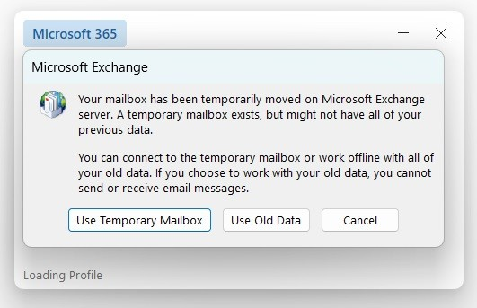

# How to fix the error "Your mailbox has been temporarily moved on Microsoft Exchange server."

## Introduction

In this guide, you will learn how to fix the error "Your mailbox has been temporarily moved on Microsoft Exchange server" which you may get when trying to access your Shared Exchange mailbox.
On very rare occasions, Shared Exchange mailboxes need to be recreated and your Outlook client will become out-of-sync with Exchange. When this happens we can easily setup a new Outlook profile and import your old data from a backup - provided you have one!
If you do not currently have a backup, do not worry! We will help walk you through the process of saving the data you currently have in Outlook, before importing it into your brand-new exchange mailbox!

## Prerequisites

Before you begin, ensure you have the following:

1. Your Shared Exchange login details
2. A backup of your existing Outlook data
3. An email client that supports importing mailbox data from .pst format.
4. A local machine or storage device with sufficient storage capacity for the restore.


## Fixing "Your mailbox has been temporarily moved on Microsoft Exchange server"

When opening Outlook, you may receive the error message "Your mailbox has been temporarily moved on Microsoft Exchange server".



1. If you get this error, and you do not have a backup of your mailbox, you'll need to choose "Use Old Data". This will open up your old mailbox and allow you to backup all the data to a .pst file, ready to be imported into your new mailbox. Please note, after selecting old data, you will not be able to send or receive emails just yet.

2. For further information on how to backup your data to a .pst file you can use [this guide](https://docs.ukfast.co.uk/desktop/sharedexchange/backupwholemailbox.html).

3. You now need to create a new Outlook profile. Follow [this guide](https://docs.ukfast.co.uk/desktop/sharedexchange/createnewoutlookprofile.html) for instructions on how to do this.

4. Once you have your new account/profile setup you can import your old data. Use [this guide](https://docs.ukfast.co.uk/desktop/sharedexchange/importdatafrompst.html) to import the data you previously backed up to a pst file.

When each of these steps is complete, you are now able to send and receive from your new Shared Exchange mailbox, with full access to anything you had in Outlook previously.

```eval_rst
  .. title:: Mail | How to fix the error "Your mailbox has been temporarily moved on Microsoft Exchange server."
  .. meta::
     :title: How to fix the error "Your mailbox has been temporarily moved on Microsoft Exchange server." | UKFast Documentation
     :description: Fixing an error which states that your mailbox has been temporarily moved on Microsoft Exchange Server.
     :keywords: shared exchange, error, moved, back up, restore, howto, guide, tutorial, outlook
```
