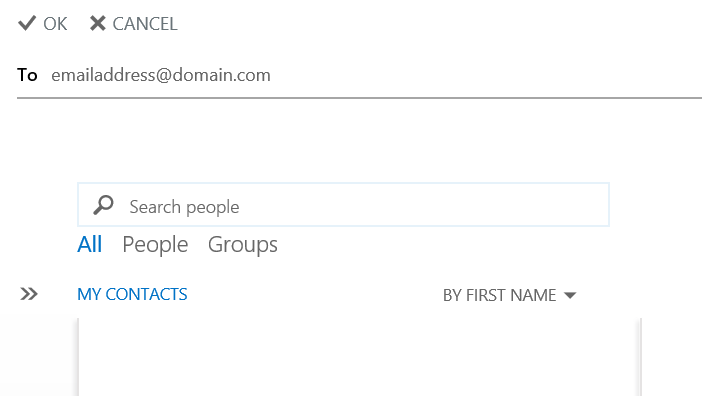

# Tracking messages sent via Shared Exchange

It's possible to track a message you have sent via the Hosted Exchange Servers.

This is via Outlook Web App, which can be accessed via <https://client.ukfastexchange.co.uk/ecp>

Once logged in select `organize email` from the left plane and `delivery reports` from the headings across the top.

Under the "Search for messages I've sent to" select this option and click `select users`


 A new window will open, where you are able to type the recipient of the email address you'd like to track in the `To`  field. Select OK, once finished and click search.



Your results will be displayed along with the status of delivery.

```eval_rst
   .. title:: Shared Exchange | Message Tracking
   .. meta::
      :title: Shared Exchange | Message Tracking | UKFast Documentation
      :description: Information about tracking messages in Shared Exchange
      :keywords: Shared Exchange, Exchange, Shex, Mail, Message Tracking
```
