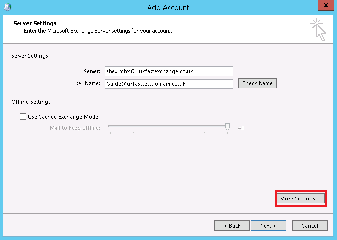
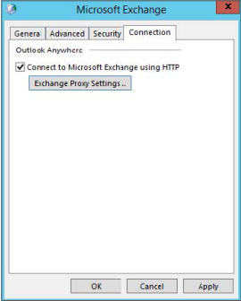
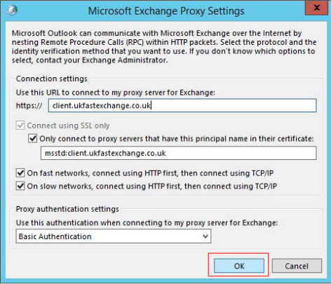

# How to Connect to Your Shared Exchange Mailbox Using Microsoft Outlook 2013

In order to configure your Shared Exchange mailbox in Microsoft outlook, please follow the below steps;

Open Microsoft Outlook 2013. The first screen you should see should be the screen below. Click next to continue.

The next screen is asking whether you want to add an email account. The default option is yes. Click next to continue.

The next screen (shown below) determines whether or not the account is created automatically using the settings you provide, or if a manual setup is required. Select Manual setup or additional server types and click next.

The next screen (shown below) is asking which service type to connect to. Select Microsoft Exchange Server or compatible service and click next to continue.

The following screen requires details of the account. Enter the server information as shown below, and then your email address in the user name box.

After you have done this, click more settings and this will present you with a pop-up box with other options, as shown below. Across the top of the window, find and click on the connection tab. Tick the connect to Microsoft Exchange using HTTP box and then select the Exchange Proxy Settings button.

The following screen will then appear that will need altering to match the details shown below.

After you have done this, click OK. You can then select OK again, and then Next.
The wizard will then connect to the `client.ukfastexchange.co.uk` server and authorise with the username and password that you provided.
If you encounter any issues setting up your account and would like assistance, please let us know by contacting support. You can do this through your [MyUKFast](https://www.ukfast.co.uk/myukfast.html?msg=6&url=%2Fdashboard.php) area under support > priority support system.
You can also contact support via telephone on 0800 230 0032.
