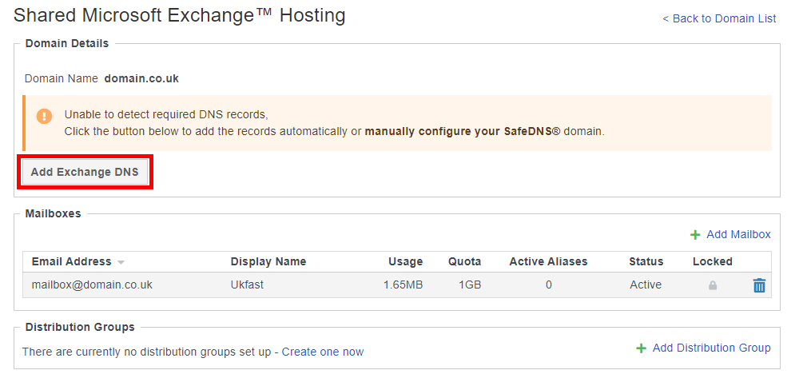
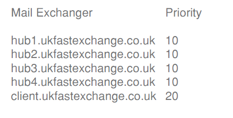

# Shared Exchange DNS Setup

## If you are using UKFast's SafeDNS system

The DNS records can be created automatically by opening Shared Exchange area within MyUKFast, selecting the domain name. If you do not have pre-existing DNS records click on the “Add Exchange DNS” button, which is shown in the red box below. This will add the DNS records automatically


If you would like to set these up manually please find our guide here, or contact the support team. Details can be found in your MyUKFast support portal.

Please allow time for any DNS changes to propagate through the internet, this may take up to 24 hours. Once complete, you are ready to use your email client to connect to your new mailbox.


## If you are not using UKFast's SafeDNS system  

You should update your DNS records with your DNS provider, the MX records should be set as:





Next, you should add an SRV record to the domain to allow for auto-discovery. This allows your Exchange ready client, such as Outlook, to find all the settings it needs to connect to our shared Exchange platform.

Here is the information you need for the SRV record, in its raw format, should you not be using our UKFast SafeDNS system for DNS:

`_autodiscover._tcp.DOMAIN.COM. 0 0 443 client.ukfastexchange.co.uk`

(Please note: you must change “DOMAIN.COM” with your own domain name)

As an optional extra if you would like to add an SPF record to prove the validity of emails leaving the domain, the format of this is as follows:
`v=spf1 include:_spf.ukfastexchange.co.uk ~all`

Please allow time for any DNS changes to propagate through the internet, this may take up to [24 hours](/domains/domains/dnspropagation). After which you are ready to use your email client to connect to your new mailbox.

* If you have any further questions please contact your dedicated account manager or speak with one of our support engineers on 0800 230 0032.

```eval_rst
   .. meta::
      :title: Shared Exchange DNS Setup | UKFast Documentation
      :description: Guide for users on how to configure DNS records for Shared Exchange
      :keywords: Shared Exchange, Exchange, Shex, Mail, DNS 
```
