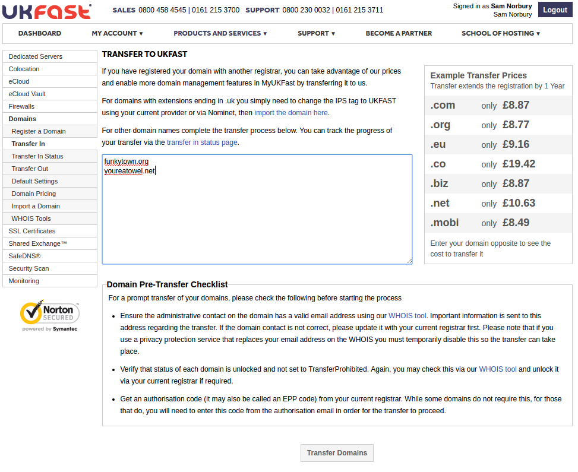

# Transferring a Domain to UKFast

```eval_rst
   .. title:: Domain Names | Transferring to UKFast
   .. meta::
      :title: Domain Names | Transferring to UKFast | ANS Documentation
      :description: How to transfer your domain to UKFast
```

```eval_rst
.. note::
    Due to the nature of this process, the majority of the steps will have to be carried out with your current registrar. There's no real standardisation to this, so whilst the rough steps you need to carry out will be described, finding how to do it with your existing registrar may need you to contact their support.
```

## `.uk` domains

For a domain with a `.uk` TLD, moving it to UKFast from another registrar should just be a matter of changing the `IPS tag` to `UKFAST` with your current registrar. Once this is changed, you can add the domain into your [MyUKFast area](https://www.ukfast.co.uk/myukfast.html) using the `Import Domain` section found at `Domains` > `Import a Domain`. The whole process can usually happen within minutes, but it does depend when the IPS tag change is sent along by the old registrar.

## Non `.uk` domains

For a non `.uk` TLD domain, the process is slightly more complicated. The first step you need to undertake it to ensure that the `administrative contact` for the domain has a valid email address against it. This address will be needed in the process, so if it's out of date or inaccurate it'll need to be updated to a valid managed inbox. This information can be checked with a `WHOIS` lookup. We have one [here](https://portal.ans.co.uk/domains/tools/) but any should suffice.


```eval_rst
.. note::
    If you use any privacy protection services that could replace or otherwise obfuscate this email address in the WHOIS database, it's possible you may have to temporarily disable this. Again, the support team of the registrar providing this service should be able to confirm.
```

If the address is valid and visible then you'll next need to acquire an authorisation code, usually referred to as an `EPP` code, from your current registrar. Your registrar may tell you that an authorisation code isn't needed for the type of domain you're transferring, it really does depend on the the TLD.

The domain in question may also be marked as `locked` with your current registrar, which prevents it from being transferred. This too can be checked via `WHOIS`. If the domain is locked, then your current registrar can unlock it for you.

With this information in hand, you can initiate the transfer in process via MyUKFast. This can be found in `Domains` > `Transfer in`, or follow the [link here](https://portal.ans.co.uk/domains/transfer-in.php).

You should see a page like this:



Fill in the large box with your domain(s) as shown and hit `Transfer Domains` to initiate the transfer process. Follow the steps through. A charge may apply for this process, but this will be signalled as you go through the process.

Once you're done here, the next step is the authorisation. This is carried out via an email sent to the `administrative contact` email address, as mentioned earlier. This email will prompt the contact to approve the transfer and fill in the `EPP` code if necessary. At this point, the registry can approve the change.

The timing for the process varies and could take up to 5 days to complete, though it's usually much quicker than that once the transfer has been approved by the administrative contact.
