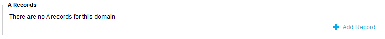
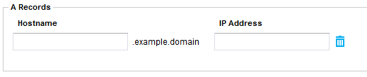

# Adding an A record to an existing domain

```eval_rst
   .. title:: SafeDNS | Adding a A Name Record
   .. meta::
      :title: SafeDNS | Adding a A Name Record | ANS Documentation
      :description: How to add a A Name record in SafeDNS

```


Before you can add a subdomain or an `A` record to your domain, you must login to the My UKFast client area and access the SafeDNS service, which can be located under the `Services` drop-down menu at the top of the client area.

Once logged in, and in the SafeDNS system, start by selecting the domain you wish to manipulate. In our example, we're using `mydomain.example`, which isn't a real/valid domain name. Once you've selected the domain, you will want to start by selecting `Add Record` under the `A Records` section:



You will presented with a series of fields, as such:



We need to fill in these fields with the information we want. So in our example, I want `www.mydomain.example` and I want to point it at `0.0.0.0`. If you want to add more than one record, simply click `Add Record` again and a new set of text fields will appear.

Once you're happy you've added the `A` records you want, just click `Save Records` at the bottom of the page and your DNS zone will be updated. These updates can take upwards of 24 hours to propagate around the world and as such, might be visible to you straight away.


<h4><b>CLI</b></h4>
```bash
ans safedns record create mydomain.example --content "0.0.0.0" --name "www.mydomain.example" --type "A"
```