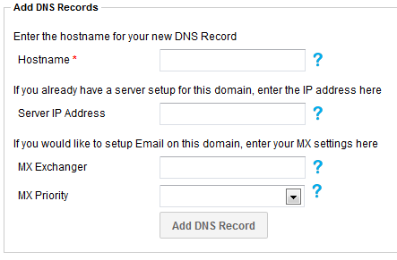
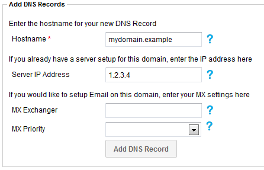

# Adding a domain into SafeDNS

```eval_rst
   .. title:: SafeDNS | Adding a Domain into SafeDNS
   .. meta::
      :title: SafeDNS | Adding a Domain into SafeDNS | UKFast Documentation
      :description: How to add a A Name record in SafeDNS

```

Adding a domain into the SafeDNS system allows you to manage the records for that domain and carefully craft how your clients access your solution.

Before we delve into the steps required to add a domain to your SafeDNS service, please ensure you've configured the domain to work with our SafeDNS system. If your domain was registered with us, then you don't need to worry about this step, but if you've registered the domain with an external service provider, then you may need to follow this guide before you can proceed.

To begin adding a domain into the SafeDNS system, you must first login to your My UKFast client area and access the SafeDNS service via the 'Services' menu, which is located across the top of the page in the client area.

Once you've logged into the SafeDNS system, you will need to import the domain by creating your first record for it. You do this by clicking 'Add Record' in the top-right of the page. You will be presented with this:



Don't be put off by all the fields. This is all simple to get going.

Start by keying in your domain name, say `mydomain.example` (please note that `example` is not a valid top-level domain and is only being used here for educational purposes) into the `Hostname` field. Don't include the `www.` part here! We show you how-to set that up in this guide.

Next, key in the IP address of your server. This can be found by selecting the `Services` menu item, followed by `Dedicated Servers`. It will follow the format of `0.0.0.0`.

Once this is in place, you should have something like this:



At this point you're ready to go and can click `Add DNS Record`, but you might want to review the next section that's available: the e-mail section.

If you know that you're going to be providing or using e-mail services from this domain, you can save yourself a lot of time by keying in the e-mail exchanger information here. We suggest you type `mail.mydomain.example` into the `MX Exchanger` field and set the `MX Priority` to `10`. This will automatically set the required `A` records for your domain and also configure the `MX` record to use it. If you're unsure what all this is about, you can safely skip this part.

After you've entered everything you need and you're ready to import the domain, simply click `Add DNS Record`.

If you're migrating your DNS from another provider, it's advisable to do a side by side comparison to ensure that all records have been copied over.

If you purchased your domain elsewhere, you will need to change the nameservers of the domain to:

```bash
ns0.ukfast.net
ns1.ukfast.net
```

You can check what they are currently by running a WHOIS test in the [MyUKFast Panel](https://portal.ans.co.uk). If your domain is registered with a 3rd party, you will need to change the nameservers by logging into their portal; if your domain is registered at UKFast, please see [this guide](/domains/domains/changingnameservers) on how to change the nameservers.

<h4><b>CLI</b></h4>
```bash
ans safedns zone create mydomain.example --name "mydomain.example"
```
