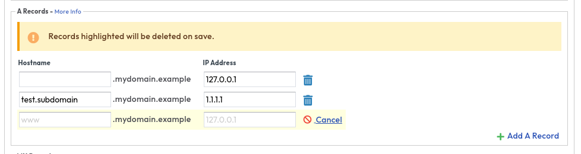

# Removing a DNS record on an existing domain

```eval_rst
   .. title:: SafeDNS | Removing a DNS Record
   .. meta::
      :title: SafeDNS | Removing a DNS Record | ANS Documentation
      :description: How to remove a DNS record in SafeDNS

```

Firstly make sure you are logged into the ANS Portal and navigate to SafeDNS > View Zones and select your domain. Once you have a list of your records you can click on the trashcan next to the record and once you have removed all the records you need to finally click apply changes.




<h4><b>CLI</b></h4>
```bash
ans safedns record list mydomain.example #Note the ID
ans safedns record delete mydomain.example <ID>
```
```eval_rst
.. note::
  If you wish to remove a NS record while protected by DDoSX you will need to turn off DDoSX protection first as you will recieve the folloing error
  ``Error removing record [<ID>]: unexpected status code (422): title="Record protected", detail="Record '<ID>' is protected and cannot be changed", status="422", source=""``

  If this is not possible please raise a support request in https://portal.ans.co.uk
```
