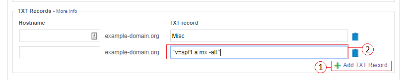
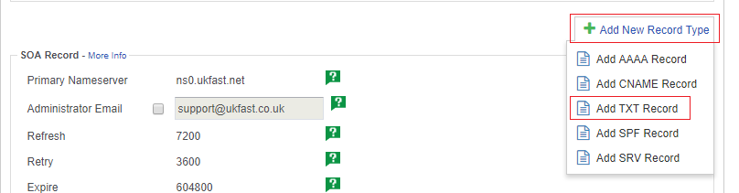
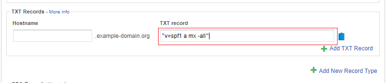

# Adding a Sender Policy Framework (SPF) record to SafeDNS

This guide provides the instructions needed to configure an Sender Policy Framework (SPF) record for your domain with SafeDNS. For an in-depth guide on SPF records how they work, please refer to [our general SPF guide](/email/spf.md).

SPF records are designed to prevent spammers from spoofing email from your domain. They give you the means to state which servers are authorised to send email on behalf of your domain. The large majority of mail servers will check for an SPF record when filtering for spam, preventing people from being able to spoof your domain for spam or phishing purposes.

An `SPF` record consists of a string of text stored in a `TXT` record within your DNS setting. There are various wizards online to help create this string, for example [SPF Wizard](https://www.spfwizard.com/)

If you're looking for a very basic SPF record that fits most situations (mail will only ever send from anything you have an A record or MX record for), the following should suffice:

```none
v=spf1 a mx -all
```

If you have a more complex setup (a separate dedicated mail server, or if you use a 3rd party bulk mail service), please do refer to the [in-depth SPF guide](/email/spf.md).

To add the SPF record, first log into [SafeDNS in MyUKFast](https://portal.ans.co.uk/safedns/index.php) and choose the relevant domain.

If you already have `TXT` records configured for the domain you will need to add a new record.

- Within the `TXT` record section click `Add TXT Record`. This will add a blank record at the end of the record list.
- Leave hostname blank, under value enter the `SPF` string provided by the SPF wizard, for example:



- Click `Save Records` at the bottom of the page

If you cannot see the `TXT` Records section you will need to add a new record type in order to add the `TXT` record.

- Click `Add New Record Type` and select `Add TXT record` from the dropdown box towards the top right corner.



- You should now see the `TXT` Records section listed with your new blank record. Leave hostname blank, under value enter the `SPF` string provided by the SPF wizard:



- Click `Save Records` at the bottom of the page

<h4><b>CLI</b></h4>
```bash
ans safedns record create example-domain.org --content "\"v=spf1 a mx -all\"" --name "example-domain.org" --type "TXT"
```

```eval_rst
.. warning::

   By default, TTL (Time To Live) is 24 hours. That means these records may take up to 24 hours before they have fully propagated to all DNS servers worldwide.
```

```eval_rst
   .. title:: SafeDNS | Adding an SPF record
   .. meta::
      :title: SafeDNS | Adding an SPF record | UKFast Documentation
      :description: Guidance on creating an Sender Policy Framework (SPF) record in SafeDNS from UKFast
      :keywords: dns, spf, email, spam, sender policy framework, spf, safedns, ukfast, hosting, domains
```
