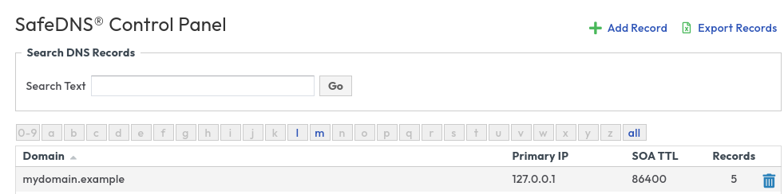
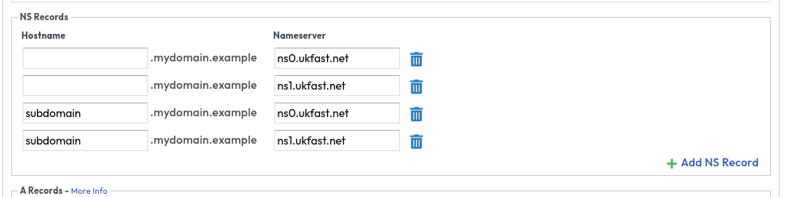

# Setting up Subdomain delegation in SafeDNS

This is a guide for using SafeDNS to setup subdomain delegation. If you do not have access to any of the features please speak to the support team to get them enabled.

Login to the [ANS Portal](https://portal.ans.co.uk/safedns) and browse to SafeDNS.



Note your domain `mydomain.example`

Now click on + Add Record and add a new zone called `sudomain.mydomain.example` This will be your new delegated zone.

Once this is created you can click on `mydomain.example` and you will see two new records



You can now manage your zone and records for `subdomain.mydomain.example` in the new zone you just created.</br>
Now go back to the zone list and manage your new zone `subdomain.mydomain.example` by selecting it.</br>

Any changes you make for `subdomain.mydomain.example` in the `mydomain.example` zone will be ignored.

# Setting up Subdomain delegation with for an external provider

To manage your new subdomain with an external provider make sure you add `NS` records in the `mydomain.example` zone for `subdomain.mydomain.example` as above, however you will need to ensure that any new zones for `subdomain.mydomain.example` are removed from SafeDNS otherwise SafeDNS will respond to the external DNS queries.


```eval_rst
   .. title:: SafeDNS | Setting up subdomain delegation
   .. meta::
      :title: SafeDNS | Setting up subdomain delegation | ANS Documentation
      :description: Guidance on setting up subdomain delegation for your zone in SafeDNS
      :keywords: dns, NS, subdomain, subdomain delegation, delegation, safedns, ukfast, hosting, domains
```
