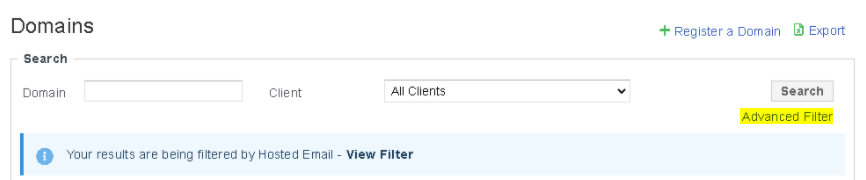
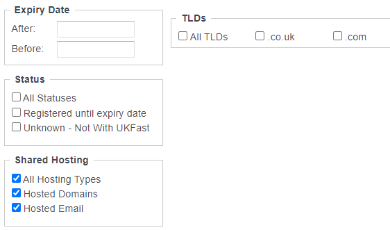
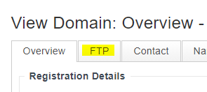
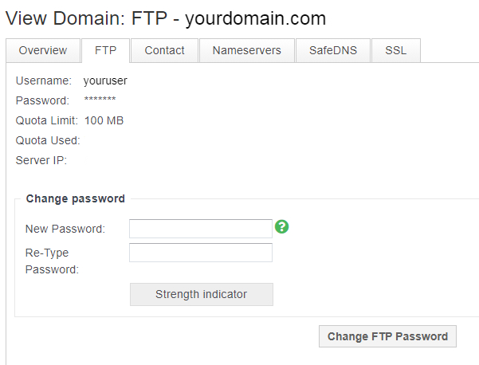
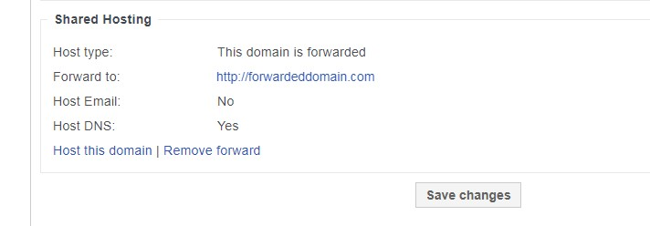

# How to View and Retrieve your Legacy Shared Hosting Data

## Viewing Shared Hosting Domains

To determine which of your domains use our legacy *web hosting* / *web forwarder* / *email services*, please use the following guide.

- In your `MyUKFast` client portal, browse to **Domains** and choose **View Domains**
- *Select* the **Advanced Filter** at the top of the Domain Search section



- Here you can filter your domains by those associated with **Shared Hosting** services



## Legacy Web Hosting

To obtain your domain content, you will need to use an **FTP client** and your existing **FTP credentials**.

- In your [MyUKFast](https://my.ukfast.co.uk) client portal, browse to **Domains** and choose **View Domains**
- Locate and open your hosted domain
- *Select* the **FTP** tab at the top of the page



- Here you can obtain the following FTP connection details:

  - **Username**
  - **Password**
  - **Server IP**



```eval_rst
.. note::
   Please see our user guide on `connecting to your website via FTP`_ for further assistance.

.. _connecting to your website via FTP: /operatingsystems/windows/commonissues/copyfiletoserver.html#connecting-to-your-ftp-server

```
## Removing Domain Forwarding
```eval_rst
.. warning::
Before removing Domain Forwarding from your domain, please ensure you have configured a suitable replacement redirect, such as a `CNAME/ALIAS record`_ or an application level redirect.

.. _CNAME/ALIAS record: /domains/safedns/recordtypes.html

```
- In your [MyUKFast](https://my.ukfast.co.uk) client portal, browse to **Domains** and choose **View Domains**
- Locate and open your hosted domain.
- Under **Shared Hosting**, select **Remove forward**
- Select **Save changes**



## Legacy Database Hosting

To obtain a copy of your **MySQL** database from the shared **MySQL 5** hosting service, please use the following guide, substituting the *host*, *user* and *password* for the connection details in your application.

- [Backing up your MySQL Database](/operatingsystems/linux/mysql/backups.html#useful-options)

## Legacy Mail Hosting

If you have previously been using the mail hosting service Zippymail, then you will need to obtain a backup of any email data you wish to retain.

### Backing up your emails

From your local mail client, you will be able to export your current mail data and import it to your new mail service.

### Microsoft Outlook

```eval_rst
.. note:: This is applicable to Outlook for Microsoft 365, Outlook 2019, Outlook 2016, and Outlook 2013
```

- *Select* **File > Open & Export > Import/Export**
- *Select* **Export to a file**, and then *select* **Next**
- *Select* **Outlook Data File (`.pst`)**, and *select* **Next**
- *Select* the **mail folder** you want to back up and *select* **Next**
- *Choose* a **location** and **name** for your backup file, and then *select* **Finish**
- If you want to ensure no one has access to your files, *enter* and *confirm* a **password**, and then *select* **OK**.


```eval_rst
.. note:: Importing mail data into an alternative mail service falls outside the scope of this article
```

### Apple Mail

To export your [Apple Mail](https://en.wikipedia.org/wiki/Apple_Mail) mailboxes, use the following steps

- Open your **Mail App**
- *Right click* on the **mailbox** you require and *select* **Export Mailbox** from drop down menu. This will export in [Mbox](https://en.wikipedia.org/wiki/Mbox) format.
- For **multiple mailboxes**, use the Command Key (⌘) to select multiple items, and then *right click* and choose **Export Mailbox**.

```eval_rst
  .. title:: How to View and Retrieve your Legacy Shared Hosting Data
  .. meta::
     :title: How to View and Retrieve your Legacy Shared Hosting Data | UKFast Documentation
     :description: How to View and Retrieve your Legacy Shared Hosting Data
     :keywords: sharedhosting, shared, zippymail, mail, ftp, legacy, database, howto, guide, tutorial
```
