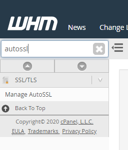
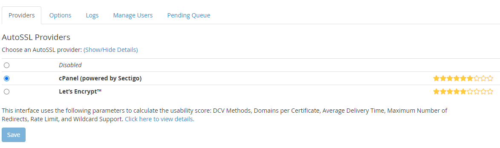
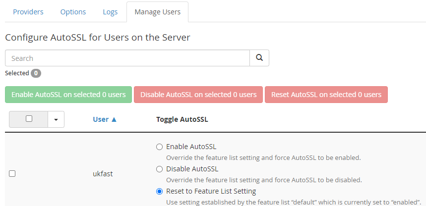
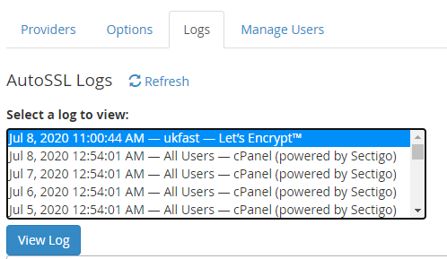
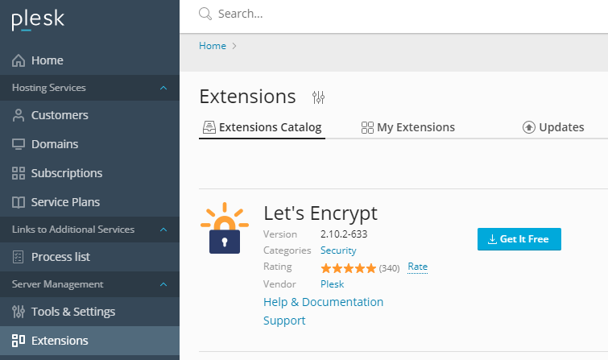
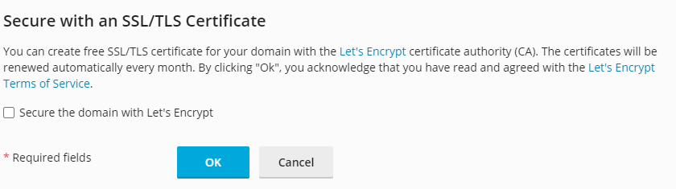
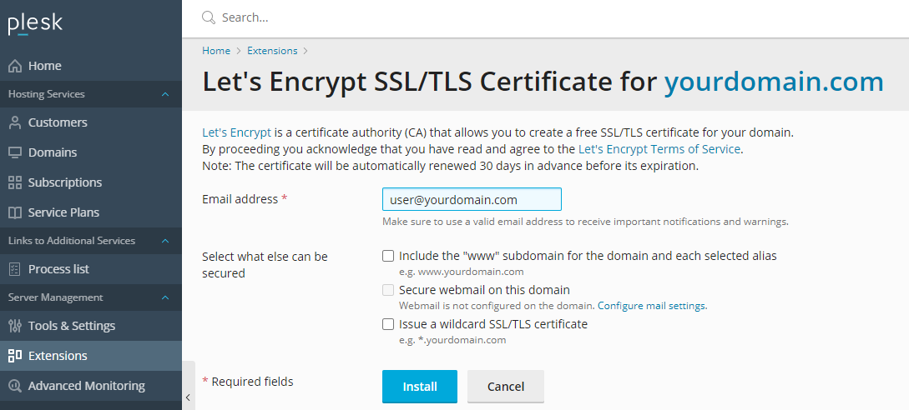
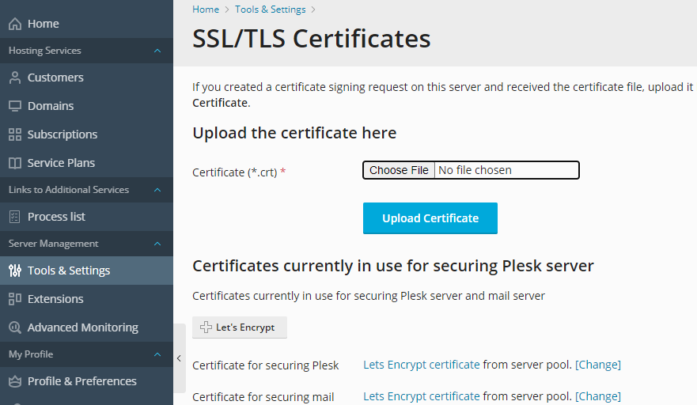

# How to Secure Your Sites with Let's Encrypt

`Let's Encrypt` is a **Certificate Authority (CA)** and is a leading supplier of free, simple and secure SSL certificates. It runs on the notion that obtaining an SSL certificate for your website should require minimal human interaction, with the goal of creating a more secure Web.

Over a billion certificates have already been issued using `Let's Encrypt`.

```eval_rst
.. note::
  UKFast Support do not offer Let's Encrypt certificate installation, but are happy to assist with ACME client installation and can offer advice on how to achieve your goals.

  Alternatively, UKFast  do offer Sectigo certificate purchase & installation. For more information on this, please contact your Account Manager or raise a support query with our support team.

```

## How it works

`Let's Encrypt` uses a 2 step process to  issue a certificate - **domain validation** (to prove you own the domain) and then the ability to issue/renew/revoke certificates thereafter.

There a few distinct types of domain validation available, so you will need to first assess which method best suits your application/needs.

```eval_rst
.. warning::
  Currently, if your sites/services  DDoSX/Webcel/WAF you will not be able to use Let's Encrypt certificates
```

## Types of challenges

### `HTTP-01` 

`HTTP-01` validation is the most common type of SSL challenge method. This involves using an `ACME` client to communicate with `Let's Encrypt` by placing a file containing a unique token in the following directory on your website

```
<docroot>/.well-known/acme-challenge/<youruniquetoken>
```
This needs to be accessible over port **80** and cannot include a redirect to an IP address. This can validate up to 10 redirects deep, and does not care about *HTTPS validation* so will allow for self-signed certificates along the way.

It is easy to automate, which is why tools like `certbot` and `AutoSSL` among others are available to make use of this technology.

A limitation of this challenge is you cannot request [**wildcard certificates**](/domains/ssl/types).

If you have multiple web servers, you have to make sure the file is available on all of them.

```eval_rst
.. note::
  You will need to ensure that your server has either port 80 open inbound/outbound, on both your firewall and your software firewall (eg. iptables, firewalld, Plesk firewall, CSF). If having any issues, please do contact our support team.

```

### `DNS-01`

The `DNS-01` challenge method requires you to add a [**TXT**](https://en.wikipedia.org/wiki/TXT_record) record to prove domain ownership.

This can be useful if your service is not accessible over port **80**, or if you have multiple webservers to cover. This challenge method also allows for you to issue [**wildcard certificates**](/domains/ssl/types), along with [**CNAME challenge delegation**](https://www.eff.org/deeplinks/2018/02/technical-deep-dive-securing-automation-acme-dns-challenge-validation) 

If using an API, such as our [SafeDNS API](https://developers.ukfast.io/documentation/safedns), this is quick and easy to add and to automate.

```eval_rst
.. note::
  You should always factor in **DNS propagation** when using this challenge method, 
```

### `TLS-ALPN-01`

`TLS-ALPN-01` challenges are currently **not** supported by `certbot`. This type of challenge uses `https` validation via `TLS`, but requires for the server to be using the `ALPN` protocol. As this is not very common currently, we would recommend you use  `HTTP-01` or `DNS-01` as your challenge method.

## Rate Limits

`Let's Encrypt` has rate limits in-built to prevent abuse of the system. This may affect how and when you issue your certificates.

More information on these limits are at the following link;

[Let's Encrypt Rate Limits](https://letsencrypt.org/docs/rate-limits/)

## Linux

For Linux servers, the `certbot` tool is currently the most popular tool for issuing **`Let's Encrypt`** certificates in a hassle free way. Here, we will show you how to install `certbot` on **CentOS** & **Ubuntu** servers, but this will be available on most Linux distributions.

`Certbot` has additional plugins specifically for servers that run `apache` or `nginx` as the web service, so be sure to install the correct plugin for your needs.

```eval_rst
.. warning::
  These plugins will amend your virtual host configurations, but may interfere with any application rewrite rules you already have in place. Always ensure you have backed up vital configuration files before use.

```
For alternative `ACME` clients/libraries/projects, `Let's Encrypt` have an extensive list at the following [link](https://letsencrypt.org/docs/client-options/).

## CentOS
### Apache

#### Installation

You will need to have the **Epel** repository (or repo) enabled to install `certbot`. If not installed, run the following;
```
yum install epel-release
```
Next, install the following `apache` `certbot` plugin from this repo. This will pull in additional packages automatically, such as `mod_ssl` if not already installed
```
yum install certbot-apache --enablerepo=epel
```
#### Issuing a certificate

As **root** (or using **sudo** if a sudo user), you can specify multiple domains/subdomains using the following syntax.
```
certbot --apache -d yourdomain.com -d www.youdomain.com
```
You can secure up to **100** domains using `-d` in the one command.

```eval_rst
.. note::
  If issuing a multidomain certificate, please note that if you remove one of the domains on it you will have to reissue the entire certificate. As this could prove problematic upon renewal, we would instead recommend issuing a certificate per domain.
```

You will be prompted by a few questions before it procedes with the installation (agreeing to terms of service, challenge method etc.). It will also ask if you want to add a redirect to https. If you select 'yes'. It will amend your apache vhost with a permanent redirect.


### Nginx
#### Installation

```
yum install epel-release
```
Next, install the following package from this repo
```
yum install certbot-nginx --enablerepo=epel
```

#### Issuing a certificate

As **root** (or **using** sudo if a sudo user), you can specify multiple domains/subdomains using the following syntax.
```
certbot --nginx -d yourdomain.com -d www.youdomain.com
```
You can secure up to **100** domains using `-d` in the one command.

```eval_rst
.. note::
  If issuing a multidomain certificate, please note that if you remove one of the domains on it you will have to reissue the entire certificate. As this could prove problematic upon renewal, we would instead recommend issuing a certificate per domain.
```

By default, this will append your nginx configuration file for the chosen domain a rewrite to https

```

      server {
    if ($host = shop.yourdomain.com) {
        return 301 https://$host$request_uri;
    } # managed by Certbot


        listen ip.ip.ip.ip:80;
        server_name shop.yourdomain.com;
    return 404; # managed by Certbot


}
```

If you wish to amend this yourself, you should chose the 'certonly' option, and manual specify the new certificates in your domain's nginx configuration file.
```
certbot certonly 

```
###  Additional options

Here is a selection of additional flags/options that you can use, should you need a more granular installation.

* `certonly` -  If you wish to install the certificate manually, this will provide you with the SSL component files;
* `--webroot` - If you have a non-standard document root that perhaps is obfuscated in your application, this is useful so that the HTTP-01 challenge file can be placed correctly
* `-d` - For specifying up to 100 domains/subdomains in the same command.
* `standalone` - Runs a webserver that binds to port `80`, so you may need to stop your current webservice
* `--agree-tos` - Automatically agree to the terms of service
* `--email` - To specify an address for registration/correspondence
* `--uir` - This enables a Content-Security-Policy in every request to *upgrade-insecure-requests*


###  Auto-Renewing certificates
Due to the short lifespan of the certificate, it introduces the risk of your certificates expiring at an inopportune time. Therefore you should look towards scheduling in **automatic renewal**.

There are two methods to achieve this: With a scheduled task (a cron job) or using an additional utility that comes with certbot.
#### Cron Method
The `certbot` utility offers a *renew* option that will check your installed certificates and renew any that are within a 30 day expiration period.

You can test this feature using the 'dry-run' option
```
certbot renew --dry-run
```

As root, you can then add a cron task with either of the following commands

```
crontab -e
or
crontab -u root -e
```

In it you can then set your domains to be checked for renewal. In this example it checks twice a month and writes to a log

```
[root@server ~]# crontab -l
0 0  */15 * 6 /usr/bin/certbot renew >> /var/log/certbot.log
```
This outputs information like...
```
- - - - - - - - - - - - - - - - - - - - - - - - - - - - - - - - - - - - - - - -
Processing /etc/letsencrypt/renewal/docs.yourdomain.com.conf
- - - - - - - - - - - - - - - - - - - - - - - - - - - - - - - - - - - - - - - -

Processing /etc/letsencrypt/renewal/p.yourdomain.com.conf
- - - - - - - - - - - - - - - - - - - - - - - - - - - - - - - - - - - - - - - -

Processing /etc/letsencrypt/renewal/shop.yourdomain.com.conf
- - - - - - - - - - - - - - - - - - - - - - - - - - - - - - - - - - - - - - - -

The following certs are not due for renewal yet:
  /etc/letsencrypt/live/docs.yourdomain.com/fullchain.pem expires on 2020-10-05 (skipped)
  /etc/letsencrypt/live/p.yourdomain.com/fullchain.pem expires on 2020-10-05 (skipped)
  /etc/letsencrypt/live/shop.yourdomain.com/fullchain.pem expires on 2020-10-05 (skipped)
No renewals were attempted.
- - - - - - - - - - - - - - - - - - - - - - - - - - - - - - - - - - - - - - - -
``` 


#### Certbot timer methods

The `certbot` package comes with a **timer** service that you can leave to run and automatically update your certificates. This is a systemd service, and can be enabled with the following;

```
[root@ ~]# systemctl enable --now certbot-renew.timer
Created symlink from /etc/systemd/system/timers.target.wants/certbot-renew.timer to /usr/lib/systemd/system/certbot-renew.timer.

[root ~]# systemctl status certbot-renew.timer
● certbot-renew.timer - This is the timer to set the schedule for automated renewals
   Loaded: loaded (/usr/lib/systemd/system/certbot-renew.timer; enabled; vendor preset: disabled)
   Active: active (waiting) since Thu 2020-07-09 08:56:24 BST; 12s ago

```


### Revoking certificates
To revoke a LetsEncrypt certificate, use the following command

```
certbot revoke (supply --cert-name or --cert-path)
```

You can obtain the cert-name/path with the 'certbot certificates' command, but this will usually be the domain name itself.

## Ubuntu

You can install the certbot utility in `Ubuntu` using the official PPA (Personal Package Archive) from `certbot`.

First, install the **software-properties-common** package, if you don't already have this.

```
apt install software-properties-common
```

Next, install the repo, update the apt database and install the module for your chosen web service. 

For `apache`

```
add-apt-repository ppa:certbot/certbot
apt update
apt install certbot python3-certbot-apache
```
or for `nginx`
```
apt install python-certbot-nginx
```

There after you can use the same methods to install a certificate as previously mentioned for [Apache](/domains/ssl/letsencrypt.html#apache) and [Nginx](/domains/ssl/letsencrypt.html#nginx)

## SafeDNS Authenticator plugin

If using our `SafeDNS` service, we have an installable plugin that allows you to use our [SafeDNS API](https://developers.ukfast.io/documentation/safedns) to automate DNS-01 validation with `certbot`. 

[SafeDNS Certbot Plugin](/domains/safedns/certbotplugin)

## cPanel

**cPanel/WHM** offers a feature called `AutoSSL` that integrates with both `LetsEncrypt` and their default provider (`Sectigo`). This allows you to install and automatically renew certificates for your domains. It should also cover your `cPanel` services, such as *mail*, *hostname* and *ftp*.

```eval_rst
.. note::
  The plugin only allows for Wildcard certificates to be generated if you use WHM as your DNS provider: If using SafeDNS or an external DNS provider then you will need to do this manually using a tool like certbot.
```

### Installation
If not installed already, then you will need to [ssh](/operatingsystems/linux/basics/connecting) onto the server as **root** and run the following command
```
/usr/local/cpanel/scripts/install_lets_encrypt_autossl_provider
```

Next, open `WHM` and search for **Manage AutoSSL**.



Here, you will have a list of providers, and `Let's Encrypt` will be one of them.



Select this provider, and after agreeing to the terms of service this will be available for you to use.

```eval_rst
.. note::
  More information on this plugin is available in the WHM plugin documentation - https://docs.cpanel.net/knowledge-base/third-party/the-lets-encrypt-plugin/86/
```

### Issuing a certificate with AutoSSL

Once you have selected `Let's Encrypt` as a provider, it's time to generate certificates for your domains.

In the `AutoSSL` section of `WHM`, click on the **Manage Users** tab. Here you will have both global and per account options for enabling/disabling AutoSSL.



Once enabled, certificates will be automatically renewed close to the expiration date of the SSL

### Troubleshooting
 
If you are having issues with generating a certificate, the first place you should check is the **logs** tab in `AutoSSL`




This should highlight any Let’s Encrypt challenge issues you may have. Beyond this, you can raise a support ticket and we can help identify the underlying issues with you.

## Plesk

`Plesk` offers `Let's Encrypt` as an extension and makes it easy to obtain a certificate for your website.

### Installation

Within `Plesk`, you can install this via the **Plesk Extensions** utility. 

Simply search within their extension store for `Let's Encrypt` and click **Get it Free** to install.



Once installed, it will appear within each domain's configuration page.

### Issuing a certificate

For **new domains**, you can include `Let's Encrypt `functionality when creating the domain itself by ticking the *Secure the domain with Let's Encrypt* option



For **existing domains**, you can select your domain (or mutliple domains) within the `Let's Encrypt `extension itself. Here it provides a few options for what you would like to cover, such as 'www' and wildcard subdomains.

```eval_rst
.. warning::
  
  Wildcard certificates can only be issued if your DNS is managed by Plesk itself. This is because it only offers DNS validation and not HTTP.
```



Once enabled, certificates will be automatically renewed close to the expiration date of the SSL

You can also secure your `Plesk` Panel and mail services using `Let's Encrypt` by selecting this in the **SSL/TLS Certificates** section of **Tools & Settings**




## Windows

`Windows` operating systems have a number of `ACME` clients available - here are a couple that clients have found to be simple to use and feature rich

## Certify the Web

[`Certify the Web`](https://certifytheweb.com/) is one of the most popular `Let's Encrypt` services available on `Windows` currently. This offers features such as;

* Automatic renewal
* `IIS` Integration
* Option to integrate alternative ACME certificate authorities

One downside to this product is that it does only offer a few certificates for free before requiring you to purchase an upgrade key.

For a complete guide on how to install this client and start issuing `Let's Encrypt` certificates, please see the following guide;

[Certify the Web - Docs](https://docs.certifytheweb.com/docs/intro)

```eval_rst
.. note:
  If you require assistance with installing this product, please raise a UKFast Support query via your https://my.ukfast.co.uk client portal.

```
## Win-ACME

[`Win-ACME`](https://www.win-acme.com/) is a popular command line alternative for issuing and maintaining `Let's Encrypt` certificates. This offers the following features;

* `IIS` Integration
* A simple command line interface
* Support for alternative web servers, such as `Apache`
* Automatical renewal via an intergrated scheduled task

For a complete guide on how to install and use this client, please see the following official documentation

[Win-ACME - Docs](https://www.win-acme.com/manual/getting-started)

## Posh-ACME

For `Powershell` users, we recommend using [`Post-ACME`](https://github.com/rmbolger/Posh-ACME) for your `Let's Encrypt` needs. This offers a feature set similar to `certbot`, and can be incorporated into environments that use APIs for DNS Challenges and automated certificate renewal.

### Installation

```eval_rst
.. note:
  If you require assistance with installing this product, please raise a UKFast Support query via your https://my.ukfast.co.uk client portal.

```

To install this client, first open your `Powershell` terminal and run the following, replacing *youruser* for the system user in question.

```
Install-Module -Name Posh-ACME -Scope youruser
```

If you have elevated privileges and wish for this to be available for all system users, use the following syntax

```
Install-Module -Name Posh-ACME -Scope AllUsers
```

Once installed, you will need to **import** the module

```
Set-ExecutionPolicy RemoteSigned -Scope CurrentUser -Force
Import-Module Posh-ACME
```

### Issuing a certificate

To issue a certificate for your chosen domain, run the following command, adjusting as per your specific requirements.

```
New-PACertificate yourdomain.com -AcceptTOS  -Contact admin@yourdomain.com
```

This will default to using the **Manual** plugin, and prompt you to create a **TXT** record for the `DNS-01` challenge. Please be aware of your chosen DNS provider's DNS propagation time.

### Using a DNS Plugin

Please see the list of [**Available Posh-ACME DNS Plugins**](https://github.com/rmbolger/Posh-ACME/blob/master/Tutorial.md#dns-plugins) for a full list of available DNS Plugins for use with this software.

As an example, to use this with Route53, please see the following usage guide, which falls outside the scope of this article.

[Route53 Posh-ACME Guide](https://github.com/rmbolger/Posh-ACME/blob/master/Posh-ACME/DnsPlugins/Route53-Readme.md)

```eval_rst
.. note:
  UKFast do not currently offer a DNS Plugin for use with Posh-ACME

```


```eval_rst
  .. title:: SSL | How to secure your sites with Let's Encrypt
  .. meta::
     :title: SSL | How to secure your sites with Let's Encrypt | UKFast Documentation
     :description: How to secure your sites with Let's Encrypt
     :keywords: ukfast, ssl, letsencrypt, let's encrypt, secure, security, linux, windows, apache, nginx, windows, powershell, iis, server, guide, tutorial
```
