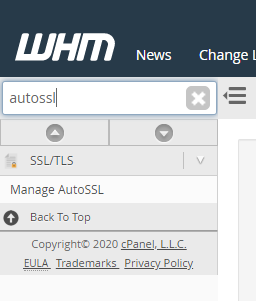
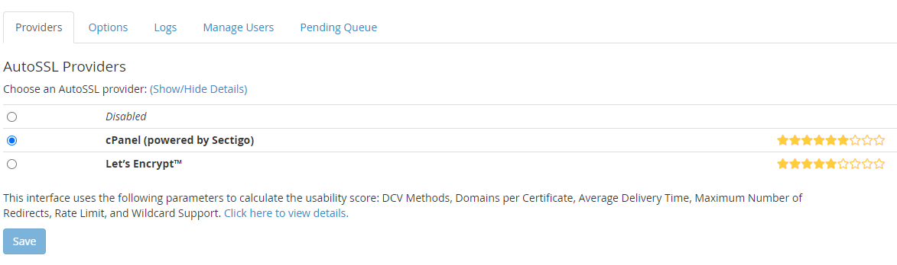
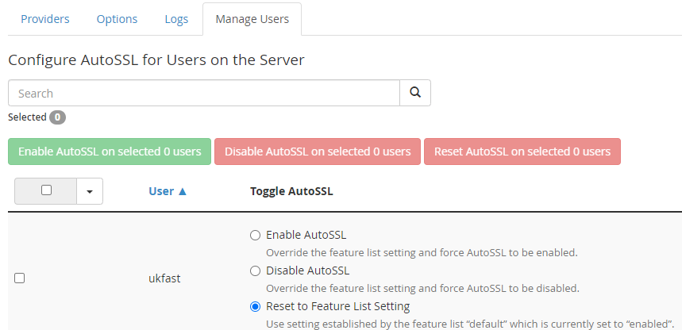
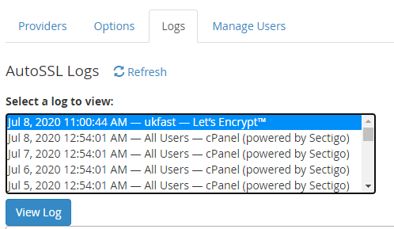

# How to secure your sites with Let's Encrypt in cPanel/WHM

**cPanel/WHM** offers a feature called `AutoSSL` that integrates with both `LetsEncrypt` and their default provider (`Sectigo`). This allows you to install and automatically renew certificates for your domains. It should also cover your `cPanel` services, such as *mail*, *hostname* and *ftp*.

```eval_rst
.. note::
  The plugin only allows for Wildcard certificates to be generated if you use WHM as your DNS provider: If using SafeDNS or an external DNS provider then you will need to do this manually using a tool like certbot.
```

## Installation
If not installed already, then you will need to [ssh](/operatingsystems/linux/basics/connecting) onto the server as **root** and run the following command
```
/usr/local/cpanel/scripts/install_lets_encrypt_autossl_provider
```

Next, open `WHM` and search for **Manage AutoSSL**.



Here, you will have a list of providers, and `Let's Encrypt` will be one of them.



Select this provider, and after agreeing to the terms of service this will be available for you to use.

```eval_rst
.. note::
  More information on this plugin is available in the WHM plugin documentation - https://docs.cpanel.net/knowledge-base/third-party/the-lets-encrypt-plugin/86/
```

## Issuing a certificate with AutoSSL

Once you have selected `Let's Encrypt` as a provider, it's time to generate certificates for your domains.

In the `AutoSSL` section of `WHM`, click on the **Manage Users** tab. Here you will have both global and per account options for enabling/disabling AutoSSL.



Once enabled, certificates will be automatically renewed close to the expiration date of the SSL

## Troubleshooting

If you are having issues with generating a certificate, the first place you should check is the **logs** tab in `AutoSSL`




This should highlight any Let’s Encrypt challenge issues you may have. Beyond this, you can raise a support ticket and we can help identify the underlying issues with you.

```eval_rst
  .. title:: cPanel | How to secure your sites with Let's Encrypt
  .. meta::
     :title: cPanel | How to secure your sites with Let's Encrypt | UKFast Documentation
     :description: How to secure your sites with Let's Encrypt in cPanel/WHM
     :keywords: cpanel, whm, ssl, letsencrypt, let's encrypt, secure, security, linux, apache, guide, tutorial
```