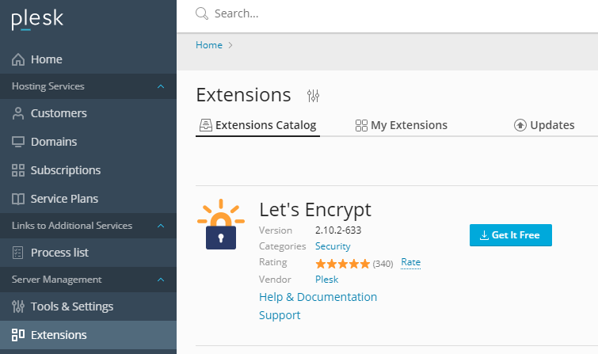
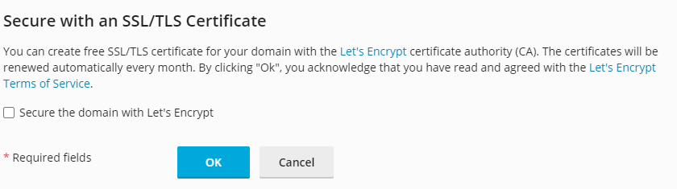
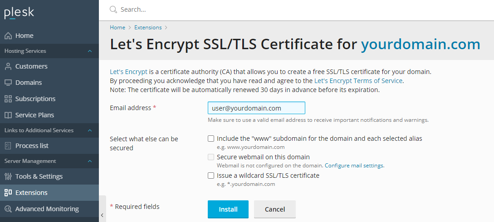
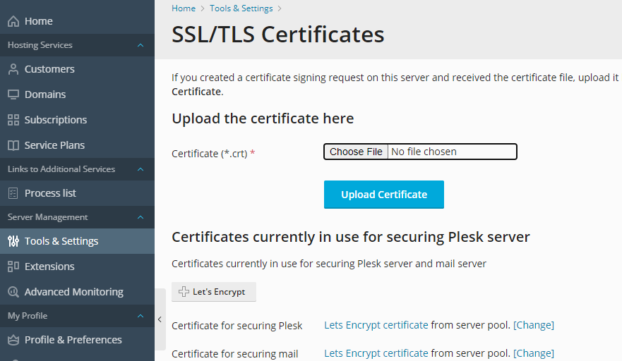

# How to secure your sites with Let's Encrypt in Plesk

`Plesk` offers `Let's Encrypt` as an extension and makes it easy to obtain an SSL certificate for your website.

## Installation

Within `Plesk`, you can install this via the **Plesk Extensions** utility.

Simply search within their extension store for `Let's Encrypt` and click **Get it Free** to install.



Once installed, it will appear within each domain's configuration page.

## Issuing a certificate

For **new domains**, you can include `Let's Encrypt` functionality when creating the domain itself by ticking the *Secure the domain with Let's Encrypt* option



For **existing domains**, you can select your domain (or mutliple domains) within the `Let's Encrypt` extension itself. Here it provides a few options for what you would like to cover, such as 'www' and wildcard subdomains.

```eval_rst
.. warning::

  Wildcard certificates can only be issued if your DNS is managed by Plesk itself. This is because it only offers DNS validation and not HTTP.
```



Once enabled, certificates will be automatically renewed close to the expiration date of the SSL.

You can also secure your `Plesk` Panel and mail services using `Let's Encrypt` by selecting this in the **SSL/TLS Certificates** section of **Tools & Settings**




```eval_rst
  .. title:: Plesk | How to secure your sites with Let's Encrypt
  .. meta::
     :title: Plesk | How to secure your sites with Let's Encrypt | UKFast Documentation
     :description: How to secure your sites with Let's Encrypt in Plesk
     :keywords: plesk, ssl, letsencrypt, let's encrypt, secure, security, linux, apache, nginx, server, guide, tutorial
```
