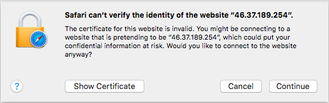

# Self Signed Certificates

```eval_rst
   .. meta::
      :title: SSL | Self Signed SSL Certificates | ANS Documentation
      :description: Information on Self Signed SSL Certificates

```

## What are Self Signed Certificates?

Self signed certificates are exactly the same as a normal SSL certificate. The only difference between a self-signed certificate and a purchased SSL from a company such as Comodo, is that the purchased SSL will be signed by a recognised certificate authority, and the self-signed certificate is signed, as the name implies, by you.

## Should you trust a Self Signed Certificate?

If you are not aware of the self-signed certificate, and if the SSL has not been installed by you, your application or by a trusted third party such as your hosting company, then you are not supposed to trust this SSL.

Here is what a standard self-signed certificate warning will look like.




## How do I create my own Self Signed Certificates?

On Linux servers, you should be able to create a certificate and a key. This is mostly used as a way to add temporary SSL encryption on test domains.

```console
  openssl req -x509 -nodes -days 365 -newkey rsa:2048 -keyout test.key -out test.crt
  Generating a 2048 bit RSA private key
  .+++
  .............+++
  writing new private key to 'test.key'
  -----
  You are about to be asked to enter information that will be incorporated
  into your certificate request.
  What you are about to enter is what is called a Distinguished Name or a DN.
  There are quite a few fields but you can leave some blank
  For some fields there will be a default value,
  If you enter '.', the field will be left blank.
  -----
  Country Name (2 letter code) [XX]:
  State or Province Name (full name) []:
  Locality Name (eg, city) [Default City]:
  Organisation Name (eg, company) [Default Company Ltd]:
  Organisational Unit Name (eg, section) []:
  Common Name (eg, your name or your server's hostname) []
```

## Installing certificates

How you configure various pieces of software to use a certificate, either self-signed or otherwise varies wildly. Referring to their relevant documentation is usually the way forward, or try using our search functionality to see if there's already an article on it.

```eval_rst
   .. title:: Self-Signed SSL Certificates
   .. meta::
      :description: Self-Signed SSL Certificates | UKFast Documentation
      :keywords: ukfast, ssl, self-signed, openssl
```
