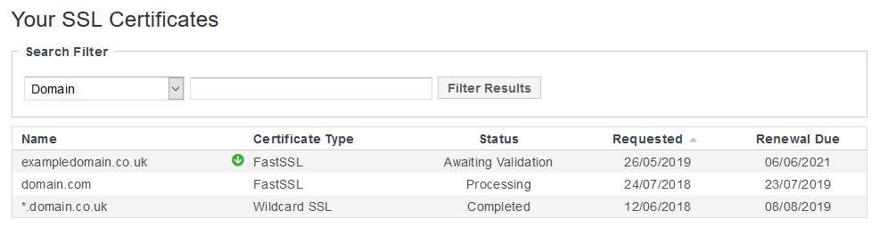
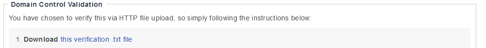
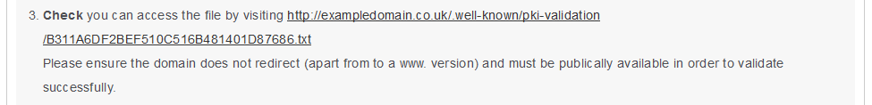
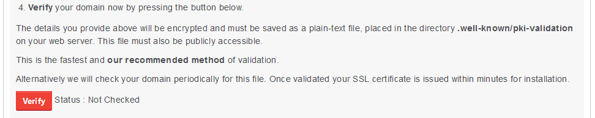

# Validating your SSL certificate via File Upload

```eval_rst
   .. meta::
      :title: SSL | Validating your SSL Certificate | UKFast Documentation
      :description: Information on how to validate your SSL Certificate

```

Please note that the following guide has been written with UKFast Linux Servers in mind.
If you need any assistance with any UKFast Products and Services that are not covered in this guide, please get in touch with our support team.

Before your brand new or renewed SSL certificate can be issued, it needs to be validated.
Validation can be done via 3 methods:

   ● File Upload (recommended)
   
   ● DNS Lookup
   
   ● Email

In this guide, we are going to be using the File Upload method which is the method we recommend you use.

To complete the validation via File Upload, you will need an FTP Client to upload the verification file to your website.
We will show you how to do this with FileZilla, a free and very popular FTP client.

If you do not have an FTP Client, you can get FileZilla [here](https://filezilla-project.org/download.php)

First of all, ensure you are logged into your [MyUKFast Area](https://my.ukfast.co.uk) and then head to the [View Certificates](https://my.ukfast.co.uk/ssl/index.php) page under SSL Certificates.
When on that page, you will see the below showing the SSL Certificates you have purchased from UKFast.
For this guide, we are going to be using exampledomain.co.uk, please substitute the domain you are covering with the SSL in these instructions to ensure that the certificate is installed correctly.



If you haven't purchased your SSL yet, you can view the SSLs we provide and purchase the certificate(s) you need [here](https://my.ukfast.co.uk/ssl/buy.php).

Click on the certificate you wish to validate in the table which will redirect you to the certificate specific page.
On this page, you will see the Domain Control Validation section which contains brief instructions on validating your certificate.

To validate your SSL Certificate via HTTP File Upload, you need to download the .txt file linked within that section of the SSL's own page.
To download the .txt file, click on the "this verification .txt file" link as shown in the screenshot below.



Save the file somewhere easy to locate for you later on, that is the file we are going to upload to your website to validation.

The next step is to connect to your server in FileZilla or your chosen FTP Client.
If you do not have an FTP User configured, please create one on your server for this purpose.

If you need any information on how to create an FTP user or need any assistance, please do not hesitate to get in touch with our [Support Team](https://my.ukfast.co.uk/pss/add.php)
Alternatively, you can use your SSH user with SFTP. You will be able to follow the same instructions when connected to the server via SFTP.

Uploading the verification file via FileZilla:

   1.  Open FileZilla
   2.  Click on the "Site Manager" icon in the top left
   3.  Click on "New Site" in the bottom left of the pop-up window
   4.  Choose your protocol, FTP or SFTP via the drop down menu
   5.  Enter your UKFast Server IP in the "Host" box
   6.  Enter the port for the chosen protocol in the port box. FTP is port 21 and SFTP is 2020 on UKFast Servers as standard.
   7.  Enter your username in the "User" box and leave "Logon Type" as "Ask for password"
   8.  Click the "Connect" button at the bottom of the "Site Manager" window
   9.  When prompted for the password, enter it in the "Password" field and then click "OK"
   10. When connected, browse to your site files on the right hand side.
       If you are using Plesk or cPanel, your site files will be within the default locations

       Plesk: /var/www/vhosts/
       cPanel: /home/

       For example, the exampledomain.co.uk will be located:

       Plesk: /var/www/vhosts/exampledomain.co.uk/
       cPanel: /home/exampledomain/

       If you have no control panel or have a custom configuration, your site files may be located elsewhere.
       If you need any assistance locating your site files, please get in touch with our support team.

   11. Once the site files have been located, ensure you have a .well-known folder within the web root.
   12. In the .well-known folder, you need to ensure there is a folder called pki-validation
   13. Once those folders are present, drag the verification file from your local machine on the left of the FileZilla window, pki-validation folder on the right

Once the verification file has been uploaded, you need to ensure it is accessible via the link shown in step 3 on your SSL page within MyUKFast.
Here is a screenshot of the link for exampledomain.co.uk, the URL for your certificate will be different as the links are randomly generated to ensure they are unique.



A Multi-Domain SSL requires each domain covered under the certificate to be validated. The same verification file needs to be uploaded to each site before the certificate can be issued.

The system used for validation needs to be able to see the content within the file you have uploaded, when it can confirm that it is the correct content, the certificate is then issued.
Within the file, you will see three strings:

   ● SHA-256 hash
   
   ● Issuer identifier
   
   ● Unique value

The file's content will look similar to the below:

   c9c863405fe7675a3988b97664ea6baf442019e4e52fa335f406f7c5f26cf14f
  
   comodoca.com
   
   10af9db9tu

Once you have confirmed you are able to see the contents of the file via the link provided on the SSL page, click the red "Verify" button as shown in the screenshot below:



Your certificate will be issued once it has been validated by the certificate issuer.

Once it has, if you have selected an Engineer Install along with your SSL. This will be installed by our support team for you.
Otherwise, your certificate parts will be available for install on the SSL page.

```eval_rst
  .. meta::
     :title: Validating your SSL Certificate (Linux) | UKFast Documentation
     :description: A detailed guide on validating your UKFast SSL Certificate via File Upload on a UKFast Linux Server
     :keywords: ssl, linux, file upload, validation, filezilla, ftp, sftp, cert, upload, cpanel, plesk
