# Setting up the FASTcloudbackup agent

## Downloading the agent

Login to the [FASTcloudbackup web console](https://fcb.ukfast.co.uk) and click `Download Center` (apologies for the US spelling!).

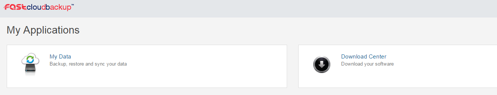

Find the appropriate Windows or Linux agent and click `Download`.  The agent will download based on your web browser's usual download process.

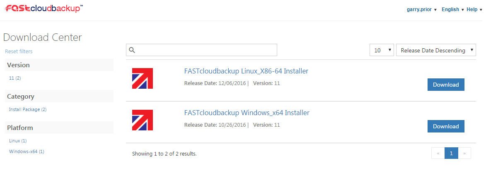

## Installing the agent - Windows

Find the agent in your browser's download folder and open it.  Follow the instructions given to install the agent.

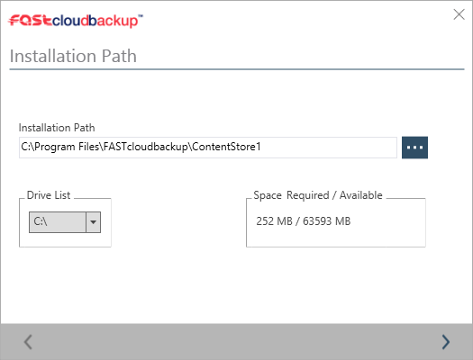

Select where to install the FASTcloudbackup agent. By default this will be to `C:\Program Files\FASTcloudbackup\ContentStore`

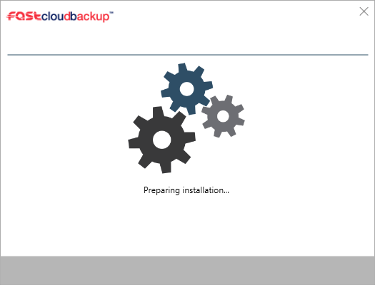

The installer will proceed to install the FASTcloudbackup agent on your computer.

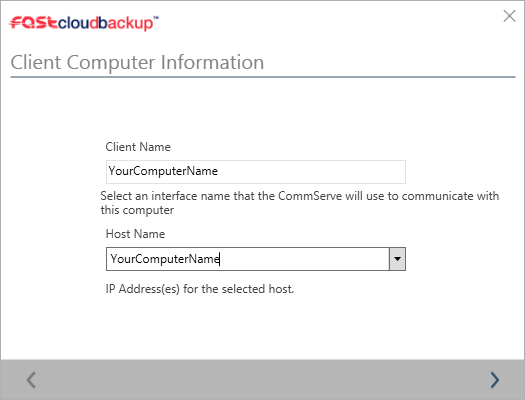

You will be asked to name your computer, this will be the computer name displayed in your [FASTcloudbackup web console](https://fcb.ukfast.co.uk). By default, this will be the local hostname of the computer running the install, though you can change this to make it easier to identify the computer in the console. It is recommended to keep the Client Name and Host Name as the same value.

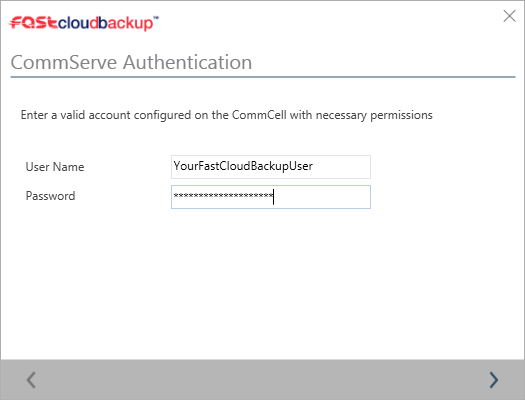

When you come to a screen called CommServe Authentication, you should enter the same User Name and Password that you used to log in to the [FASTcloudbackup web console](https://fcb.ukfast.co.uk).

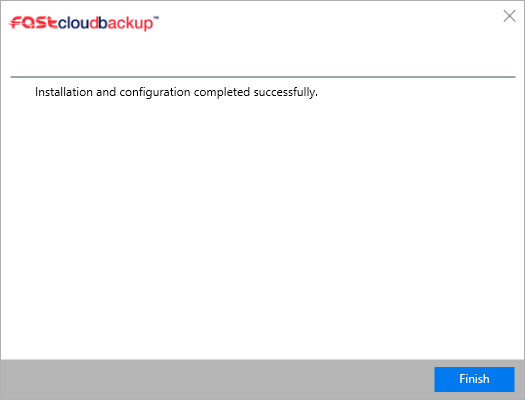

The installation will the complete and you can begin to manage backups of this computer in the [FASTcloudbackup web console](https://fcb.ukfast.co.uk).

```eval_rst
.. seealso::
   Please note that the installation process will add a Migration Assistant to your laptop, but you don't need to use this once you've      completed the agent installation.  After the steps above, you're ready to start running backups.

```
## Installing the agent - Linux

Once downloaded to your Linux client, extract the .tar file to any directory. Browse to the extracted directory and run "cvpkgadd" (with root privileges) to begin the installer

```
fastcloudbackup_linux_x86-64]# ./cvpkgadd
```

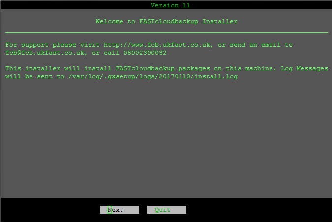

Select Next to proceed.

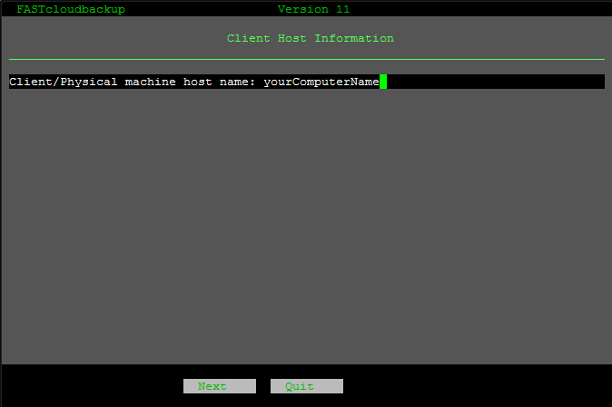

Enter your machine hostname, by default this will be set to the computers hostname running the installer, you can leave this as default.

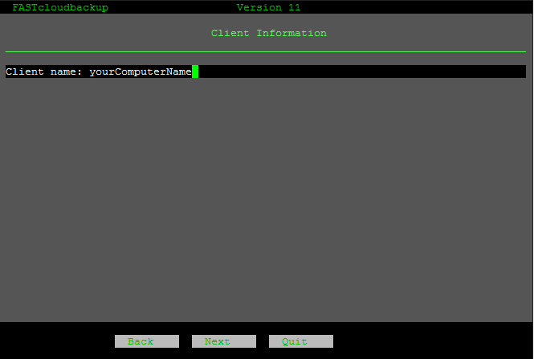

The client name will be set to the computers hostname running the installer. This is how the computer will be named in the [FASTcloudbackup web console](https://fcb.ukfast.co.uk). You can leave this as default or change this to make the computer easier to identify in the console.

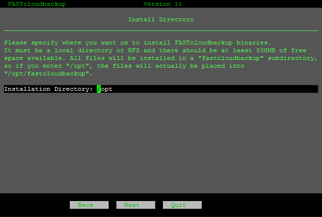

By default, the installation directory will be set to /opt, you can change this if you wish to install the client to an alternative directory.

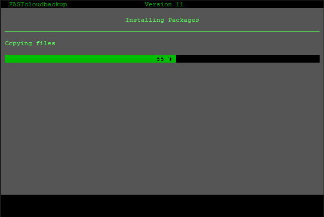

The installer will proceed to install the agent.

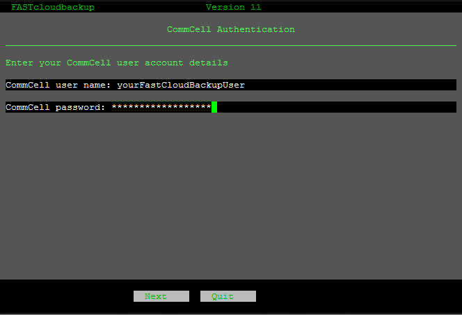

When asked for your CommCell user account details, you should enter the same User Name and Password that you used to log in to the [FASTcloudbackup web console](https://fcb.ukfast.co.uk).

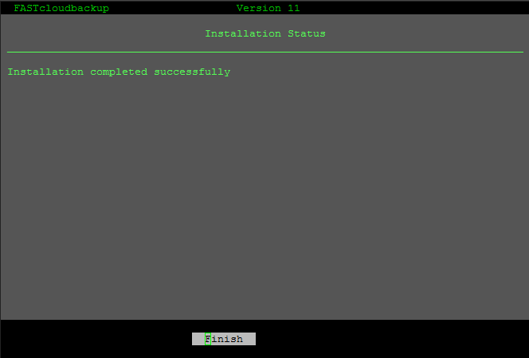

The installation will the complete and you can begin to manage backups of this computer in the [FASTcloudbackup web console](https://fcb.ukfast.co.uk).

## Checking the agent is set up correctly

Once you've installed the agent on your computer or server, you can check it's been set up properly by heading back to the [FASTcloudbackup web console](https://fcb.ukfast.co.uk).  From the home page click `My Data` and you'll be taken to a page called Computers.  On here you will see the computer(s) and server(s) you have installed the FASTcloudbackup agent on to.

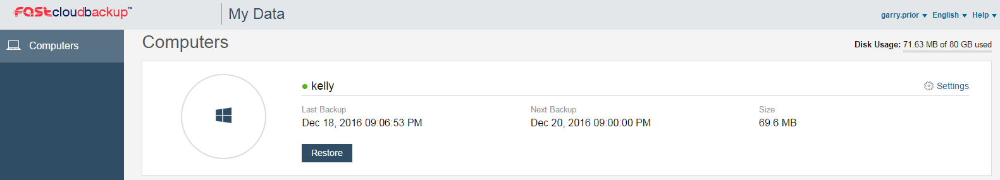

## Removing the FASTcloudbackup agent

If you no longer wish to backup a particular computer or server then you can remove the FASTcloudbackup agent using your computer/server's usual uninstall process.  Note that you will no longer be able to see this computer or server in the FASTcloudbackup web console, or view/download/restore files previously backed up, so make sure to retrieve any files you need before removing the agent.

Once you've removed the agent from your computer or server, you will no longer be charged the monthly per device fee, and the amount of data you had backed up will no longer count towards your storage quota.
