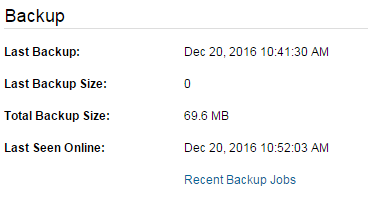
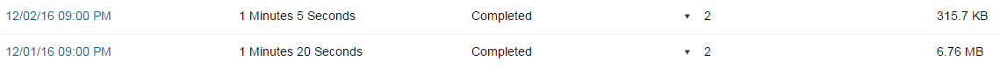

# Restoring files and folders from a backup

```eval_rst
   .. title:: FastCloudBackup | Restoring Files
   .. meta::
      :title: FastCloudBackup | Restoring Files | UKFast Documentation
      :description: Information on how to restore files from your FastCloudBackup account
      
```

Restoring from a backup is a simple process.  Find the files and/or folders you wish to restore as described in the [Managing Files and Folders](/dr-ha/FASTcloudbackup/Managingfilesandfolders) section.  Select the files or folders and click `Restore` at the top of the page.


To restore from a previous backup job, click on `Recent Backup Jobs` within the computer or server you wish to restore from.



Find the backup job in question from the list, click on the link and restore the files/folders as described above.


