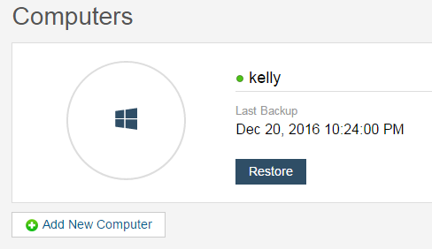
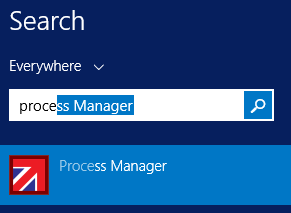
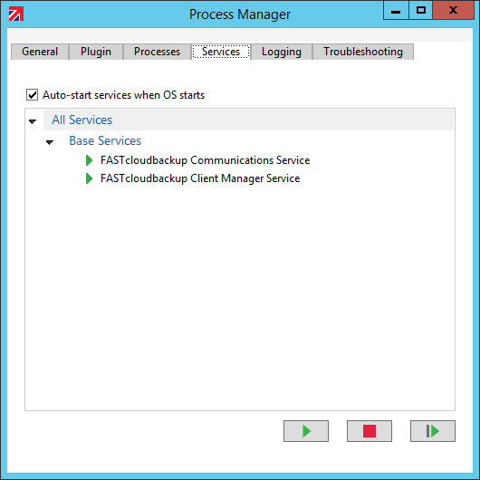
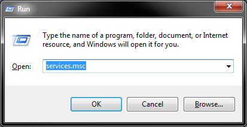
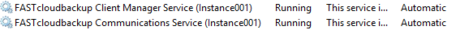
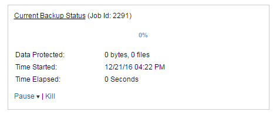
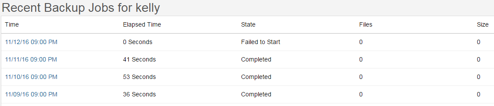
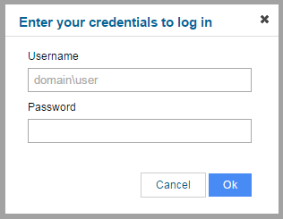
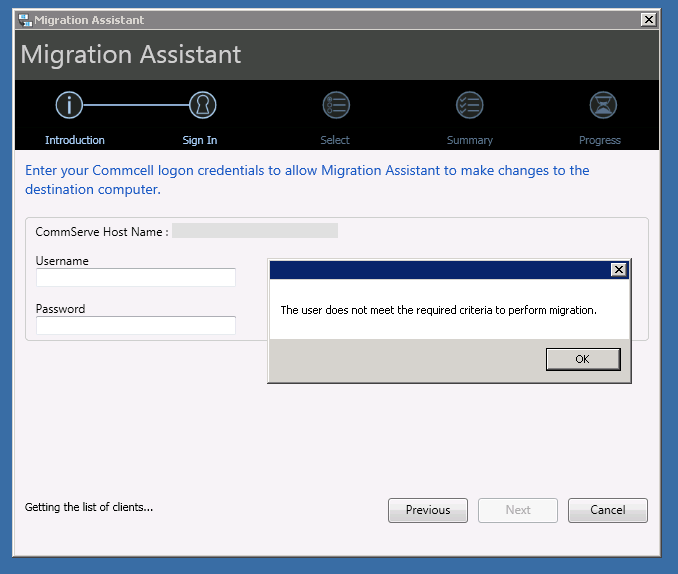

# Troubleshooting

```eval_rst
   .. title:: FastCloudBackup | Troubleshooting
   .. meta::
      :title: FastCloudBackup | Troubleshooting | UKFast Documentation
      :description: Information on how to troubleshoot issues with FastCloudBackup
```

This section contains help relating to problems you may run in to.

## Add New Computer button doesn't work

There is an button on the Computers page labelled `Add New Computer`.



You should not use this to add new computers or servers to be backed up - instead follow the instructions shown on [Setting up the FASTcloudbackup agent](Installingthefastcloudbackupagent) - this will guide you through installing the agent so you can run and manage backups.

## Problems browsing file structure

FASTcloudbackup runs as a system service and so cannot pre-select or utilise shortcuts to folders such as Documents or Photos.  In order to find the folders you wish to backup you'll need to navigate through the full path - for example `C:\Users\[username]\Documents\[foldername]`

To make it simpler to get to the folders you access regularly, set them up as [Favourite folders](Managingfilesandfolders.html#favourite-folders).

## The amount of data backed up is larger than the total of my files and folders

You may notice that the total amount of data backed up within FASTcloudbackup is larger than the size of the files and folders on the computer or server being backed up.  This will typically be because of hidden files or metadata that have also been included in the backup process.

## Backups aren't running - Windows computers or servers

If backups are not running (failing to start) then check that you have all the FASTcloudbackup services running correctly on your computer or server.  To do this go to the Process Manager that was installed as part of the FASTcloudbackup installation.  Find and open this using your Windows Search box, often found in the Start menu.



  Open the Process Manager and click on the `Services` tab.  Check all the FASTcloudbackup services are shown as running (with a green arrow).  If they're not, set them to run.  Also ensure that `Auto-start services when OS starts` is ticked.



You can also check this on Windows computers by opening the `Run` programme and then `services.msc`.



You will see a list of all services on this computer; look for the FASTcloudbackup ones and check they are shown as Running, and also Automatic in the Startup Type column.



## Backups aren't running - Linux computers or servers

If backups are not running (failing to start) then check that you have all the FASTcloudbackup services running correctly on your computer or server.  To do this run the following command to get a list of all FASTcloudbackup services

```
fastcloudbackup list
```
  If any services are shown as stopped then run
```
fastcloudbackup restart
```  

## Backups taking a long time to run

The first time a computer or server is backed up, a full backup of all selected files and folders needs to take place.  This can take a while, depending on the total amount of data.  Subsequent backups will be incremental, meaning that only files that have been changed or created since the last backup will be processed, making the backup quicker to run.

The speed of your network connectivity will also affect the time a backup takes to run.

You can set up an alert so you are notified if a single backup job exceeds 24 hours - see [Alerts](alerts) for details.

You can "kill" a backup job at any point through the [FASTcloudbackup web console](https://fcb.ukfast.co.uk).  When a backup job is in progress, click `Kill` in the Schedules area to stop the backup from running.



## Failed backups

You can see the history and status of your backup jobs in the [FASTcloudbackup web console](https://fcb.ukfast.co.uk) by clicking `Recent Backup Jobs` within the computer or server in question.  You'll see a complete list of jobs, along with the state, number of files and total size of backup.  This will enable you to identify any backups that did not run successfully.



Possible backup job states are:

- Completed:  the backup job ran successfully.
- Failed to Start:  this is most likely because the computer or server was not accessible during the scheduled backup window, potentially in line with the policy you configured when [creating a backup schedule](Settingupbackups.html#creating-a-backup-schedule) - for example specifying that backups should only run if the computer is plugged in to a power source rather than on battery mode.


## Showing Live Machine data and Network Share data

There are options to show live machine data and network share data within the [FASTcloudbackup web console](https://fcb.ukfast.co.uk).  You'll find these under the drop down menu at the top of the My Data screen.


To view this data you'll be asked to enter the Username and Password for the computer or server in question (note this is not the same as your FASTcloudbackup username and password).



## The Sync function doesn't work

You may see an option within the web console to Sync data between two computers you are backing up.  However this feature is currently disabled within FASTcloudbackup and therefore will not do anything when selected.

## Why doesn't the Migration Assistant work?

When installing the FASTcloudbackup agent, a Migration Assistant will also be added to your computer or server.  However you should not use this to complete the installation or setup process.  Simply follow the instructions in [Setting up the FASTcloudbackup agent](Installingthefastcloudbackupagent).


