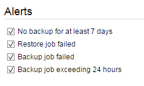
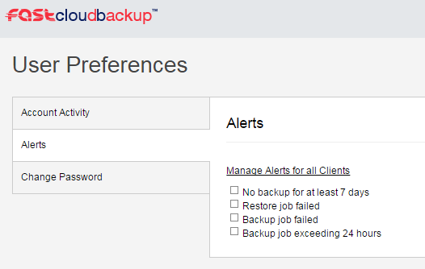

# Setting up alerts

You can set up a number of alerts to notify you of any problems with your backups.

## Setting up alerts for one computer or server

From the homepage of the [FASTcloudbackup web console](https://fcb.ukfast.co.uk) click on `My Data` and then `Settings` for the computer/server you want to set up alerts for.


You will see the Alerts area on the right hand side of the screen.



There are four alerts you can choose to set up, by ticking the relevant box:

- No backup for at least 7 days
- Restore job failed
- Backup job failed
- Backup job exceeding 24 hours

Each alert will be sent as an email to your registered email address in the event of a problem.

To stop receiving alerts, simply untick the relevant box(es).

## Setting up alerts for all computers or servers within your FASTcloudbackup end user account

From the homepage of the [FASTcloudbackup web console](https://fcb.ukfast.co.uk) click on your username in the top right corner, then `Alerts`.  On this page you can set alerts which will apply to all the computers and servers you have being backed up within your account.



To stop receiving alerts, simply untick the relevant box(es).

```eval_rst
  .. meta::
     :title: Setting up Alerts | UKFast Documentation
     :description: A guide to setting up alerts for FASTCloudBackups
     :keywords: ukfast, fast, cloud, backups, alerts, server, tutorial, guide, restore
