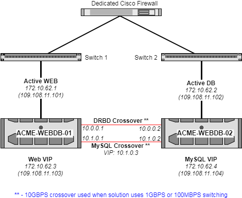
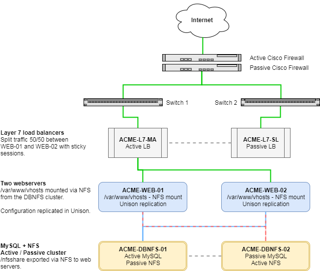

# Introduction to BCP


```eval_rst

   .. meta::
      :title: DR HA | Introduction to BCP | UKFast Documentation
      :description: Introduction to the Business Continuity Platform from UKFast

```

Our Business Continuity Platform (also known as "BCP" or "clusters") are a highly-available configuration of RedHat or CentOS servers making use of several technologies to allow for failover in the event of an issue on one node, along with the balancing of services across more than one server.

Depending on your requirements, you might be working with a different number of servers operating in BCP using different methods of replication in slightly different configurations, so please bare that in mind when using this documentation.

This service can be deployed on physical hardware, or within our eCloud Hybrid / Private platforms - while many of the principles are similar, there are some differences between the two. The main difference is the use of SAN storage in place of DRBD.

## Two node (active / passive) clusters

The most common BCP configuration deployed at the moment is our two-node WEBDB clusters. In this configuration, your web server runs on one side (NGINX + PHP-FPM / Apache), and the database element runs on the other side (MySQL / MariaDB / Percona) while both nodes are operational. These two node solutions are active / passive.

### Solution diagram

A two node BCP is usually deployed in a format similar to this:



In this example, each node is connected to a different switch, providing redundancy at the network level so that service can persist a switch failure.

The red lines in the diagram represent 10GBPS direct connections between the nodes, which are used for replication and to handle MySQL traffic from the web node to the DB node. If 10GBPS switching has been included in the solution, this would be used instead of crossover cables.

### Virtual IPs

The two virtual IPs ("VIPs") provided are attached to the resource group for the web services and DB services respectively. These VIPs will always be attached to the half of the cluster which is actively running the related service.

As such, the external web VIP *(109.108.11.103 in this example)* would be the address used when updating your [DNS records](/domains/safedns/index) to point at the cluster. The MySQL VIP *(109.108.11.104 in this example)* would be used to access MySQL remotely via MySQL Workbench or a similar application.

When connecting to MySQL from your application hosted on the webserver, you should use the `10.1.0.3` internal-only crossover VIP which is associated to the resource group for the database service, and operates over a 10GBPS NIC. Using the public MySQL VIP *(172.10.62.4 in this example)* would mean that MySQL traffic needs to flow over the switch alongside your visitor traffic and might cause performance issues when under heavy load, as such, using the crossover connection is recommended.

### Replication of data

There are two methods employed on two node clusters to replicate data between physical servers: DRBD and Unison. For clusters running under eCloud, Unison is still used in the same way, but SAN storage is used in place of DRBD.

#### Distributed Replicated Block Device (DRBD)

Two DRBD volumes are created (`/dev/drbd0` and `/dev/drbd1`), one for website files and one for database files, which are then mounted by the cluster to `/var/www/vhosts` for web and `/var/lib/mysql` for database as required.

DRBD works by replicating the two local storage volumes on each server at block level over the 10GBPS connection in real-time. So, as you write to blocks on the active cluster node, these block level changes will be synchronized immediately with the passive node.

As DRBD is active / passive, you will only be able to access the DRBD device on the active node in the cluster, so don't be alarmed if `/var/www/vhosts` or `/var/lib/mysql` is "missing" from the passive node.

Anecdotally, you can consider DRBD as operating in a similar way to RAID1, except that it synchronizes disks in different servers over the network. That being said, there are differences between RAID1 and DRBD, so it's only comparable on a basic level.

**[Continue reading about DRBD on BCP »](drbd)**

```eval_rst
.. seealso::
   Further reading about DRBD for those interested:

   - `<https://en.wikipedia.org/wiki/Distributed_Replicated_Block_Device>`_
   - `<http://docs.linbit.com/docs/users-guide-8.4/>`_
   - `<https://www.ibm.com/developerworks/library/l-drbd/index.html>`_
```

#### Unison

A package called [Unison](https://www.cis.upenn.edu/~bcpierce/unison/) is used to synchronize configuration between both nodes on a schedule. This runs as a [cron job](/operatingsystems/linux/basics/cron) on both nodes every minute. By default it will be set to copy your webserver configuration, database server configuration, SSL certificates, and system users and passwords between the two nodes.

If you're adding configuration files outside of the standard package locations, you will likely need to modify the Unison settings to add in the new paths.

This should not be used for files which are regularly written to, such as log files, as Unison may run into conflicts it cannot resolve and pause replication.

**[Continue reading about Unison on BCP »](unison)**

```eval_rst
.. seealso::
   Further reading about Unison for those interested:

   - `<https://www.cis.upenn.edu/~bcpierce/unison/>`_
   - `<https://www.cyberciti.biz/faq/unison-file-synchronizer-tool/>`_
   - `<http://www.linuxjournal.com/content/file-synchronization-unison>`_
```

## Four node (active / active) clusters

Clusters which are deployed with more than 2 nodes are designed on a per-solution basis to best fit your needs, however an average configuration would resemble something like this:

 - 2x Load balancers (active / passive)
 - 2x Web servers (load balanced)
 - 2x DB+NFS servers (active / passive cluster)

### Solution diagram



Normally this would also be racked over two switches, with the `-01` server of each pair on one switch, and the `-02` on the other switch. Sometimes NIC bonding is used to connect servers into both switches and present one interface to the server. Further connections to the switch may be made to facilitate internal traffic, depending on requirements.

### Virtual IPs

Much like in a two node cluster, you will receive a VIP for MySQL, which will follow the MySQL service when it changes nodes. This will have an internal and external address - the internal one should be used in the application hosted on the web servers, and the external used for connecting remotely via MySQL workbench or similar.

Unlike the two node clusters, [load balancers](/network/loadbalancing/index) are used in place of a web VIP. As such, you'll receive a VIP for the load balancer which is configured as requested to split load between the web servers, this is the address you should use in your [DNS records](/domains/safedns/index) when going live.

### Replication of data

Replication in this example of a four node BCP solution uses much of the same technology as the two node clusters. DRBD or SAN storage is used for MySQL (`/var/lib/mysql`) and the NFS export (`/nfsshare`) on the DBNFS cluster, and Unison is used to synchronize configuration between `DBNFS-01` & `DBNFS-02`, and `WEB-01` & `WEB-02`.

However, the web servers mount `/var/www/vhosts` via NFS from the export on the DBNFS cluster, meaning it can be read and written to from both web servers.

On four (or more) node solutions, there is more flexibility about how files are replicated. Some clients opt to not have the NFS element mentioned above, and push their code out to each web server individually using `git` and their chosen deployment tool. Alternatively, some clients use NFS for assets only (for example, the `media` directory of Magento), and deploy the rest of their code directly to the web servers.

- **[Information about DRBD on BCP »](drbd)**
- **[Information about Unison on BCP »](unison)**
