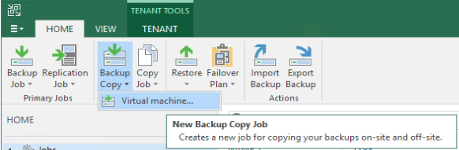
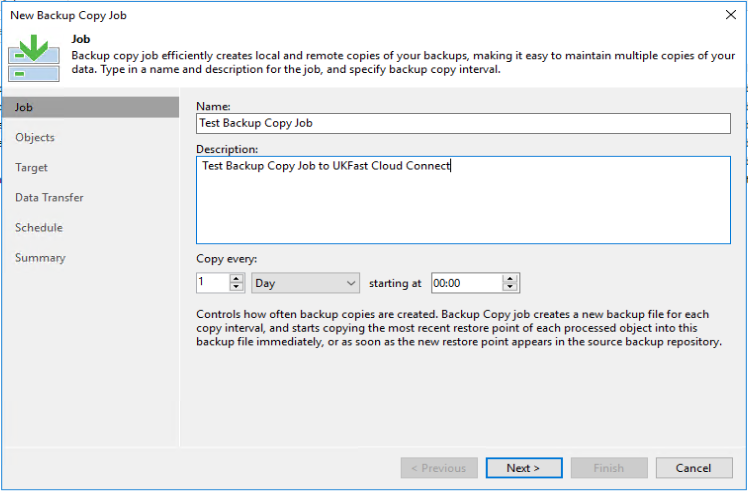
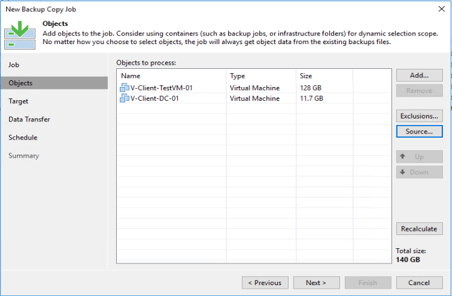
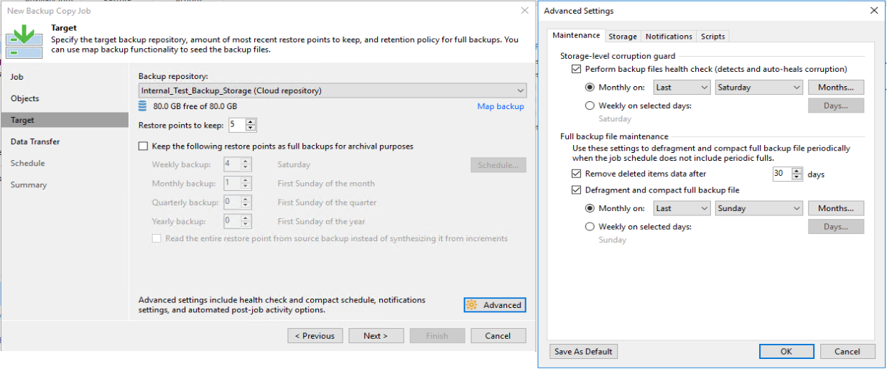
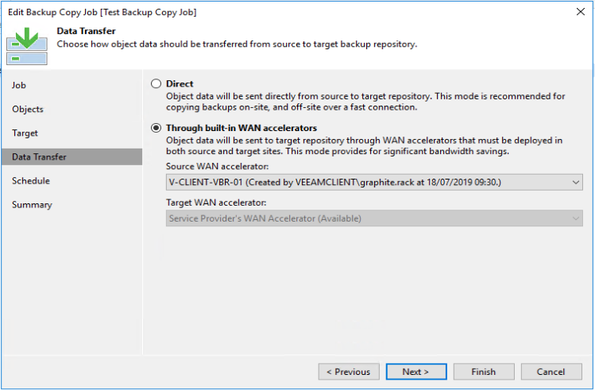
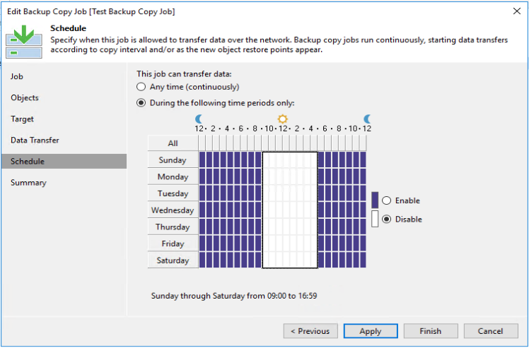

# Configuring a backup copy job

## Creating the Job
1. Open "Veeam Backup & Replication Console" and connect to your Veeam Server
2. Navigate to "Home"
3. On the top bar, select "Backup Copy" > "Virtual Machine"

### Job
1. **Name/Description** - enter a name for the backup copy job and a description if needed (recommend something that is easy to reference which VMs are going to be in this particular job)
2. **Copy Every** - you need to pick how often you would like a backup copy transferred to UKFast Cloud Connect and when you would like the copy interval to start. We would generally recommend that the copy interval starts at a time where you are confident the Backup job for the given VMs will have finished.

### Object

1. **Add** - you have the choice to add the backups you would like to copy from, "infrastructure", "backups" or "jobs"; it doesn't make much difference which you pick, it will always select the most recent restore point of the backup job you select. Select the VMs/Backup that you would like to add to this job. 
2. **Exclusions** - you have the option to exclude certain VMs from the backup copy job by selecting them directly from the vCenter hierarchy. 
3. **Source** - you also have the option to change the source of the where the backup data comes from if you have multiple backup repositories.

### Target

1. **Backup Repository** - select the drop down and select the backup storage that has been provided to you by UKFast. This should have your tenant name in it and say "(Cloud repository)" at the end
2. **Restore points to keep** - select the number of restore points that you would like to keep at UKFast. The time between the restore points is decided by what you selected in the **Copy Every** section earlier on.
3. **Keep the following restore points as full backups for archival purposes** - you also have the option to archive backups Weekly, Monthly, Quarterly or Yearly. Please be aware of the additional storage that this will take up.
    * **Read the entire restore point from source backup instead of synthensizing it from increments** - the end result is exactly the same whether you choose this or not, it just means there's a slightly lower chance of data corruption if it pulls the full source backup file rather than using all of the local incrementals to create a full backup file. The negative of ticking this is the increased bandwidth resource it will use.
4. **Advanced** - there a few other settings in the advanced section, but these are the ones that we recommend you should consider changing.
    1. **Storage-level corruption guard** - this is beneficial to run around once a month to avoid backup file corruption. Detailed information can be found on Veeams website on how this works - [Health Check for Backup Files
](https://helpcenter.veeam.com/docs/backup/hyperv/backup_health_check.html?ver=100)
    2. **Full backup file maintenance**
        * **Remove Deleted items data after** - one thing we often find is that delete items in Veeam Backup Repositories can go unseen and take up unnessessary backup storage. We recommend setting this to a reasonable time period, so that deleted backup files are removed automatically
        * **Degragment and compact full backup file** - if you choose not to enable archival backups in step 3 of this section (the process of archival will do it automatically), then we recommend that you enable this to run once a month. This could potentially save you and UKFast storage space.

## Data Transfer

<blockquote>
Section to configure WAN Accelerators, these are only beneficial to use when you have a very slow network upload speed of lower than 60Mb/s.

Sizing information for WAN Accelerators can be found on Veeams Website - [WAN Accellerator Sizing](https://helpcenter.veeam.com/docs/backup/vsphere/wan_accelerator_sizing.html?ver=100). We generally recommend a starting point of the following:  
* Hard disk size - 10% of total data that requires replicating
* 4 CPUs
* 16GB RAM
</blockquote>

1. **Direct** - this is the default option and should be left selected if you are not planning to use a WAN Accellerator
2. **Through built-in WAN accelerators** - if you have purchased a WAN Accelerator from UKFast, select this option. 
    1. **Source WAN accelerator** - select the WAN Accelerator at your site to be used for this replication job. It's recommended the WAN Accelerator is set up as a seperate Virtual Machine and not installed on the Veeam Backup and Replication Server.
    2. **Target WAN accelerator** - select the WAN Accelerator at UKFasts' site to be used for this replication job.

## Schedule
You have the ability to only let the Backup Copy Job run during a specific time window. You may want to set this so it doesn't run during business hours, or you may want to make it so backup copies do not run at the same time as your replications. 

