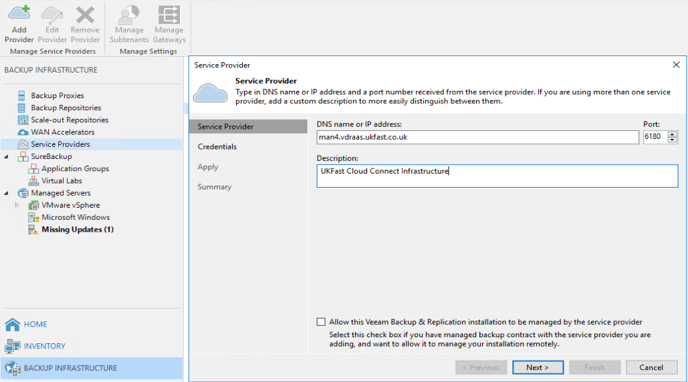

# Connecting to UKFast Veeam Cloud Connect 
 
1. Open "Veeam Backup & Replication Console" and connect to your Veeam Backup and Replication Server 

2. Navigate to "Backup Infrastructure" > "Service Providers"

3. Select "Add Provider" or right click and select "Add Service Provider"

4. Type the external DNS address that has been provided to you in the "DNS name or IP address" section.
    1. Tick the box "Allow this Veeam Backup & Replication Installation to be managed by the service provider" - this is required for license reporting through our VAC console and also to provide you with licenses if you are purchasing one through ourselves. We will not be able to control your Veeam server without credentials from yourself. 
    2. Select "Next"

5. Ensure that next to "Verified by" it says [need to fill this section in once we have got the certificate]
