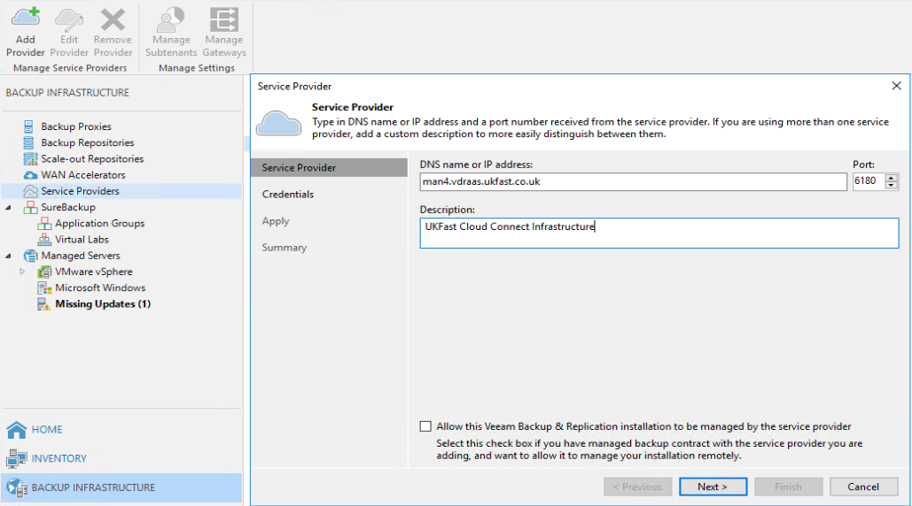
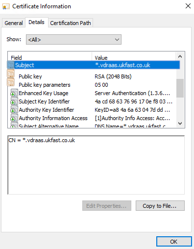
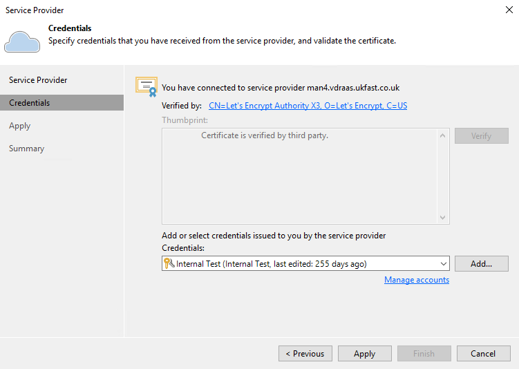
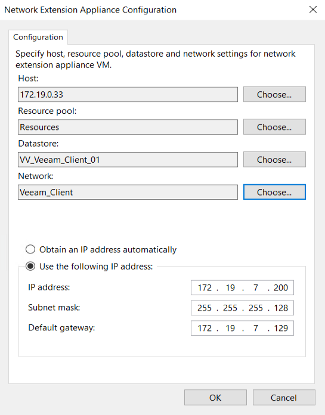

# Connecting to UKFast Veeam Cloud Connect

1. Open "Veeam Backup & Replication Console" and connect to your Veeam Backup and Replication Server

2. Navigate to **Backup Infrastructure** > **Service Providers**

3. Select **Add Provider** or right click and select **Add Service Provider**

   1. **Service Provider** - Type the external DNS address that has been provided to you in the "DNS name or IP address" section.
       1. Tick the box "Allow this Veeam Backup & Replication Installation to be managed by the service provider" - this is required for license reporting through our VAC console and also to provide you with licenses if you are purchasing one through UKFast. We will not be able to control your Veeam server without these credentials.
       2. Select "Next"



   2. Ensure that next to "Verified by" it says "CN=Let's Encrypt Authority"
      1. If you click on the certificate > **Details** > The **Subject** should be ***.vdraas.ukfast.co.uk**
      
      2. Select **Add...** in the bottom right to add the credentials provided to you by UKFast.
      3. Select **Apply**

  


   3. **Replica Resources** - This section shows you the DRaaS resources provided to you by UKFast.  Please double check these are correct and get in touch with us if you believe they are not.

   4. **Network Extension** - You need to add and configure your "Network Extension Appliances" (NEA). You will need to launch one per Internal Subnet/VLAN that you will be replicating to UKFast.
      1. Select **Add**
         * **Host** - Select a Host that you would like the NEA appliance to run off. It must have access to the internal network that this appliance will be used for
         * **Resource pool** - Select a resource pool for the appliance. If you don't use these, select the host object
         * **Datastore** - Select a datastore for the appliance to be stored in.
         * **Network** - Select the internal network for the appliance. This section needs to be different for each appliance, if you are lauching multiple.
         * **IP address** - The NEA Appliance needs to be given an internal IP address on the network it is going to be attached to. This can be done manually or via DHCP if you have a server set up.
         
   5. Select **Apply** and then **Next**
   6. **Summary** - Give all of the settings one final check before clicking **Finish**

```eval_rst
   .. title: Connecting to UKFast Veeam Cloud Connect
   .. meta::
      :title: Connecting to UKFast Veeam Cloud Connect | UKFast Documentation
      :description: How to connect to UKFasts Veeam Cloud Connect infrastructure
      :keywords: ukfast, cloud, ecloud, public, hosting, infrastructure, vmware, draas, veeam, connect, dr, replication, backup
```
