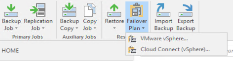
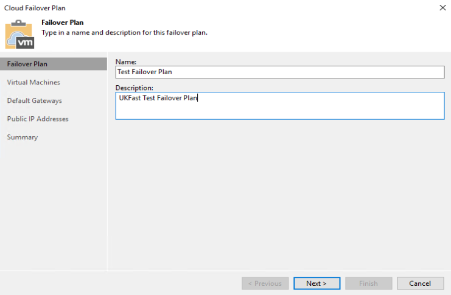
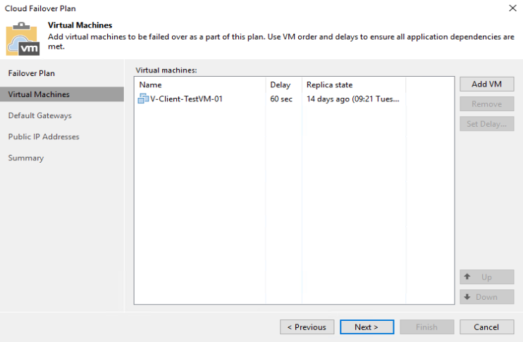
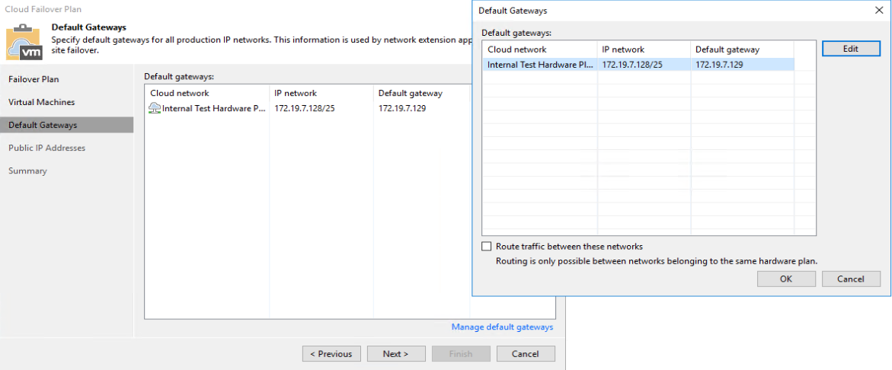
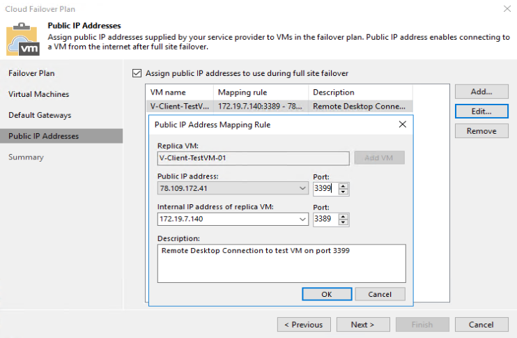

# Creating a Failover Plan

A Failover Plan defines which VMs you want to failover, internal networking at UKFast and your NATs for your external IPs. These should be created immediately after you have configured and run your replications, so they are ready to be used in the event of a DR situation. In the event of an outage you will not be able to create or modify your Failover Plans.

We generally recommend you have one Failover Plan that includes all of your VMs, making it as simple as possible to failover in the event of a DR scenario. That said, some solutions may require multiple plans. You may want to split your business-critical VMs into one Failover Plan, which you can fail over first, and then a second with less critical VMs to  be failed over once the first set are up and running.

The main thing to be aware of if you decide to use multiple Failover Plans is that you can only use an external IP in one plan (it can be used multiple times in that one plan to create different network mappings).


## Creating Your Failover Plan
1. Open "Veeam Backup & Replication Console" and connect to your Veeam Server
2. Navigate to "Home"
3. On the top bar, select "Failover Plan" > "Cloud Connect (vSphere)..."



### Failover Plan
1. Pick a name and a description for the Failover Plan. If creating multiple, it's critical that the name and description are absolutely clear, so there is no question of which to select when you or UKFast come to perform a failover.



### Virtual Machines

1. **Add VM** - After clicking this you will see a list of your replication jobs, you can choose to either select a replication job as a whole or expand it and pick individual VMs underneath.
2. **Set delay...** - You have the ability to select boot delays for each of your VMs. There are multiple reasons for doing this, such as ensuring domain controllers come up before other servers or database servers come up before application servers. You may also want to put a long delay on none-business-critical VMs, to ensure business-critical VMs come online first.
    * Use the **Up** & **Down** buttons in the bottom right to change the boot order.



### Default Gateways

1. **Manage default gateways** - Specify the default gateways for each of the internal networks that have been provided to you by UKFast. The default gateway should be the same as what is configured on the VMs that map to it at your site; this IP will then be assigned to the NEA Appliance at UKFast, which will do any routing after a failover. You will have created the network mappings to these networks when configuring your replication jobs.
    * **Route traffic between these networks** - if you need VMs on separate networks to communicate with each other you need to tick this box.




### Public IP Addresses

Create the network mappings for the public IP address UKFast has assigned to you.

You can use the same External IP multiple times for the same or different VMs providing you use a different source port.


1. **Assign public IP addresses to use during full-site failover** - Tick this box if you need to assign public IPs to any VMs.
    * **Add...** - Select this to create a new mapping rule. You have to create each mapping individually, but you can create multiple, one after another, while configuring the Failover Plan. You can also come back at a later date to add/modify/remove them.
        1. **Replica VM** - Brings up a list of all VMs you have selected to be included in your Failover Plan. You should select the VM that you want to set a rule up for.
        2. **Public IP address:** - A drop down of all external IPs that UKFast has assigned to you. You need to pick one of the external IPs and a source port, which will be presented externally.
        3. **Internal IP address of replica VM** - A list of all internal IPs that are assigned to the VM you have select for this mapping rule. Select the internal port that you need the source port to be mapped to.
        4. **Description** - Finally, we recommend you add a description that is fairly clear to understand in the event of a DR Scenario.



```eval_rst
   .. meta::
      :title: Creating a Failover Plan | UKFast Documentation
      :description: How to create a Failover Plan in Veeam
      :keywords: ukfast, cloud, ecloud, public, hosting, infrastructure, vmware, draas, veeam, connect, dr, replication, backup, failover