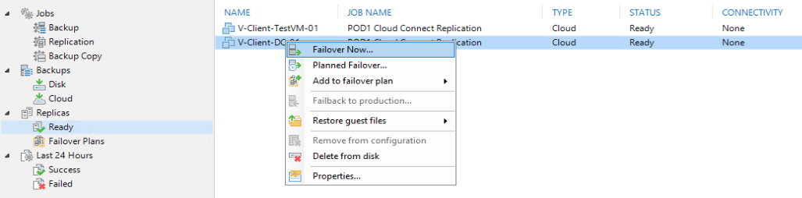
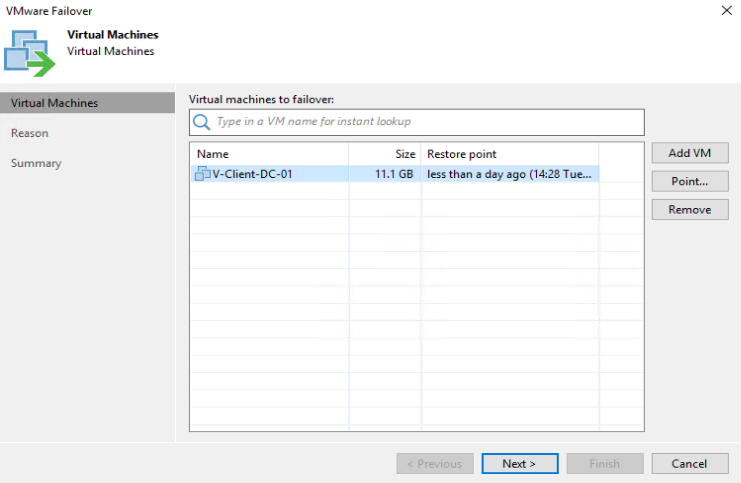
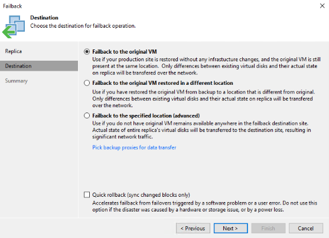

# Veeam Failovers

This guide explains the different failover types within Veeam and how to perform each of them.

If you are currently in a DR situation and need to perform a failover, please navigate to this section of the document 
 [Performing Full Failovers](#Performing-Full-Failovers-In-the-event-of-an-emergency)


## Full Failovers
Full failovers are performed using a Failover Plan which you will have created yourself in your local Veeam Backup and Replication Console. How to create a Failover Plan can be found here - [How to create a Failover Plan](creating_a_failover_plan.md)

A full failover is used in a DR Scenario where you have lost access to your production site. When performing a failover using a Failover Plan the NEA Appliance at UKFast is used to configure the External IP NAT's that you set up in the mapping section of the Failover Plan configuration. It **does not** set up the Layer 2 VPN connection; this is only possible using partial failovers, which are explained below.

You have the ability to initiate these failovers from within your Veeam Backup and Replication console or via your MyUKFast portal should you not have access to your production site. You also have the option to call UKFast support who can initiate the failover for you.


## Partial Failovers

Partial failovers are used to failover individual VMs. Use this type of failover in the event that your production site is still up and running. It will use both the NEA Appliance on yours and UKFast's infrastructure to create a Layer 2 VPN tunnel between the sites along with ProxyARP solutions enabling VMs to communicate as if they were still in the same Layer 2 network. More information on this can be found here  - [NEA Appliance - Partial Failovers](https://helpcenter.veeam.com/docs/backup/cloud/cloud_connect_partial_site_failover.html?ver=100)


## Performing Full Failovers in the Event of an Emergency

### Initiating the Failover

1. Login to your MyUKFast > navigate to the **Disaster Recovery** section down the left hand side > **DRaaS** - [MyUKFast DRaaS](https://my.ukfast.co.uk/draas)
2. If you only have one DRaaS solution it will take you straight into the overview page. If you have more than one, select the DRaaS solution that you would like to perform the failover on.
3. Next to the Failover Plan you would like to failover, select **Enable Failover** to initiate the failover


You also have the option to call UKFast support, should you have any issues doing this, and we will be able to initiate the failover for you.

#### Undoing the Failover

**This will not replicate changes made at UKFast back to your local infrastructure, it will simply power off the VMs at UKFast. If you want to replicate changes made at UKFast, you must use the "Failback to production" feature on your local Veeam console**

1. Login to your MyUKFast > navigate to the **Disaster Recovery** section down the left hand side > **DRaaS** - [MyUKFast DRaaS](https://my.ukfast.co.uk/draas)
2. If you only have one DRaaS solution it will take you straight into the overview page. If you have more than one, select the DRaaS solution that you would like to revert the failover on.
3. Next to the failover plan which has been failed over, select **Disable Failover** to revert the failover


### Test Failover While Production is Still Online 

The most likely reason you would do this is to simulate a real DR situation and bring your VMs online at UKFast since you have the ability to do this without affecting your live VMs. The VMs will be powered up on UKFast’s infrastucture and the NEA Appliance will configure the NATs specified in the Failover Plan. Production will not be able to communicate with DR, but you should be able to access your VMs by the NATs you configured with the external IPs.

1. Open "Veeam Backup & Replication Console" and connect to your Veeam Server
2. Navigate to **Home** > **Replicas** > **Failover Plans**

When you right click you have three options to select, **Start**, **Start to** and **Test**.

#### Start


1. This option starts a failover immediately without giving any dialogue box with further warnings. It opens a window giving you a breakdown and progress of the failover process; if there are any errors they will be shown here. Press F5 to refresh this box manually.


2. Once complete, all of the VMs along the left-hand side should show a status of success and you should also see "Success" in the top right. If you were to test the external IPs you set the NAT rules up with you should now be able to access them.

3. Once you are finished and you want to roll everything back you need to **right click the Failover Plan** > **Undo**


#### Start To
This is the exact same process as **Start** above; however, you can choose to bring up all VMs using the closest restore point before your chosen time and date. 


#### Test
This does the same process as Start. However, once it has confirmed the VMs and NEA Appliance have powered on, along with testing the network connectivity of the NEA Appliance it rolls back the changes immediately. This is good way to quickly test your Failovers Plan, but if you want to actually confirm access to your VMs yourself you will need to use one of the other two options.


## Performing Partial Failovers

Partial failovers are done on a VM-by-VM basis, but you do have the ability to have multiple VMs failover at the same time.

1. Open "Veeam Backup & Replication Console" and connect to your Veeam Server
2. Navigate to **Home** > **Replicas** > **Ready**

When you right click you have two options to select which will perform a partial failover, Start Now and Planned Failover. The crucial difference between these is that Start Now  brings the VMs online in DR using a restore point that has already been replicated. Planned Failover  performs two incremental replication passes (one online and then one offline) before bringing the VM online in DR; this can take some time depending on the amount of data change and your bandwidth.



#### Failover Now
1. Right click the VM you would like to perform a Partial Failover on and select **Failover Now**
    1. **Add VM** - Once you have started the failover wizard you have the ability to add more VMs that you would like failover
    2. **Point** - You can choose to select an older restore point rather than using the most recently available. You may want to do this if you have an issue with the VM in production and need to get it back online as soon as possible
2. **Reason** - add a reason for the failover



Your VMs in production should now be able to communicate with the VMs you have failed over onto the UKFast infrastructure.


#### Reverting the Failover
4. Underneath **Replicas** on the left-hand side, there should now be a new section called **Active**. If you right click on the VM you have failed over in that section you will get two options for rolling back.
   1. **Undo failover** - Reverts the failover, but you will lose any changes made on the VM running on UKFast's infrastructure
   2. **Failback to production** - Sets up a reverse replication, so any changes you have made in DR will be replicated to DR.
        * **Failback to the original VM** - Use this option if the original VM you failed over from is still in place and you are happy for data on it to be overwritten by the VM running on UKFast’s infrastructure. You have the option perform a **Quick rollback**, which Veeam only recommends doing if the failback process is due to a software or user issue. This only replicates the changed blocks rather than all data.
        * **Failover to the original VM restored in a different location** - This is the same as the first option, except you are able to specify the location of the VM. You may use this option because you have performed a restore of the VM on your local site, which you would like to replicate changes made in DR to.
        * **Failback to the specified location** - Replicates an exact copy of the VM in DR back to a location of your choice on your local VMware infrastructure.



```eval_rst
   .. meta::
      :title: Veeam Failovers | UKFast Documentation
      :description: Information regarding types of failovers and how to initiate them
      :keywords: ukfast, cloud, ecloud, public, hosting, infrastructure, vmware, draas, veeam, connect, dr, replication, backup, failover
