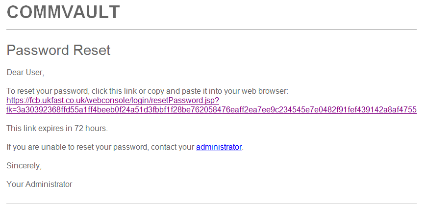

# General information / FAQs

## What is FASTcloudbackup?

FASTcloudbackup is a file and folder backup solution, based on Commvault technology.  It's designed to backup computers and servers running Linux, Windows and Mac.  For full details and pricing, visit [the UKFast website](https://www.ukfast.co.uk/fastcloudbackup.html)

## How does FASTcloudbackup work?

FASTcloudbackup works by installing an agent onto the computers and servers you wish to backup.  Once installed, you can configure and manage backups and restores through the [FASTcloudbackup web console](https://fcb.ukfast.co.uk)

## Where is my data stored once it's been backed up?

Data is backed up to the FASTcloudbackup platform hosted in our [Manchester-based data centres](https://www.ukfast.co.uk/our-datacentres.html).  We guarantee your data will never leave the UK.

## How is my data kept secure?

All data sent during the backup process is encrypted using the HTTPS protocol, meaning it's secure from the moment it leaves your computers and servers. You will need port 443 open on your firewall, so that the FASTcloudbackup agent can communicate with the backup servers hosted in our data centre.

Once your data reaches our FASTcloudbackup servers it's secured using AES-256 bit encryption – the standard used by companies and governments around the world to protect sensitive data. Our UK data centres are ISO27001 certified and PCI-DSS compliant.

## What is the data retention period?

28 days for all files backed up.

## How does billing work?

Billing for FASTcloudbackup is based on the amount of storage quota (in gigabytes) you purchase, plus the number of computers or servers you install the FASTcloudbackup agent on to.  Full pricing details are available on the [UKFast website](http://ukfast.co.uk/fastcloudbackup.html).

(a) Storage quota - this is billed monthly in advance, based on the total amount of gigabytes you have purchased across all end user accounts

(b) Per device charge - this is billed monthly in arrears, based on the total number of computers or servers the FASTcloudbackup agent has been installed on to.  Note that you will be billed even if a device is not currently being actively backed up - so if you no longer wish to backup a device then we suggest removing the FASTcloudbackup agent to avoid further charges.

## Why does the Reset Password email have a Commvault logo?

FASTcloudbackup is based upon Commvault software.  That's why in some parts of the web console or system emails, you may see references to Commvault.  It's nothing to worry about - you are still using FASTcloudbackup.



```eval_rst
   .. title:: General product information on FASTcloudbackup
   .. meta::
      :description: General product information on FASTcloudbackup | ANS Documentation
      :keywords: ukfast, FASTcloudbackup
```
