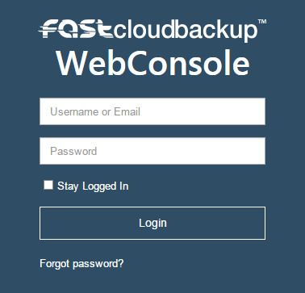

# Getting started

## Buying storage quota

Login to [MyUKFast](https://www.ukfast.co.uk/myukfast.html) and go to FASTcloudbackup, which is in the `Products & Services` drop down menu.

On this page you can choose how much storage quota you need.  You can have multiple FASTcloudbackup end user accounts within your overall MyUKFast account, and you purchase storage quota on a "per end user account" basis.  To get started, choose the amount of storage quota you want for your first end user account.  You can create more end user accounts, each with their own storage quota, later on.

Once you've chosen the storage quota you want, click `Buy` and go through the MyUKFast payment process.

## Creating an end user account

You will need at least one FASTcloudbackup end user account to login to the FASTcloudbackup web console and use the service.  Once you've purchased your storage quota, create a username and password for your end user account.

## Logging into the FASTcloudbackup web console

Click into your end user account and then click `Go to FASTcloudbackup web console`, or click [here](https://fcb.ukfast.co.uk).  Use the username and password you created previously to login to the web console



```eval_rst
   .. title:: Getting started with FASTcloudbackup
   .. meta::
      :description: Getting started with FASTcloudbackup | UKFast Documentation
      :keywords: ukfast, FASTcloudbackup
```
