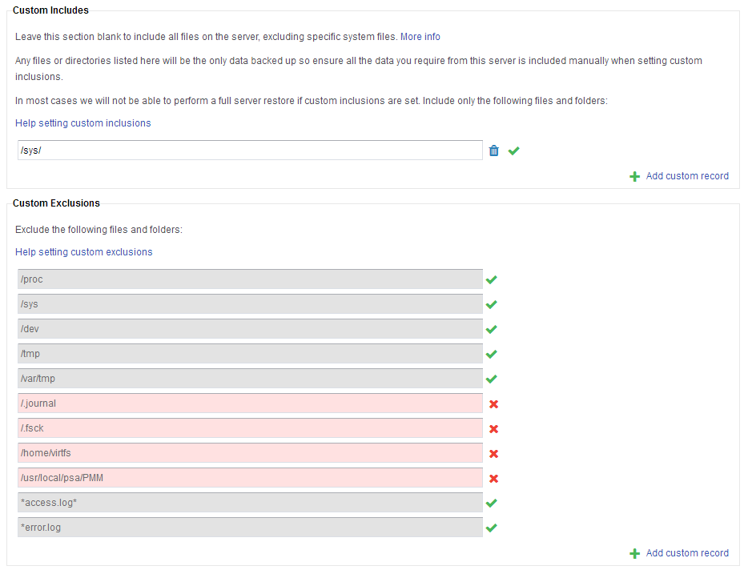

# Backup Schedules

Within the **Backup** tab of your server, navigate to **Backup Schedule** and select the blue pencil icon to modify.


## Schedule options

Backups are performed daily and retained for 7 days.


**Number of iterations** is the number of backups that are stored by your retention schedule. For example, retaining 7 iterations of a daily backup is a 7 day retention period. It is not currently possible to change the number of iterations or freqency.

**Manually Start Backup** schedules the backup to be executed as soon as possible by the server outside of the standard schedule.

```eval_rst
.. warning::
  Please note. a maximum of 7 backup iterations are retained, therefore your oldest backup will be lost when performing a manual backup.
```

**Backup Window** is a time period when the backup server will attempt to perform backups. This must be at least a 3 hour period to ensure that all backups can be queued and performed efficiently.

## Custom includes and excludes

Includes and excludes are directories, partial directories or wildcard file names that are explicitly included or excluded from your backup.

[Default includes and excludes](/dr-ha/ukfast_backup/getting_started.html#Default-includes-and-excludes) are setup automatically with your server and more rules can be added via MyUKFast. If you do not want any of the default exclusions to apply, you can overwrite the default exclusions by setting a custom inclusion. Using custom inclusions will imply that you want all of your backups to be custom and will therefore overwrite the defaults. 

## User defined includes and excludes

Navigate to the "custom includes/excludes section on the page and select `+ Add custom record` and follow the guidance below to create a rule."



Directories can be absolute like `C:/Users/WorkPC/Documents` or `/home/centos/documents` – this would backup the whole "Documents" folder. Wildcards can also be used `C:/Users/WorkPC/Documents/*.xlsx` or `/home/centos/documents/*.xlsx` – this would backup any `.xlsx` files in the "Documents" folder.
It is also possible to backup specific files from across the whole volume, for instance on linux systems `*.bin` would backup all `.bin` files from the volume, or `C:/*.docx` would backup all of the `*.bin` files on the C drive.

**Save** saves the current editable options on the screen.

```eval_rst
  .. title:: UKFast Backup schedules
  .. meta::
     :title: UKFast Backup schedules  | UKFast Documentation
     :description: Managing backup schedule, inclusions and exclusions
     :keywords: ukfast, backup, files, folders, recovery
```
