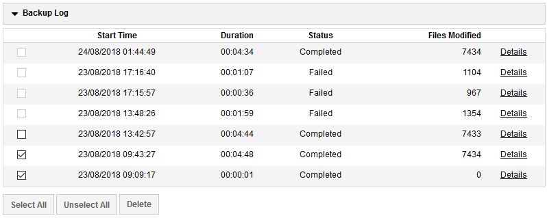
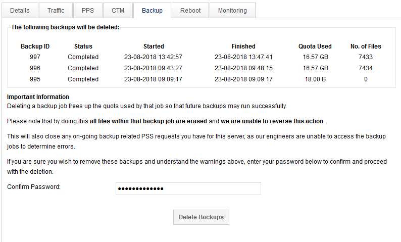

# Deleting Backups

Within the **Backup** tab of your server, expand the **Backup Log** section.

## Selecting backups



Backups are handled by moving all data forwards to the latest backup and only removing file versions that are out of the retention period (reverse-incremental backups).

To delete backups, check the boxes to the left of each backup starting from oldest to youngest and selecting `Delete`, this will take you to the confirmation screen before deleting. It is not possible to delete backups out of this sequence as this would break the data reference links within the older backups.

## Confirming deletion



At this stage you are required to re-enter your password and select `Delete Backups` button to initiate deletion. The server will start removing backups asap starting the oldest ones first. This process cannot be stopped and will vary from a few seconds to several minutes depending on the backup size.

Backups will show `Pending Deletion` in the backup log whilst this process takes place.

```eval_rst
  .. title:: Deleting Backups 
  .. meta::
     :title: Deleting Backups  | UKFast Documentation
     :description: Deleting backups using MyUKFast with UKFast Backup
     :keywords: ukfast, backup, files, folders, recovery
