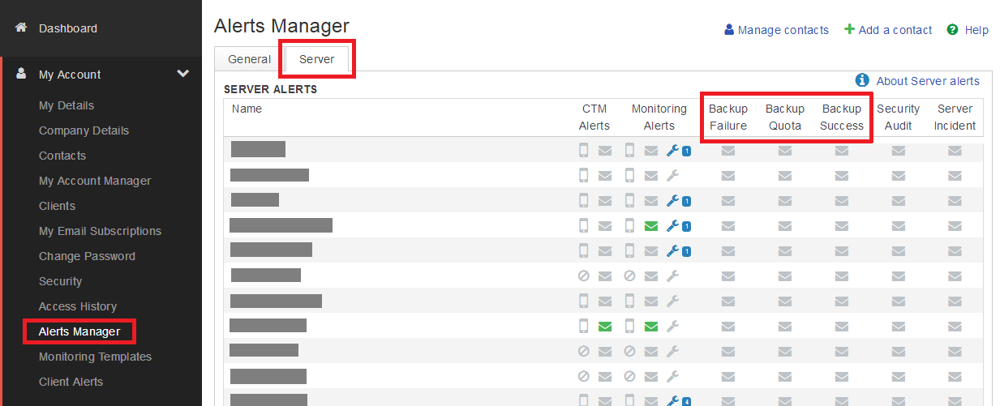
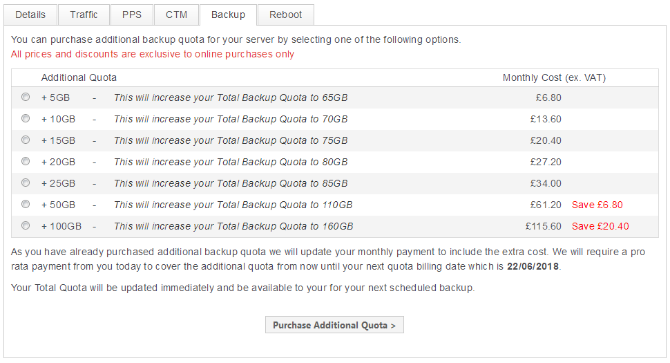

# Frequently Asked Questions

## How do I configure alerts for UKFast Backup?
Alerts can be set up in the event of a backup failure, backup quota is reached or backup is successful.



You can set up and confiure alerts for UKFast Backup within MyUKFast. To do this, open the `My Account` menu and select `Alerts Manager`. Within this window, select the `Server` tab and activate email alerts for the contacts you require.

## How do I purchase additional quota for UKFast Backup?

Additional quota can be purchased by contacting your Account Manager or through MyUKFast.



Navigate to your server backup control panel within MyUKFast and select `Purchase Additional Quota >` at the top of the page. This will take you to a screen where you can select the amount of additional quota you require (up to a maximum of 300GB) and allow you to complete the purchase online.

```eval_rst
  .. title:: UKFast Backup frequently asked questions
  .. meta::
     :title: UKFast Backup frequently asked questions | UKFast Documentation
     :description: Managing backup schedule, inclusions and exclusions
     :keywords: ukfast, backup, files, folders, recovery
```
