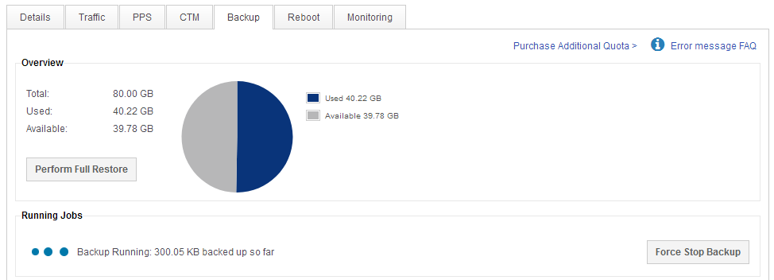

# Getting Started

UKFast Backup can be managed by selecting the server you want to manage within [MyUKFast](https://www.ukfast.co.uk/myukfast.html) and selecting "Backup" from the tab menu.



**Overview** provides information on your total, used and available backup quota and provides quick access to perform a full restore.

**Running jobs** is only visible when a backup or restore job is currently being processed.

```eval_rst
.. warning::
  Please note that Windows backups must wait for a system state to run on the client before files will begin to process, this often takes up to 20 minutes.
```

## Default includes and excludes

UKFast Backup comes pre-configured with a default backup schedule which includes all data from mounted disks and excludes certain files including:

* Linux includes
  * `/`


* Linux excludes
  * `/proc`
  * `/sys`
  * `/tmp`
  * `/.journal`
  * `/.fsck`
  * `/var/tmp`
  * `/home/*/.trash`
  * `/home/*/tmp`
  * `/home/*/logs`
  * `/home/*/wp-content/updraft`
  * `/var/www/vhosts/*/wp-content/updraft`
  * `/usr/local/psa/PMM`
  * `/home/virtfs`
  * `/var/McAfee/agent/logs`
  * `/var/cpanel/modsec/modsec.sqlite`
  * `/var/lib/clamav/daily.cld`
  * `/var/crash`
  * `/var/log/journal`
  * `/var/log/atop`
  * `/var/cache`
  * `/backup`
  * `/var/lib/psa/dumps`
  * `/var/cpanel/php/sessions`
  * `/var/lib/php/session/`
  * `/var/lib/mysql/*.bin`
  * `/var/www/vhosts/*/logs`
  * `/home/*/.cache`
  * `/home/*/cache`
  * `/var/www/*/.cache`
  * `/var/www/*/cache`
  * `/home/*/var/log`
  * `/var/www/*/var/log`
  * `/home/*/var/session`
  * `/var/www/*/var/session`
  * `/home/*/backup-*`


* Windows includes
  * `[A-Z]:/`


* Windows excludes
  * `[A-Z]:/System Volume Information`
  * `[A-Z]:/$recycle bin`
  * `hiberfil`
  * `[A-Z]:/pagefile.sys`
  * `[A-Z]:/Windows/Temp`
  * `[A-Z]:/Windows/Installer`

You can create additional rules within the [backup schedule](/dr-ha/ukfast_backup/backup_schedule).

```eval_rst
  .. title:: Getting started with UKFast Backup
  .. meta::
     :title: Getting started with UKFast Backup | UKFast Documentation
     :description: Managing UKFast Backup through MyUKFast
     :keywords: ukfast, backup, files, folders, recovery
