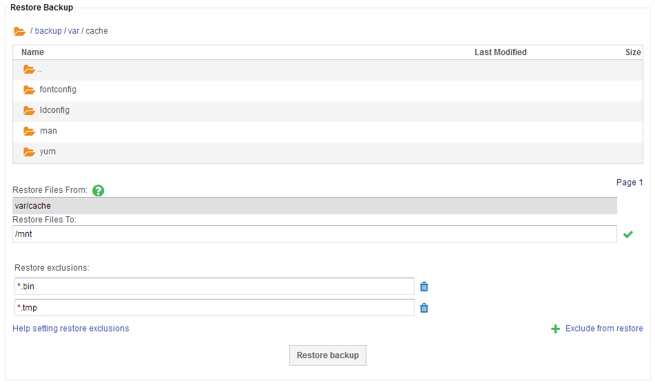

# Restoring Files

## Full Restore

Full restores will restore all files within a backup to a specified folder, and are initiated directly from the **Overview** section in the **Backup** tab.


First select **Perform Full Restore** and select the restore point from the drop down menu. Second, fill in the location on your server that you want your files to be restored to. A green tick will be displayed next to the file path when the backup server is able to verify that the location exists on the client server. If a red cross is shown, please verify that the path exists on your server.

## Partial Restore

Partial restores allow you to select a specific file or folder from a backup and restore to a specified folder. Navigate to the backup from which you need to restore files within the **Backup Log** and select **Details**.



Using the file browser, navigate to the file or folder you would like to restore, this automatically populates the **Restore Files From** path. Then fill in the **Restore Files To** location that you want your files to be restored to. A green tick will be displayed next to the file path when the backup server is able to verify that the location exists on the client server. If a red cross is shown, please verify that the path exists on your server.

**Restore Exclusions** allow you to exclude files or folders from a restore which is particularly useful when restoring a backup that has many redundant files scattered across. In this example any file name with an extension of `.bin` or `.tmp` would be excluded from the restore.

```eval_rst
  .. title:: Restoring files with UKFast Backup
  .. meta::
     :title: Restoring files with UKFast Backup | ANS Documentation
     :description: Restoring files with UKFast Backup through MyUKFast
     :keywords: ukfast, backup, files, folders, recovery
