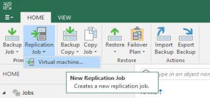
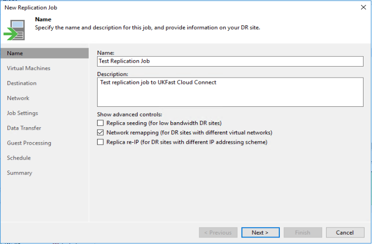
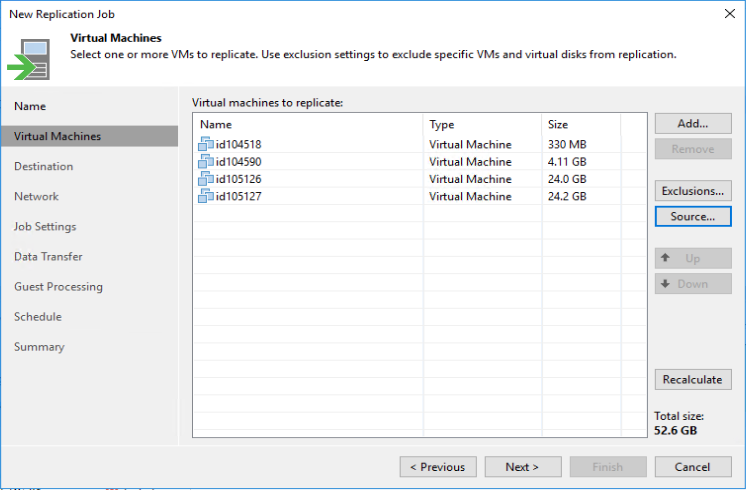
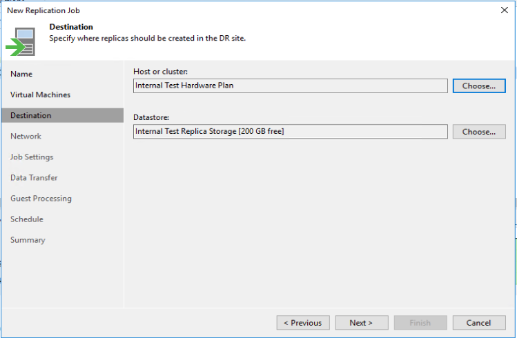
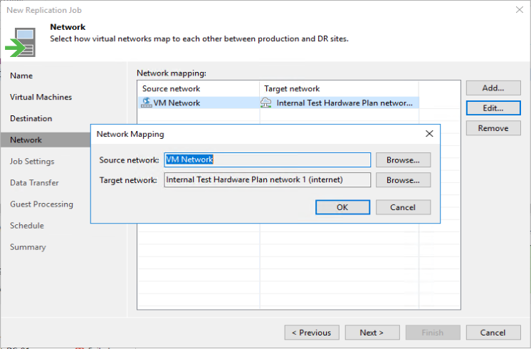
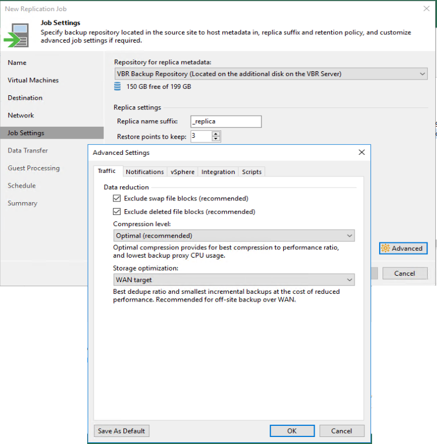
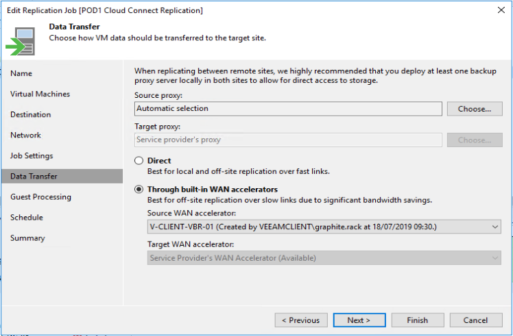
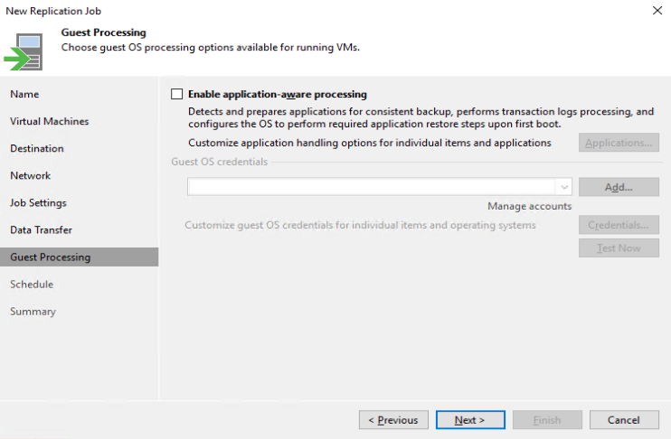
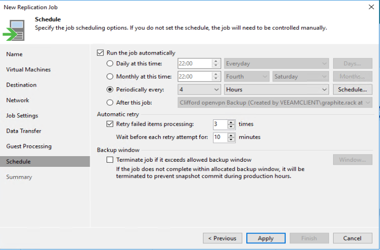

# Configuring a replication job

Before configuring your replication job please ensure that you have read through this document: [Veeam Replication Jobs](veeam_replication_jobs.md)

## Creating the Job
1. Open **Veeam Backup & Replication Console** and connect to your Veeam Server
2. Navigate to **Home**
3. On the top bar, select **Replication Job** > **Virtual Machine**

### Name
1. Enter a name for the replication job and a description if needed (recommend something that is easy to reference which VMs are going to be in the job)
    1. **Replica seeding** - this is used if there has been a copy of your backups shipped to us and uploaded on to our Veeam Environment. 
    2. **Network remapping** - **(enable)** this is used to map the internal networks on your current VMs to the internal networks UKFast have provided to you. 
    3. **Replica re-IP** - **(do not enable)** - this is used when you DR sites use different internal networks as your production. This is not required when replicating to UKFast, as you will keep your current internal IPs.

### Virtual Machines
1. **Add** - select the VMs that you would like to replicate in this job 
    1. **Exclusions** - you have the option to exclude specific disks on VMs from being replicated. You may want to do this if you want to save your Cloud Connect storage and there is a none critical data disk that won't be needed in the event of a DR situation.
    2. **Source** - you can choose to obtain the replication data from a Veeam backup rather than taking it directly from a Snapshot on the VM. This is useful if you want to limit the snapshots on a VM and there aren't strict RPO requirements. **This will only replicate data from the latest backup, so enable with caution.**

### Destination
1. Under "Host or cluster" select "Choose" > "Cloud host" > select the UKFast Service Provider (it will be called our external DNS name with your login name after in brackets) > Click "OK"
2. Under "Datastore" ensure that your datastore is select. If you have multiple, select the relevant one.

### Network
<blockquote>
Section to create network mappings. When you create a mapping all VMs on the "Source Network" at your site will be connected to the "Target Network" at UKFast. You should have a dedicated target network for each of the source networks, which you are replicating VMs from.
</blockquote>

1. Select "Add" to create a network mapping > select the "Source network" and "Target network"

### Job Settings
1. **Repository for replica metadata** - select a local repository for replica metadata. You will need on average 128MB of storage for every 1TB replicated, but this could vary.
2. **Replica name suffix** - this is what shows up within our VMware environment, so recommend that it is left as the default "_replica"
3. **Restore points to keep** - this specifies the amount of restore points that will be available when performing a fail over; the maximum number possible 28. The time difference between each restore point will be the time between is defined by the schedule that is chosen in a later step (i.e. if you choose an hourly replication with 7 restore points, you will have 7 hours worth of restore points, each an hour apart. Depending on the amount of data change inbetween each restore point these have the potential to take up a considerable amount of space due to them being store in a VMware snapshot.

4. **Advanced**
    1. **Storage optimization** - this setting needs changing to "WAN Target" to ensure the replication jobs get the best performance when replicating over the internet to UKFast
    2. **Guess quiescence** - on the "vsphere" page there is an option "Enable VMware Tools quiescence", which is disabled by default. It is recommended to leave this as disabled due to the potential impact caused when the VM is stunned unless you definitely need it enabled.

### Data Transfer
<blockquote>
Section to configure WAN Accelerators, these are only beneficial to use when you have a very slow network upload speed of lower than 60Mb/s. If you have not purchased a WAN Accelerator from UKFast, you only need to complete step 1 ("Source Proxy"). You cannot configure one at your side if it hasn't been enabled on the service providers end.

Sizing information for WAN Accelerators can be found on Veeams Website - [WAN Accellerator Sizing](https://helpcenter.veeam.com/docs/backup/vsphere/wan_accelerator_sizing.html?ver=100). We generally recommend a starting point of the following:  
* Hard disk size - 10% of total data that requires replicating
* 4 CPUs
* 16GB RAM
</blockquote>

1. **Source proxy** - we would generally recommend this is left as the default "Automatic Selection" unless you have any specific requirements.
2. **Through built-in WAN accelerators** - if you have purchased a WAN Accelerator from UKFast, select this option. 
    1. **Source WAN accelerator** - select the WAN Accelerator at your site to be used for this replication job. It's recommended the WAN Accelerator is set up as a seperate Virtual Machine and not installed on the Veeam Backup and Replication Server.
    2. **Target WAN accelerator** - select the WAN Accelerator at UKFasts' site to be used for this replication job.

    

### Guest Processing
1. **Enable application-aware processing** - you should consider enabling this option on certain VMs to assist in creating consistent backups for the likes for Exchange, Database VMs or AD. You will need to provide Guest OS administrator credentials in order for this to work successfully.

### Schedule
<blockquote>
If you are running the replication as a one time job you can skip past this page.
</blockquote>

1. **Run the job automatically** - You can schedule the job to run Daily, Monthly or periodically specifying Minutes or Hours. You also have the option to select the job only to run on certain Days, Months or at certain times if using the periodically option.
2. **Automatic retry** - we find the default settings here usually suffice, but have the option to change this if you have a specific need
3. **Terminate job if it exceeds allowed backup window** - caution should be applied before enabling this option, as it could result in a backup that wasn't necessarily going to fail being cancelled early

