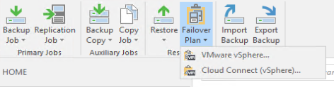
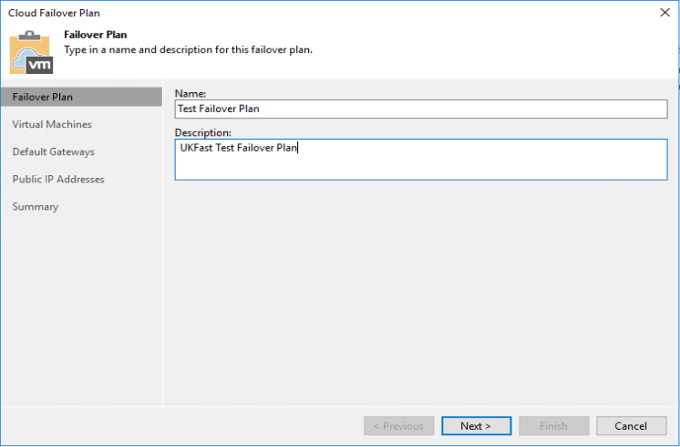
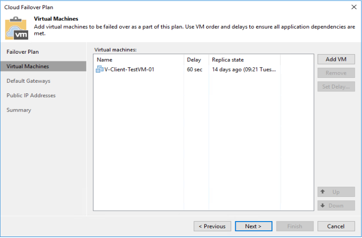
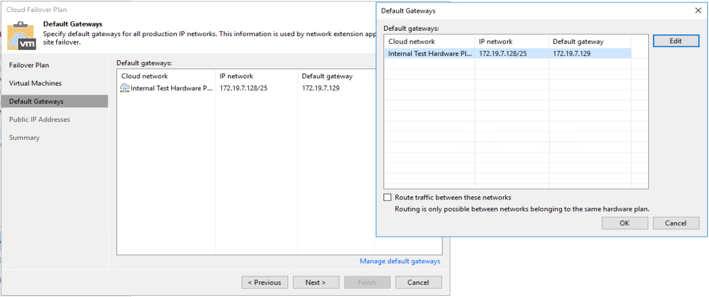
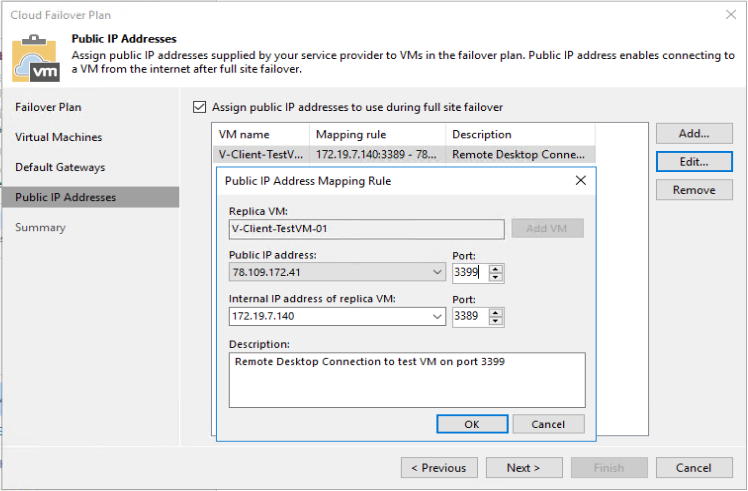

# Creating a Failover Plan

A Failover Plan defines the VMs to failover, internal networking at UKFast and your NATs for your external IPs. These should be created straight after you have configured and run your replications, so they are ready to be used in the event of a DR situation. Once your site goes down you will not be able to create or modify you failover plans.

We generally recommend you have one Failover Plan that has all of your VMs in, so that it is as simple as possible to failover in the event of a DR scenario. That said, there is no reason why you can have multile. You may want to split your business critical VMs in to one failover plan, which you can fail over first and then a second with the less critical VMs, which can be failed over once the first is up and runing. The main thing to be aware of if you decide to use multiple Failover Plans is that you can only use an external IP in one plan (it can be used multiple times in that one plan to create different network mappings).

## Creating the Failover Plan
1. Open "Veeam Backup & Replication Console" and connect to your Veeam Server
2. Navigate to "Home"
3. On the top bar, select "Failover Plan" > "Cloud Connect (vSphere)..."



### Failover Plan
1. Pick a name and a description for the failover plan. If creating multiple, it's critical that the name and description are absolutely clear to what they are, so there is no question when you or UKFast come to perform a failover.



### Virtual Machines

1. **Add VM** - after clicking this you will see a list of your replication jobs, you can choose to either select a replication job as a whole or expand it and pick inidividual VMs underneith
2. **Set delay...** - you have the ability to select boot delays for each of your VMs. There are multiple reasons why you may do this, such as ensuring your Domain Controllers come up before the rest of your Servers or your Database servers coming up before your Application Servers. You may also want to put a long delay on your none business critical VMs, so you can ensure that your business critical VMs come online first.
    * You will need to use the **Up** & **Down** buttons in the bottom right to change the boot order



### Default gateways

1. **Manage default gateways** - here you need to specify the default gateways for each of the Internal networks that have been provided to you by UKFast. The default gateway should be the same as what is configured on the VMs that map to it at your site; this IP will then be assigned to the NEA Appliance at UKFast, which will do any routing after a failover. You will have created the network mappings to these networks when configuring your replication jobs. 
    * **Route traffic between these networks** - if you need VMs on seperate networks to be able to communicate with each other you will need to tick this box.




### Public IP Addresses

```
This is he section where you will create the network mappings for the public IP address UKFast has assigned to you. 

You can use the same External IP multiple times for the same or different VMs providing you use a different source port. 
```
1. **Assign public IP addresses to use during full site failover** - if you need to assign public IPs to any VMs, you need to tick this box.
    * **Add...** - select this to create a new mapping rule. You have to create each mapping individually, but you can create multiple one after another while configuring the Failover Plan. You can also come back at a later date to add/modify/remove them.s
        1. **Replica VM** - this will bring up a list of all VMs that you have selected to be included in your failover plan. You should select the VM that you want to set a rule up for.
        2. **Public IP Address:** - this is a drop down of all External IPs that UKFast has assigned to you. You need to pick one of the external IPs and a source port, which will be presented externally.
        3. **Internal IP address of replica VM** - this is a list of all internal IPs that are assigned to the VM you have select for this mapping rule. You will need select the internal port that you need to the source port to be mapped to.
        4. **Description** - finally, we recommend you add a description that is fairly clear to understand in the event of a DR Scenario.



