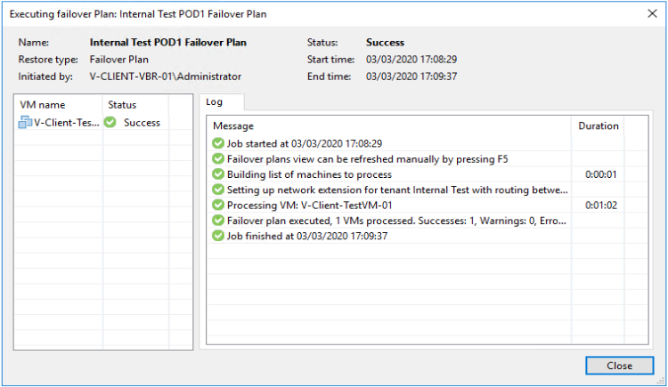
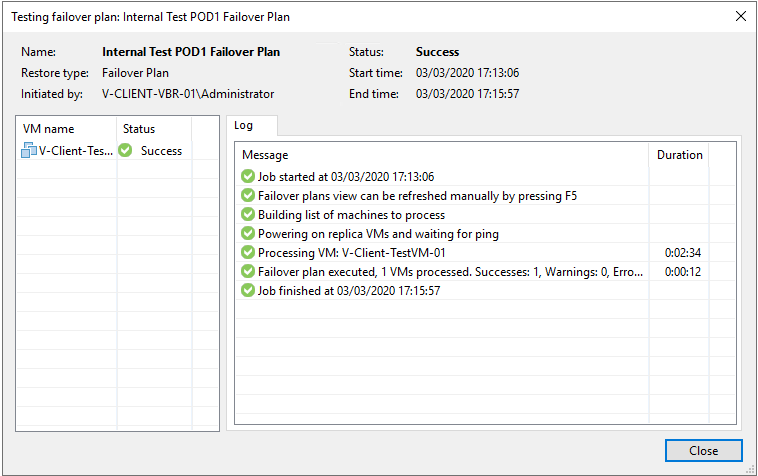
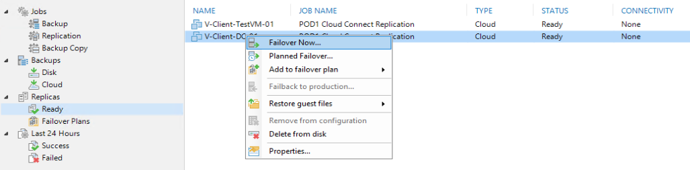
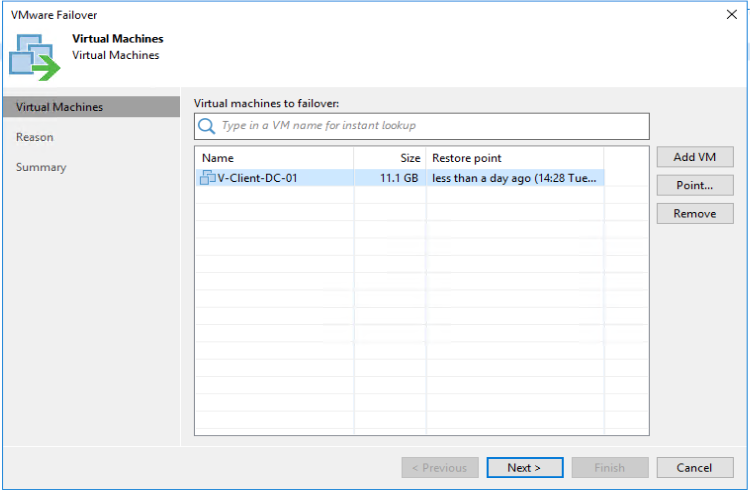

# Veeam Failovers

This guide will go through the different Failover types within Veeam and how to perform each of them.

If you are currently in a DR Situation and need to perform a failover, please navigate to this section of the document [Performing Full Failovers](### In the event of an emergency)

## Full Failovers
Full failovers are perform using the a Failover Plan which you will have created yourself. How to create a Failover Plan can be found here - [How to create a failover plan](creating_a_failover_plan.md)

This is the failover type that you will use in the event of a DR Scenario where you have lost access to your production site. When performing a failover using a Failover plan it uses the NEA Appliance at UKFast to configure the External IP NAT's that you set up in the mapping section of the failover plan configuration. It **does not** set up the layer 2 VPN connection; this is only able to be do using Partial Failovers which I will speak about further down.
s
You have the ability to initiate these failovers from within your Veeam Backup and Replication console or via your MyUKFast portal should you not have access to your production site. You also have the option to call UKFast support who can initiate the failover for you.

## Partial Failovers

Partial failovers are used to failover individual VMs at a time. You will only use this type of failover in the event that your production site is still up and running. It will use both the NEA Appliance on your production infrastructure and UKFast's Infrastructure to create a Layer 2 VPN tunnel between the sites along with a ProxyARP solutions enabling VMs to communicate as if they were still in the same Layer 2 network. More information on this can be found here - [NEA Appliance - Partial Failovers](https://helpcenter.veeam.com/docs/backup/cloud/cloud_connect_partial_site_failover.html?ver=100)

## Performing Full Failovers

### In the event of an emergency 

`**TBC**`

Log in to MyUKFast and perform the failover or contact UKFast to perform it for you.

#### Undoing the failover

`???`

### Test Failover while production is still online 

The most likely reason you would do this is to simulate a real DR situation and bring your VMs online in DR. You have the ability to do this without affecting you live VMs in production. The VMs will be powered up on UKFasts Infrastucture and the NEA Appliance will configure the NAT's specified in the Failover Plan. Production will not be able to communicate with DR, but you will be able to access your VMs by the NAT's you configured with the external IPs.

1. Open "Veeam Backup & Replication Console" and connect to your Veeam Server
2. Navigate to **Home** > **Replicas** > **Failover Plans**

When you right click you have three options to select, **Start**, **Start to** and **Test**.

#### Start

1. This option will start a failover immediately without giving any diagalogue box with further warnings. It will open up a window giving you a break down and progress of the failover process; if there are any errors they will be shown here. You can press F5 to refresh this box manually.

2. Once complete all of the VMs along the left handside should show a status of success and you should also see "Success" in the top right. If you were to test the external IPs you set the NAT rules up with you should now be able to access them.

3. Once you are finished and you want to roll everything back you need to **right click the Failover Plan** > **Undo**

#### Start To
This is the exact same process as **Start** above; however, you can choose to bring up all VMs using the closest restore point before your chosen time and date. 

#### Test
This does the same process as **Start**; however, once it has confirmed the VMs and NEA Appliance has powered on, along with testing the network connectivity of the NEA Appliances it roles back the changes immediately. This is good quick way to test your failovers plans, but if you want to actually confirm access to your VMs yourself you will need to use one of the above two options.

## Performing Partial Failovers

Partial failovers are done on a VM by VM basis, but you do have the ability to have multiple VMs failovers at the same time.

1. Open "Veeam Backup & Replication Console" and connect to your Veeam Server
2. Navigate to **Home** > **Replicas** > **Ready**

When you right click you have two options to select which will perform a partial failover, **Start Now** and **Planned Failover**. The crucial difference between these is that **Start Now** will bring the VMs online in DR using a restore point that has already been replicated. **Planned Failover** will perform two incremental replication passes (one online and then one offline) before bringing the VM online in DR; this can take some time depending on the amount of data change and your bandwidth.

#### Failover Now
1. Right click the VM you would like to perform a Partial Failover on and select **Failover Now**
    1. **Add VM** - once you have started the failover wizard you have the ability to add more VMs that you would like failover
    2. **Point** - you can choose to select an older restore point rather than using the most recently available. You may want to do this if you have an issue with the VM in production and need to get it back online as soon as possible
2. **Reason** - add a reason for the failover
3. Your VMs in production should now be able to communicate with the VMs you have failed over on to the UKFast infrastructure
4. **Reverting the Failover**
    * **Undo Failover** - this option will revert the failover, but you will loose any changes made on the VM running on UKFast's infrastructure
    * **Failback to production** - this option will set up a reverse replication, so any changes you have made in DR will be replicated to DR.
        * `more info on failbacks needs adding`

