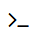

# eCloud VM Console

This console allows you to access your VM as if you were directly connected to the server. It's a very powerful troubleshooting tool, and also a good safety net when making configuration changes.

For example, if you are changing network or firewall settings and accidentally lock out your network connection, console access will let you log in and fix it. In another example, if your VM has crashed, console access may show some helpful error messages which can help us find the root cause.

In order to access the VM console for your VMs, please browse to the list of your VMs, and find the button below:

 

 For Public VM clients, that button can be found (highlighted in green in this screenshot) here:

   

For Private and Hybrid VM clients, that button can be found (highlighted in green in this screenshot) here:

  

## Logging Out - Best Practice

It is strongly recommended to log out when you are finished with the VM. This console allows you to log in to the VM directly from the ANS Portal. As such, all contacts authorised to view your VMs will also be able to see the console. In the case of resellers, or those with non-technical contacts, logging out after use will prevent unauthorised access to the VMs via the console.

```eval_rst
   .. title:: eCloud VM Console
   .. meta::
      :description: VM console access for eCloud VMs on public and private plans
      :keywords: ukfast, cloud, ecloud, console, public, hosting, infrastructure, vmware, powercycle, reboot
```
