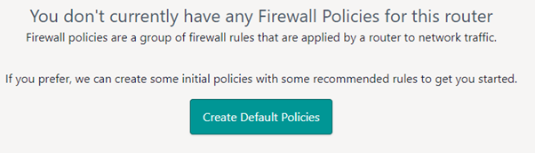
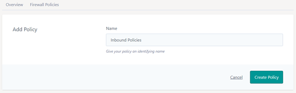
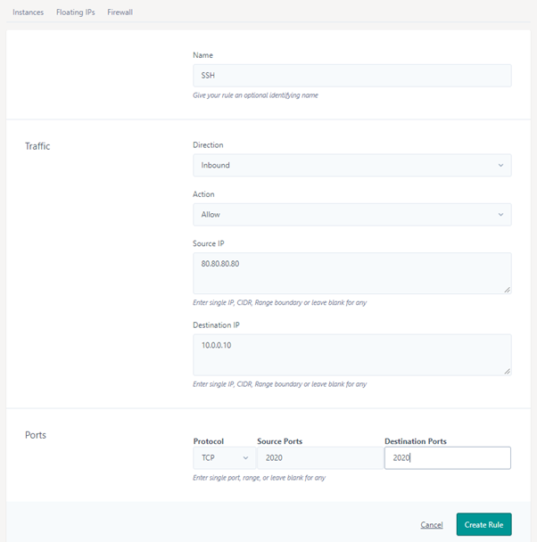
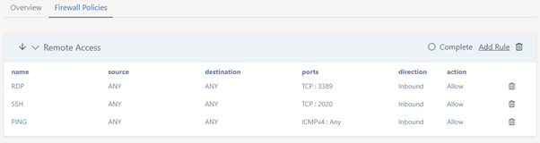
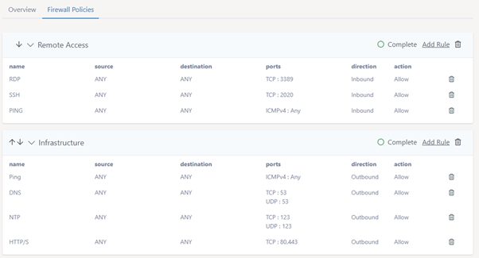

# Firewall Policies (North-South Firewalling)
See Network Policies for East-West Firewalling (between network segments).

This section relates to the policies and rules for north-south firewall traffic (e.g. from the router to some other destination such as the internet or another router within eCloud VPC)

### How Firewall Policies work
Firewall policies are applied on the router, the policies are applied in order from the top down and the rules within the policies in the order they appear too (top down also). Each rule is checked and once a rule is found to match the criteria, this rule is applied with no further checks being carried out. If none of the rules' criteria is matched then the default 'drop' rule is applied to the packet.

If you have advanced networking, you may also need to add the corresponding rules in the network policy section (which are applied at the NIC level of the Instance rather than at the router like here).

### Creating your Firewall Policies

To get started, you need to create a policy within the router you wish the rules to be applied to. Note that in most cases users would have default rules created for them on VPC creation, if you did not then you still have the option when there are no policies created:



### Create a policy - set the name for your first policy and hit the create button.


 
### Add some rules to your policy

Set the details of your rule, at the minute you cannot reorder rules so you need to add them in the order in which they are to be checked, or alternatively add 1 rule per policy and then you can reorder everything using the policies.





Add further policies & rules as you need.



### Ordering of firewall rules
Press the up or down arrows on the left hand side of the policy name to change the order in which the policies are applied.

```eval_rst
   .. title:: Firewall Policies
   .. meta::
      :title: Firewall Policies | UKFast Documentation
      :description: Managing your firewall policies and rules
      :keywords: ecloud, ecloud VPC, MyUKFast, VPC, Virtual Private Cloud, Instances, Firewall
```
