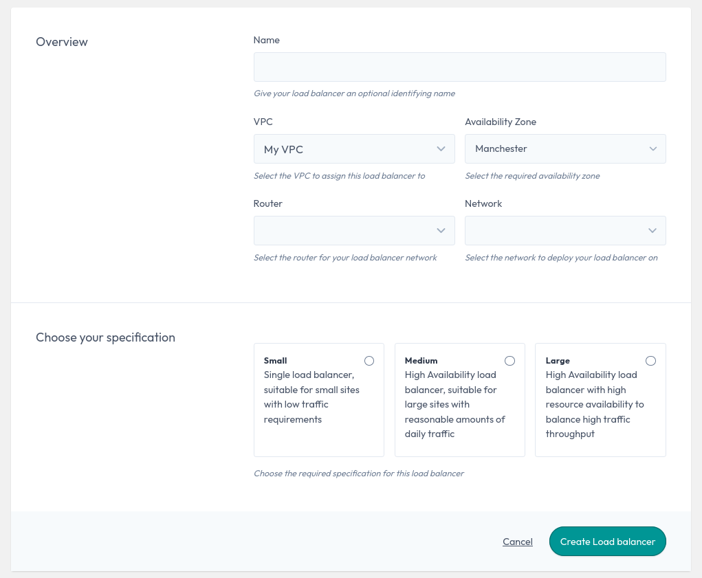
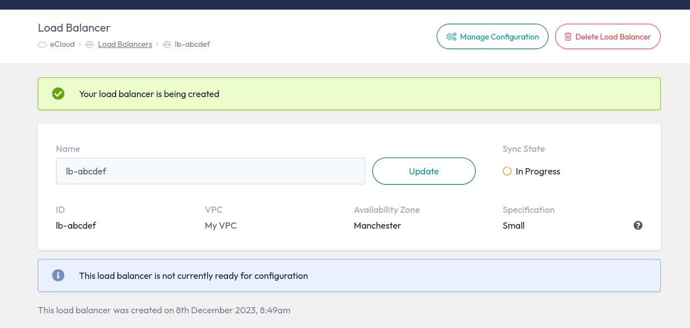

# Load Balancers

A load balancer is a device that distributes network or application traffic across a number of servers to increase
capacity, reliability, and reduce latency


### How do Load balancers work

Load balancers are deployed onto your chosen network providing access to other instances within your VPC.

Available in 3 specification to suit your use case, from small sites with low traffic requirements up to large
applications with high traffic throughput.


### Creating a Load balancer

On your ANS Portal you will find your load balancers listed under the Networking section of the main navigation bar.

From the load balancer resource screen, click the `Create Load balancer` button, where you can now create your
load balancer using our deployment screen.

It is recommended that you give your load balancer an identifying name, you can now configure where you load balancer
is intended to deploy to, and choose the specification size for your use case.



When ready, click the `Create Load balancer` button to start the deployment. You will then be redirected to the
overview screen for your new load balancer.



When the infrastructure is deployed, you will then be able to manage the configuration of your load balancer.
More information on how to configure a load balancer is available in our
[Getting started](/network/load-balancers/getting-started/) guide


### Managing your Load balancer

eCloud Load balancers are managed from two locations, the infrastructure itself is managed from the eCloud VPC section
of the Portal, but the management of the load balancer itself, is done via the
[Load balancer Management](/network/load-balancers/index) screens.


### Deleting a Load balancer

On your ANS Portal select the load balancer you wish to delete and browse to the overview screen.

Before you can delete the infrastructure, you will need to ensure all dependent resources have been removed, this
includes any Virtual IPs configured and that no production traffic is pointed at the load balancer.

Once dependent resources are removed, you can click the `Delete Load balancer` button to trigger the removal process.


```eval_rst
   .. title:: Load Balancers
   .. meta::
      :title: Load Balancers | ANS Documentation
      :description: Managing Load balancers
      :keywords: ecloud, ecloud VPC, ANS Portal, VPC, Virtual Private Cloud, Load Balancers
```
