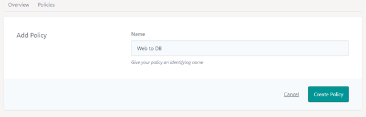
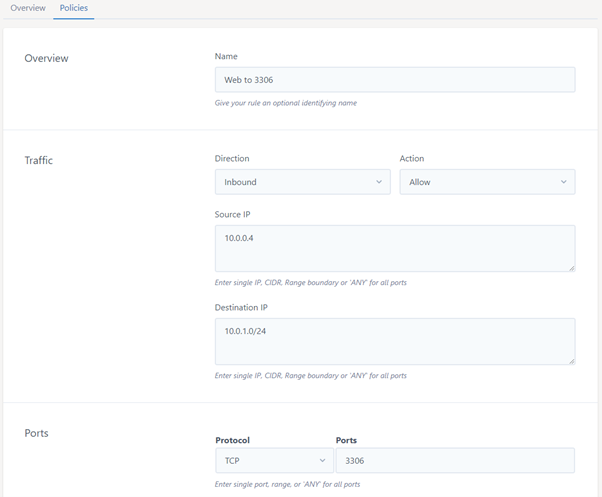

# Network Policies (East-West Firewalling)
Network policies are the rules controlling traffic between network segments/blocks e.g. between your WEB 10.0.0.0/24 and your DB 10.0.1.0/24 CIDRs

### How do the Network Policies work
Network policies are applied to the NIC of the instance, if a rule is met it is applied, if there is no match then the packet is dropped, so if you are using advanced networking you need to explicitly apply rules between network segments to allow inter network communication
Network policies are only available to VPCs that have been created with the 'Advanced Networking' feature enabled, unfortunately this cannot currently be retrospectively be enabled.
Note that you may also need to add the corresponding rules in the Firewall Policies section (which are applied on the router rather than at the Instance NIC like here).

### Creating a Network Policy
This section is exactly the same for Network Policies as Firewall policies;

Add a Policy



Add rules to the policy



### Ordering the Network Rules
Press the up or down arrows on the left hand side of the rule name to change the order in which the rules are applied.

### Deleting Network Policies
Use the trash can to delete the rules


```eval_rst
   .. title:: Network Policies
   .. meta::
      :title: Network Policies | ANS Documentation
      :description: Managing your Network policies and rules
      :keywords: ecloud, ecloud VPC, ANS Portal, VPC, Virtual Private Cloud, Firewall, Network Policies
```
