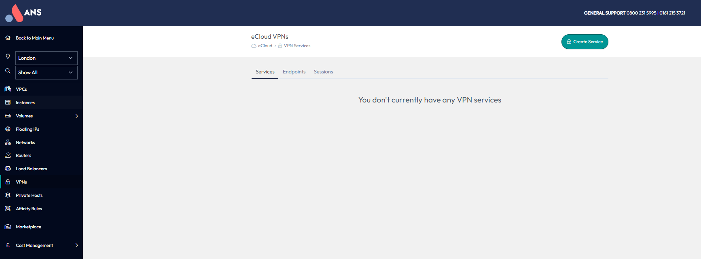
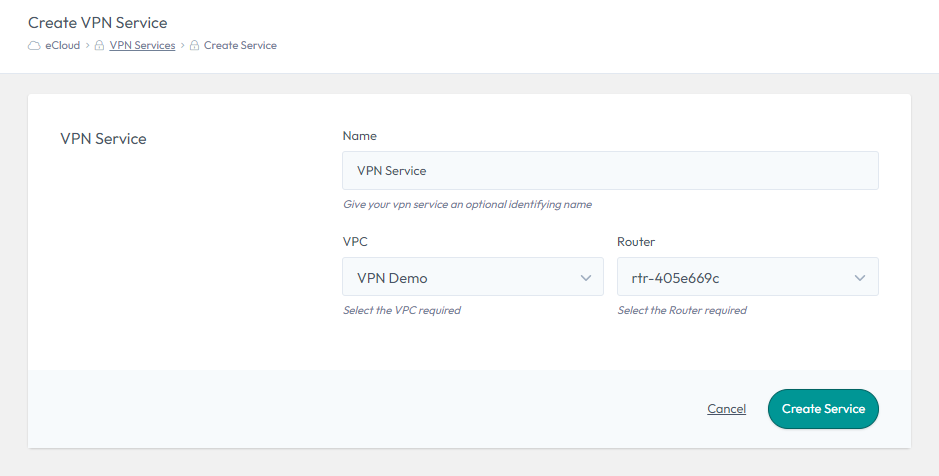
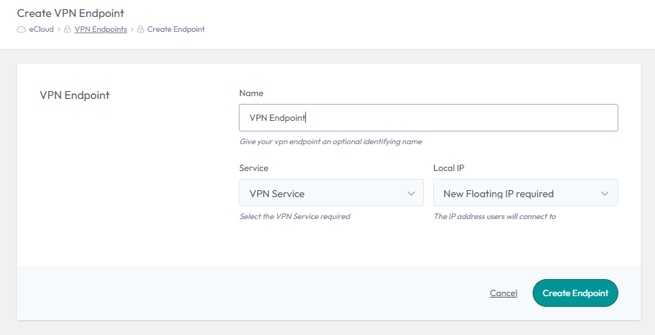
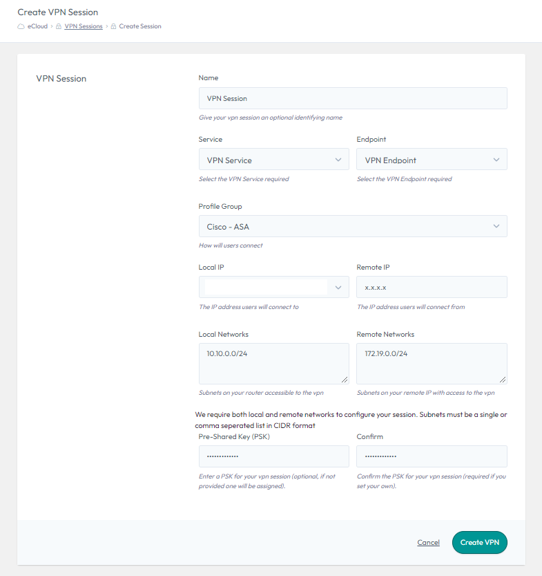

# eCloud VPC VPNs

In eCloud VPC you have the ability to set up Site-to-Site IPSec VPNs. These can be used to enable connectivity from external networking devices or between different eCloud VPC Routers.

VPNs can be set up between eCloud VPC Routers which are in the same or different AZ/Region.


## How to setup a VPN

Select the region you want to create the VPN in using the dropdown on the left hand menu and navigate to the VPNs section also on the left hand menu.



VPNs in eCloud VPC consist of three different parts, a VPN Service, Endpoint and Session. These are explained in more detail in the below sections.

### Services

A VPN Service has a one-to-one mapping with a Router in eCloud VPC. This means if you want to have a VPN to two different eCloud VPC Routers, you will need to create a separate VPN Service for each of them.

To create, select "Create Service", choose a name, select the relevant VPN and Router, then select "Create Service".



### Endpoints

A VPN Endpoint is where the IPSec VPN will terminate at the eCloud VPC side. A VPN Endpoint has a One-to-One mapping with a VPN Service, but you can have multiple Endpoints mapped to the same Service.

A VPN Endpoint is also where the FIP (external IP) is assigned.

To create, select "Create Endpoint", choose a name and select the VPN Service you would like this Endpoint to be mapped to. You then have the option to choose either an existing Floating IP (external IP) or request a new one. Finally, select "Create Endpoint" to create the VPN Endpoint (this could take a few minutes to complete).



### Sessions

A VPN Session has to map to a specific VPN Endpoint and the associated Service. This is the object which will contain all of the configuration required to set up the VPN tunnel on the eCloud VPC side.

To create, select "Create Session", choose a name and then select the VPN Service and Endpoint you would like this Session to use.

The Profile Group defines what encryption settings are applied, such as the Ciphers. It is critical that the profile used in eCloud VPC matches the configuration of the remote device or the tunnel will not establish. We have a range of generic profiles which are detailed [here](vpn.md#profile-groups).

The Local IP (external) will automatically be selected, as it is defined in the Endpoint you will have already created.

The "Remote IP" will be the external IP of the device you are setting up a VPN connection to. This will either be an external device or the external IP of a different eCloud VPC Endpoint.

The "Local Networks" are the local eCloud VPC internal IPs and/or Subnets, which you would like to be part of this VPN Tunnel. These can only include IPs or Subnets, which are defined on networks associated with the Router the Service is linked to. It is critical that these match the configuration on the remote device.

The "Remote Networks" are the internal IPs and/or Subnets from the remote site, which you would like to be part of this VPN Tunnel. It is critical that these match the configuration on the remote device.

A "Pre-Shared Key (PSK)" needs to be defined, which will need to match the PSK on the remote device.




#### Profile Groups

There have been a range of VPN Profiles created, which have various levels of encryption settings. Details of these can be seen in the following table. If you need any advise on which VPN profiles to use, please get in touch with our support team.

| Profile Name        | IKE Version | Phase 1 - Encryption | Phase 1 - Integrity | Phase 1 - DH Group | Phase 1 - PRF | Phase 1 - SA Lifetime | Phase 2 - Encryption | Phase 2 - Integrity | Phase 2 - SA Lifetime | Phase 2 - PFS |
|---------------------|-------------|----------------------|---------------------|--------------------|---------------|-----------------------|----------------------|---------------------|-----------------------|---------------|
| IKEv1 Weak          | IKEv1       | AES-128              | SHA-1               | 2                  | -             | 86400                 | AES-128              | SHA-1               | 28800                 | No            |
| IKEv1 Medium        | IKEv1       | AES-256              | SHA-256             | 5                  | -             | 28800                 | AES-256              | SHA-1               | 3600                  | 5             |
| IKEv2 Medium        | IKEv2       | AES-256              | SHA-256             | 14                 | SHA-256       | 86400                 | AES-256              | SHA-256             | 28800                 | 14            |
| IKEv2 Strong        | IKEv2       | AES-256              | SHA-256             | 19                 | SHA-256       | 28800                 | AES-256              | SHA-256             | 3600                  | 19            |
| IKEv2 Strongest     | IKEv2       | AES-256-GCM          | -                   | 21                 | SHA-512       | 28800                 | AES-256-GCM          | -                   | 3600                  | 21            |
| Cisco - ASA         | IKEv2       | AES-256              | SHA512              | 21                 | SHA-512       | 86400                 | AES-256              | SHA-512             | 28800                 | 21            |
| Cisco - ASA (legacy)| IKEv1       | AES-256              | SHA-1               | 5                  | SHA-1         | 86400                 | AES-256              | SHA-1               | 28800                 | 5             |
| Netgate - pfSense   | IKEv2       | AES-256              | SHA-256             | 14                 | SHA-256       | 28800                 | AES-128, AES-128-GCM | SHA-256             | 3600                  | 14            |


```eval_rst
   .. title:: eCloud VPC VPNs
   .. meta::
      :title: eCloud VPC VPNs | UKFast Documentation
      :description: Site-to-Site IPSec VPNs in eCloud VPC
      :keywords: ecloud, ecloud VPC, MyUKFast, VPC, Virtual Private Cloud, VPN, IPSec, IKE
```
