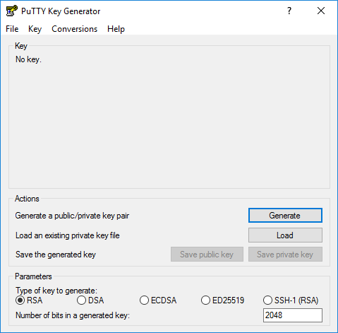
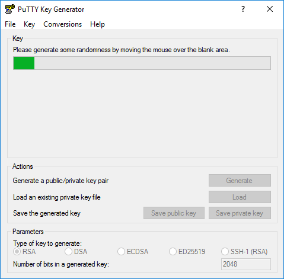
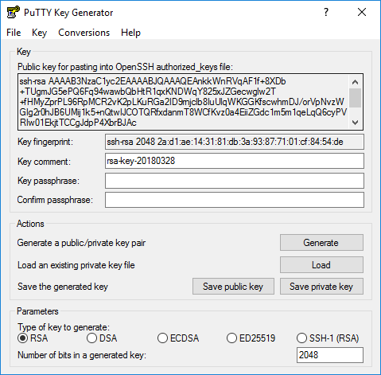
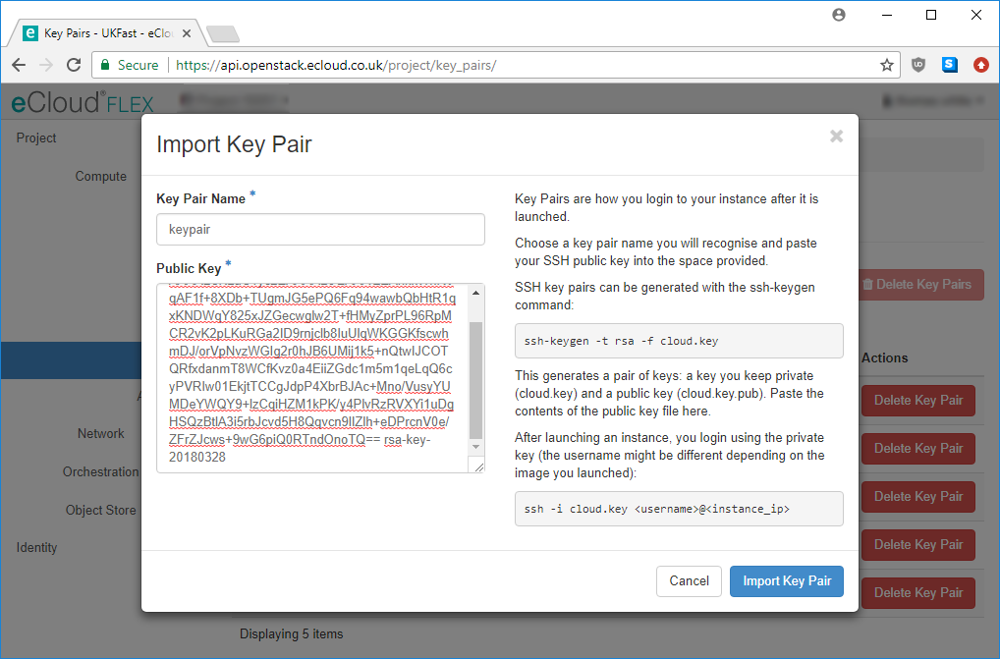
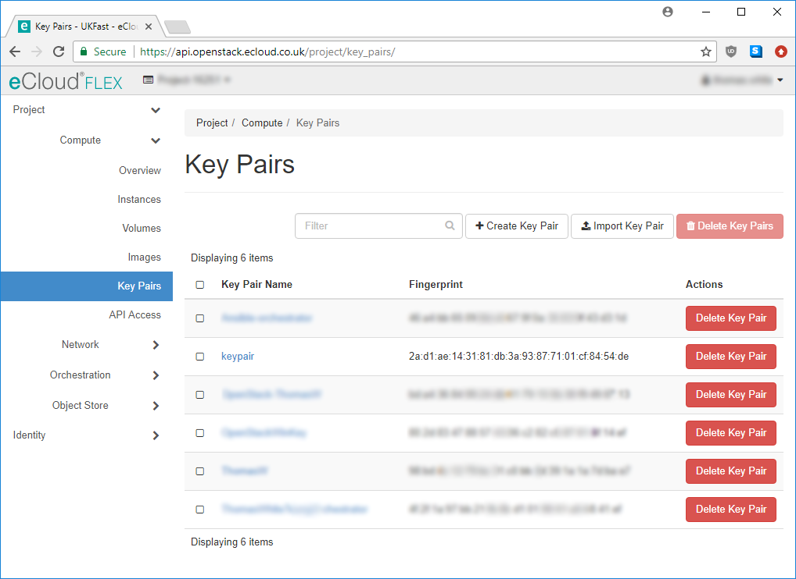
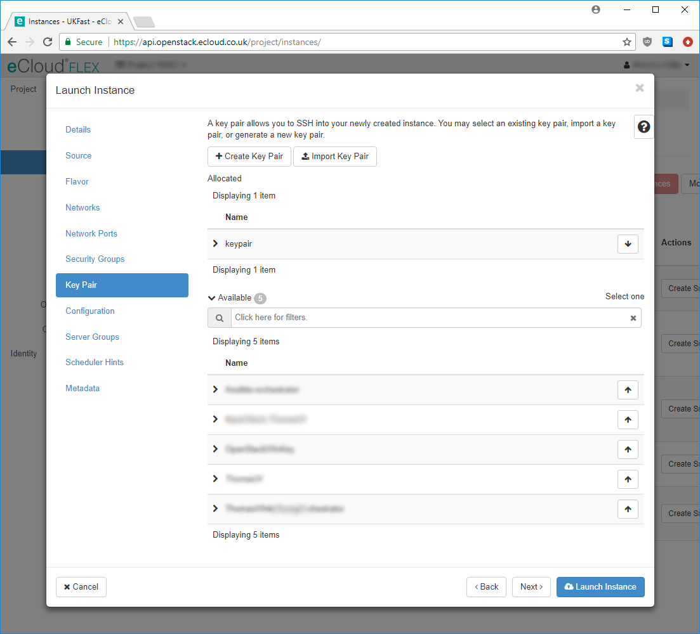

# Accessing eCloud Flex Linux Instances Using SSH

When creating Linux servers on the eCloud Flex platform, you will need to provide an SSH key in order to access the instance successfully. This page will take you through the steps to generate an SSH key pair in PuTTY, but you can also [generate an SSH key from the Linux command line](/operatingsystems/linux/ssh/keys.html#generating-keys), and then import this key into your eCloud Flex Dashboard.

For Windows instances, please follow the steps to [retrieve your password](/ecloud/flex/general/passwordretrieval) instead.

## PuTTY Key Creation

For the following steps you will require [PuTTY](https://www.chiark.greenend.org.uk/~sgtatham/putty/latest.html), which offers SSH capabilities from a Windows environment.

Firstly, generate an SSH key pair, which will consist of a private key, and a public key. As the names suggest, the public key is what will be shared with our platform. It is imperative to keep the private SSH key secure as this will be a unique identifier to permit access to your server. To generate this key, open `PuTTYGen (PuTTY Key Generator)` and click "Generate" as shown below.





Whilst creating your key, you should move your mouse around the PuTTYGen window to generate random data, which will ensure the key is cryptographically secure. As soon as this is completed, you will see options such as saving your public and private key. After typing your password for the key in the appropriate fields, save your private key to a secure place as this will be needed in the next section.



With the output in the "Key" section of the application, which will begin with `ssh-rsa` as shown, you will need to import this (the public key) in to the [eCloud Flex dashboard](https://api.openstack.ecloud.co.uk/project/key_pairs/).

## Add SSH Key Pairs in the eCloud Flex Dashboard

To import your new key pairs in to the [eCloud Flex dashboard](https://api.openstack.ecloud.co.uk/project/key_pairs/), navigate to the "Key Pairs" page and select the "Import Key Pair" button. In the pop-up window provided, enter a memorable name for your key (we recommend using your own name for environments with multiple users), and paste the public key (the "Key" noted in the previous section if using PuTTY) in to the "Public Key" box shown below.



If the key has been successfully imported, this will be visible in the Key Pairs area, as shown. If you encounter errors during the import process, please double check you have exported your key in the correct format.  If it still does not work [please raise a ticket with UKFast Support](https://portal.ans.co.uk/pss/create) (only available if you pay for eCloud Flex support).



With the key pair now successfully imported, you will be able to select this when launching future instances within eCloud Flex. During the launch process, click the "+" sign next to the appropriate key pair and you will be able to [connect with your new SSH key pair](/operatingsystems/linux/basics/connecting.html#connecting-using-private-key) as soon as the instance is available.



```eval_rst
   .. title:: Access eCloud Flex Instances Using SSH
   .. meta::
      :title: Access eCloud Flex Instances Using SSH | ANS Documentation
      :description: Detailed guidance on accessing Linux instances using SSH on eCloud Flex
      :keywords: ecloud, flex, instance, ssh, key pair, rsa, password, horizon, putty
```
