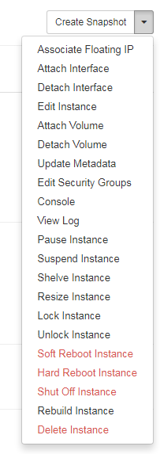
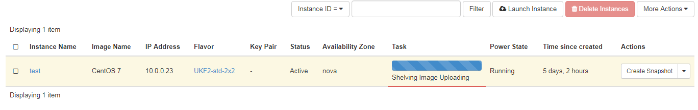

# When are eCloud Flex instances billable

As with any OpenStack-based cloud, eCloud Flex instances can be in a number of different statuses.  In order to manage your cloud spend effectively, it's important to understand which statuses are billable and which aren't - and also how to toggle between them effectively.

## Status of an eCloud Flex instance

The possible statuses of an eCloud Flex instance are listed below.  For a full explanation of each of these see [this article on the OpenStack developer site](https://developer.openstack.org/api-guide/compute/server_concepts.html)

* Active
* Build
* Deleted
* Error
* Hard Reboot
* Migrating
* Password
* Paused
* Reboot
* Rescue
* Resize
* Revert Resize
* Shelved
* Shutoff
* Soft Deleted
* Suspended
* Unknown
* Verify Resize

**eCloud Flex instances will always be billed unless they are Deleted or Shelved.**  Suspending, pausing or shutting off an instance will not stop it from consuming hardware resources on the eCloud Flex platform, and therefore you will get billed at the standard rate.

## Managing the status of your eCloud Flex instance

If you don't want to be billed for an instance, then make sure to either delete or shelve it - to do this go to the [Instances page in the eCloud Flex control panel](https://api.openstack.ecloud.co.uk/project/instances/), and click the Actions drop-down menu on the right-hand side of the table.  Choose either Delete Instance or Shelve Instance.



Once the action has completed, you can check the status of the instance in the table.



There are many potential reasons to pause, suspend or shut off an instance, as long as you understand you are still being billed for it.

**Deleted instances cannot be retrieved, so be sure you no longer want the instance before taking this action.**  You can always take a snapshot of an instance before deleting it, and launch a new instance from this later on.  Or alternatively, "Shelve" the instance.

## What does "Shelving" an instance mean

Shelving an instance essentially means taking a snapshot of the disk, which is stored for retrieval so you can easily un-shelve it at a later point.  Importantly, once an instance has been shelved it is no longer consuming compute resources, and so you will not get billed for the instance.  There may be additional charges for storage of the snapshot. See the eCloud Pricing page in ANS Portal for details.

* if the instance was originally booted from an image, storage of the snapshot will be billed at the same rate as Block Storage Snapshots
* if the instance was originally booted from a volume, there will be no additional charges given you are already paying for the Block Storage volume separately

To un-shelve an instance and start using it again, click the `Actions` drop-down menu and then `Unshelve Instance`.  After a few seconds the instance will be available for use (and become billable again).

```eval_rst
   .. title:: Statuses of eCloud Flex instances
   .. meta::
     :title: Statuses of eCloud Flex instances | UKFast Documentation
     :description: Guidance on which eCloud Flex instance statuses are billable
     :keywords: openstack, ecloud, flex, ukfast, hosting, billing
```
