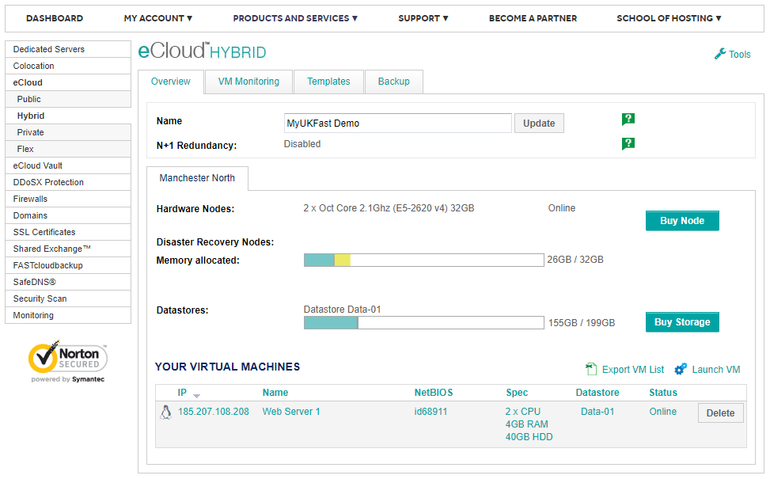
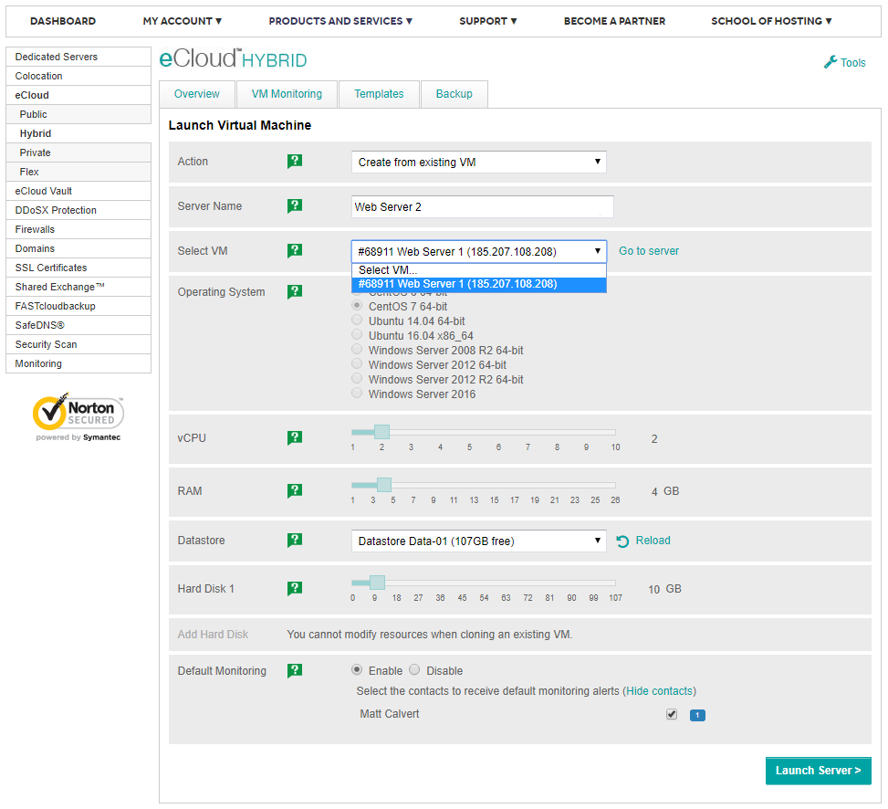
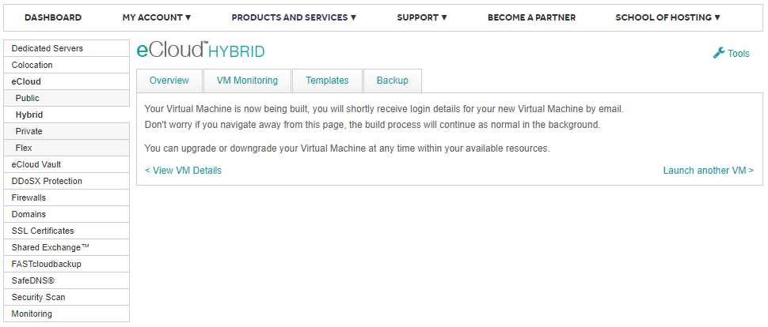
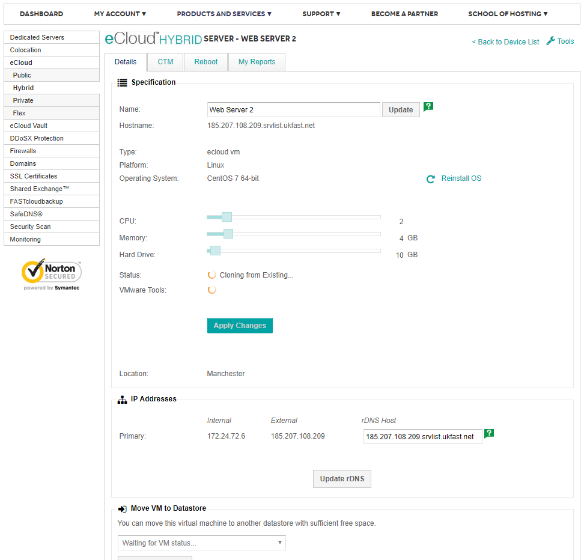
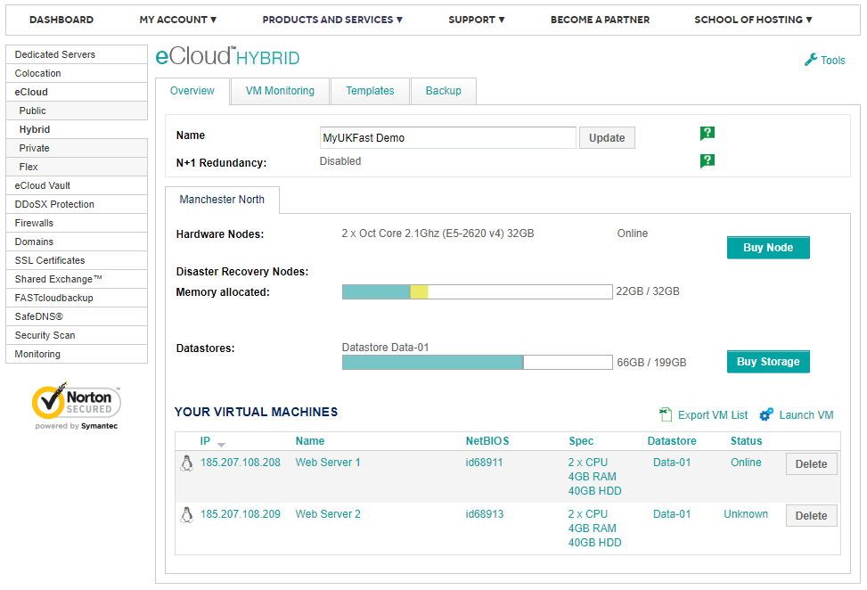
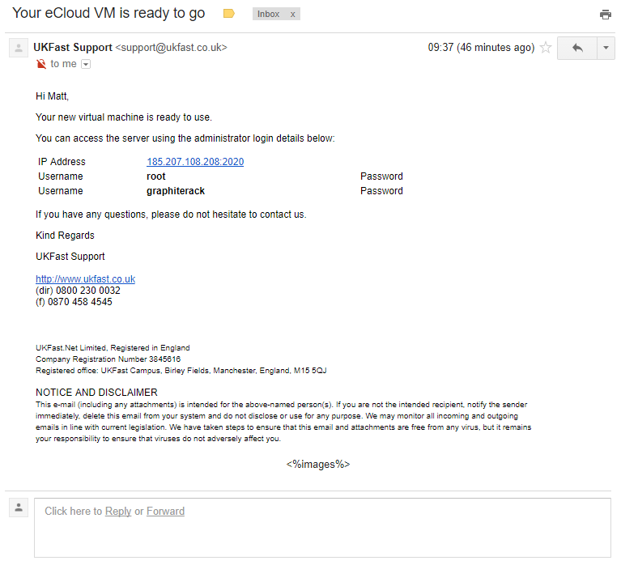
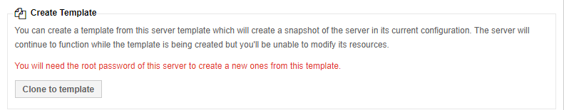
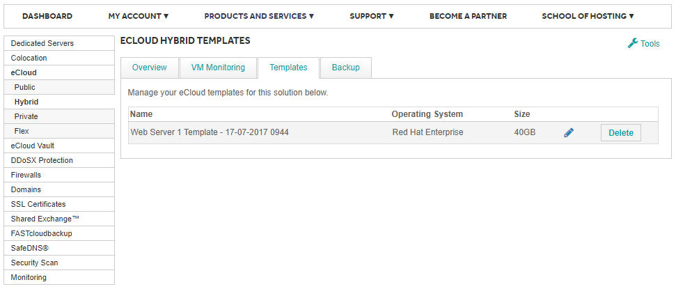
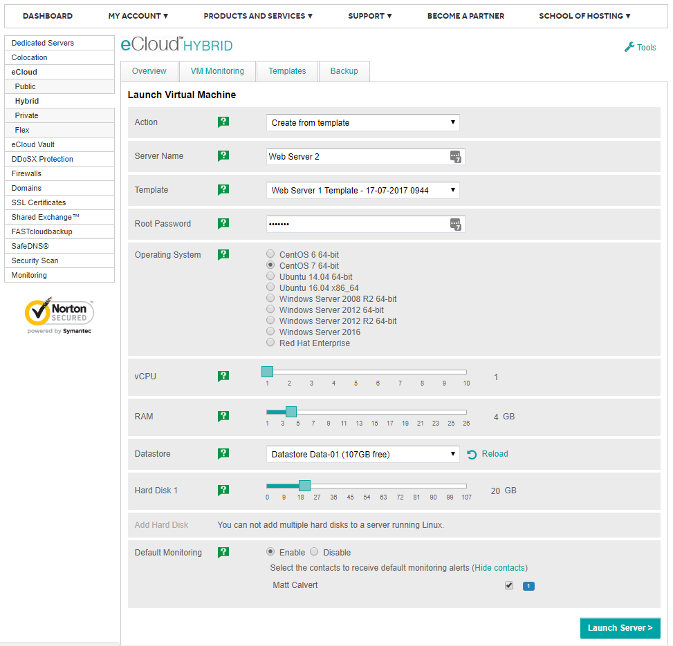

# Cloning and Templating VMs

```eval_rst

   .. title:: eCloud Private | Cloning and Templating VMs
   .. meta::
      :title: eCloud Private | Cloning and Templating VMs | UKFast Documentation
      :description: Information on how to clone and template VMs in your eCloud Private solution

```

This guide walks you through the process of cloning and templating VMs in the MyUKFast portal.

## Cloning VMs
First of all, log into your MyUKFast client area and choose the option **eCloud -> Hybrid** or **eCloud -> Private**, depending which one you have.
In my case it is **eCloud -> Hybrid**.

You should be presented with a screen similar to this:


In my client area here you can see that I currently have 1 virtual machine which I've named **Web Server 1**. It's currently **Online** and has the IP address **185.207.108.208**.

Now I want to clone that virtual machine and build a new **Web Server 2** from it. Here's how I do that.
1. Click on **Launch VM** on the front page, as shown in the screenshot above.
2. Under **Action** select **Create from existing VM**.
3. Give it a new name, **Web Server 2** in my case.
4. Under the **Select VM** dropdown list, select the VM you want to clone.
5. Select the **Datastore** to build the VM on. I left the default set.
6. Click on **Launch Server** to submit the request.
You can see mine listed here:


7. All being well you should receive a confirmation message on-screen like this:


8. If you click on the **View VM Details** link you will be taken back to the **VM Details** page as shown. The **Status** here reflects our request status, **Cloning from Existing...**


9. Back on the main page you should now see both of the VMs listed:


10. Then once the cloning operation has completed you will be sent a welcome email like this:


## Templating VMs
This is very similar to the Cloning operation except we must first create the template that we will create our virtual machines from.
Here's how:
1. Click on the VM you want to clone in the VM list
2. Scroll down the page a little and click on **Clone to template** as shown:

3. You should now see a banner at the top of the page saying **Cloning VM to template...**
4. If you now click on the **eCloud Hybrid** or **eCloud Private** link on the left and click on **Templates**, you should see the new template listed:

5. Now when you click on **Tools** and **Launch VM**, you should see the template listed as shown:

6. After a little while you should see the virtual machine be listed as Online.
_The login details will be same as the VM the template was created from._
