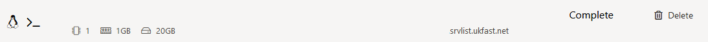
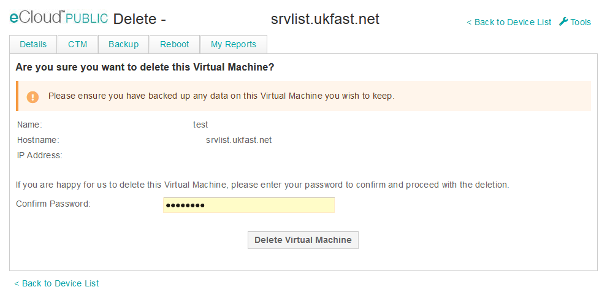

# Delete VM

If you need to delete the VM this can be actioned in [ANS Portal](https://portal.ans.co.uk/ecloud-public) using the delete option to the right of the VM entry as shown below.



From here you will be prompted for your ANS Portal password as below.



After which you will then be asked for some quick feedback about your experience using eCloud public.

```eval_rst
   .. title:: eCloud Public delete VM
   .. meta::
      :description: Programatic control of your eCloud Public resources
      :keywords: ukfast, cloud, ecloud, public, hosting, infrastructure, vmware, delete
```
