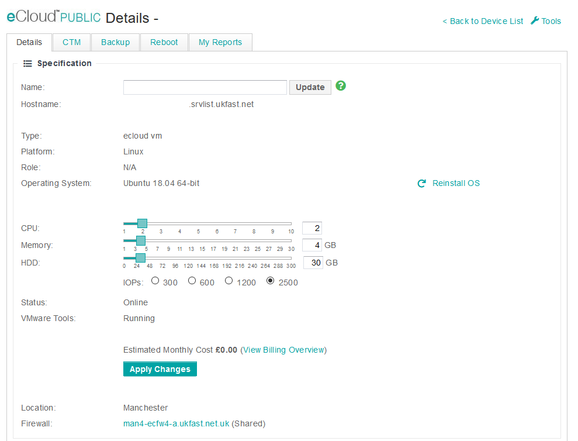

# Disk

If additional disk space is needed for the VM this can be added in [MyUKFast](https://my.ukfast.co.uk/ecloud-public) using the HDD slider.



Within this screen you can drag the memory slider to increase or decrease the disk size allocated to this VM specifically **_this cannot be decreased once added._** After this has been set you can then apply changes for this to take effect. The hyper-visor then goes away and extends the disk for the VM. Once added the disk within the OS will need to be extended please see the following links for further instruction on this:

[Windows](https://docs.ukfast.co.uk/operatingsystems/windows/windowsadministration/diskmanagement.html)

[Linux](https://docs.ukfast.co.uk/operatingsystems/linux/basics/lvm-extend.html)

**Please note that services within the OS such as MySQL may require a restart to recognise the new memory.** 

```eval_rst
   .. title:: eCloud Public edit disk 
   .. meta::
      :description: Programatic control of your eCloud Public resources
      :keywords: ukfast, cloud, ecloud, public, hosting, infrastructure, vmware, memory
```
