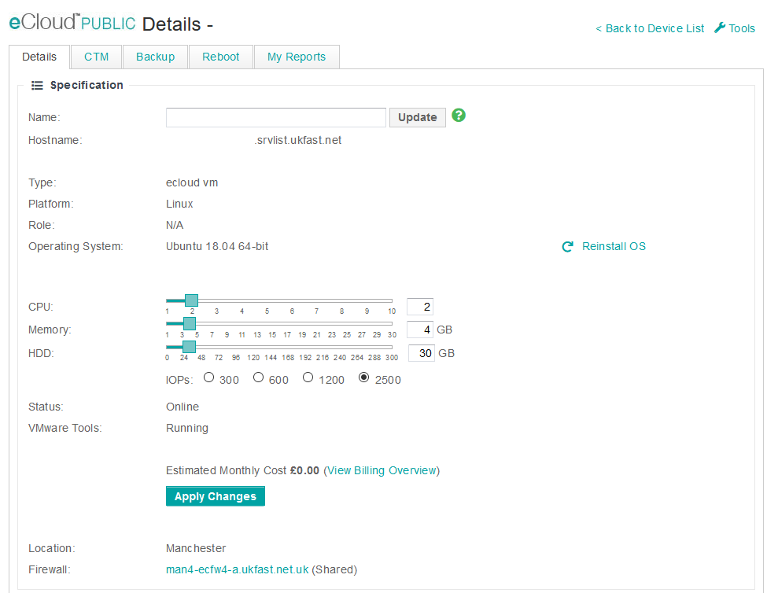
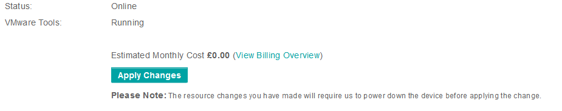

# Memory

If resource contention on memory is noticed and additional resource is required this can be easily scaled within [MyUKFast](https://my.ukfast.co.uk/ecloud-public) by selecting the VM in question which will open the below VM configuration page.



Within this screen you can drag the memory slider to increase or decrease the memory allocated to this VM specifically. After this has been set you can then apply changes for this to take effect. This can be done while the VM stays online as we allow memory hot-add on the platform. A reduction of memory allocation however will require a reboot this is clearly stated before actioned as shown below.



**Please note that services within the OS such as MySQL may require a restart to recognise the new memory.**

```eval_rst
   .. title:: eCloud Public edit memory
   .. meta::
      :description: Programatic control of your eCloud Public resources
      :keywords: ukfast, cloud, ecloud, public, hosting, infrastructure, vmware, memory
```
