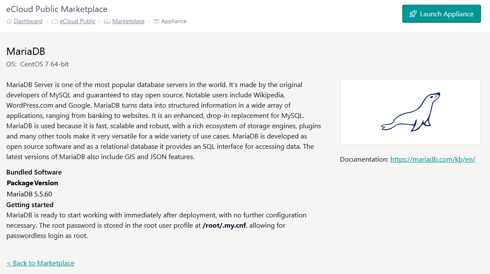
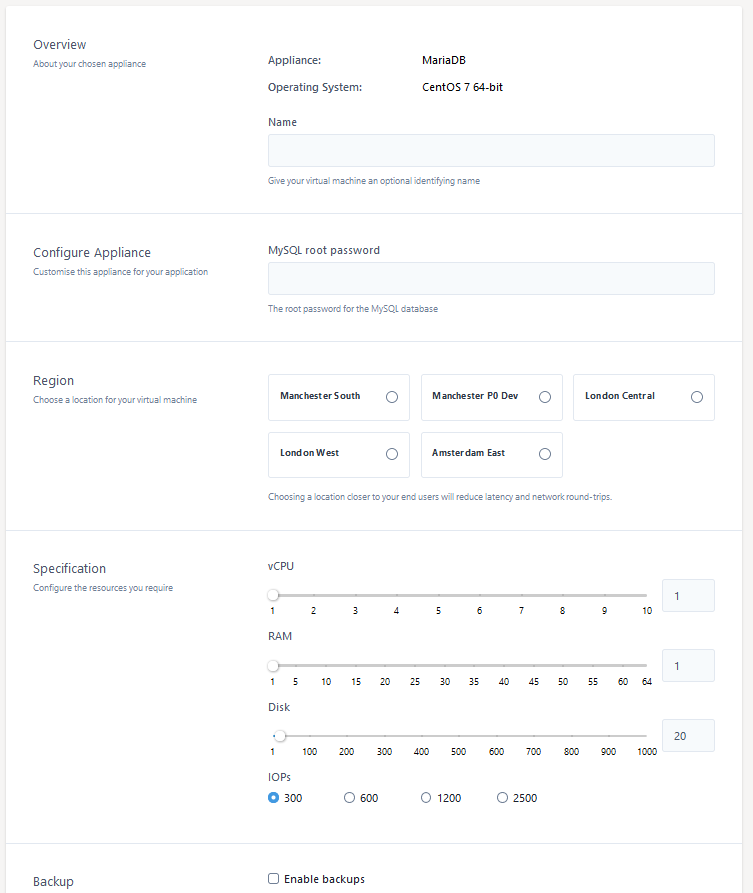
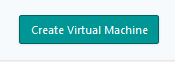

# eCloud Public VM Marketplace

Specific OS customisation is available via the [eCloud marketplace](https://my.ukfast.co.uk/ecloud-public/marketplace). From here you can chose a specific template and launch a VM pre-configured for this by selecting the template then launch appliance as shown below:



From here you will be taken to the below device configuration page where vCPU, RAM, Disk space and other attributes of the VM can be specified. You may also be asked for unqiue information to that template as in the below example a MySQL root password defined.



Once the specification is set you can then select to create appliance.



From here this will be visible in your eCloud public [VM list](https://my.ukfast.co.uk/ecloud-public), once the build is finished this will have the stack documented in the marketplace template installed.

```eval_rst
   .. title:: eCloud Public VM marketplace 
   .. meta::
      :description: Programatic control of your eCloud Public resources
      :keywords: ukfast, cloud, ecloud, public, hosting, infrastructure, vmware, marketplace
```
