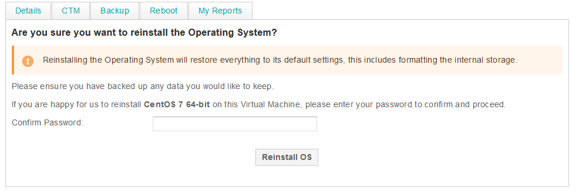

# eCloud Public Reinstall OS

You can reinstall the originally selected OS of the virtual machine at any point by selecting the VM from the [MyUKFast VM list](https://my.ukfast.co.uk/ecloud-public) then the reinstall OS button shown below:


From here you will be prompted for your MyUKFast password as below:



This will then re-run our automation to present a fresh install of the operating system.

```eval_rst
.. meta::
   :title: eCloud Public APIs | UKFast Documentation
   :description: Programatic control of your eCloud Public resources
   :keywords: ukfast, cloud, ecloud, public, hosting, infrastructure, vmware, reinstall, OS
