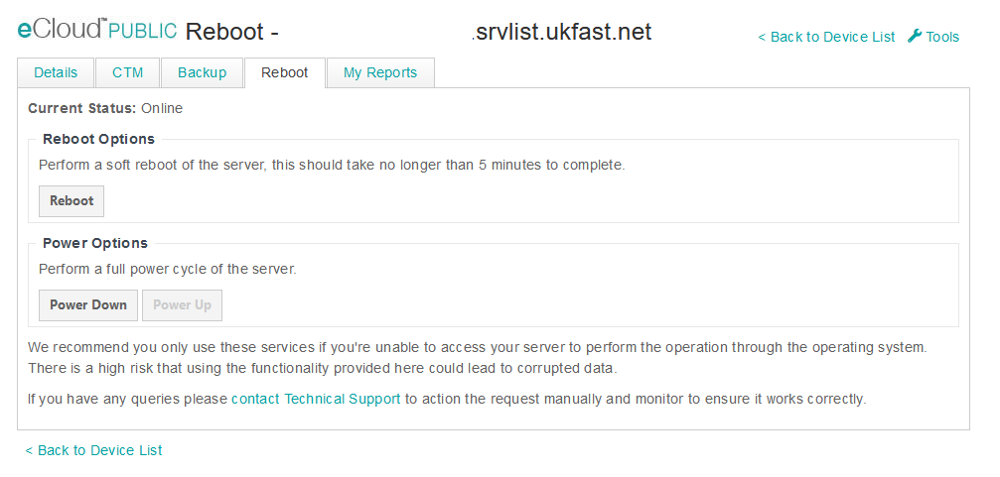

# VM Power Cycle

In the event that you need to reboot or power on or off a VM this can be actioned through [ANS Portal](https://portal.ans.co.uk/ecloud-public), by selecting the VM and navigating to the reboot tab along the top. This will display the following.



From here you have options to perform a soft reboot of the VM along with a full power cycle be powering down then powering up the VM. During the boot process a console session can be gained while waiting for the SSH or RDP services to start. This can be found on the [VM list page](https://portal.ans.co.uk/ecloud-public) as the console button below:


```eval_rst
   .. title:: eCloud Public VM power cycle
   .. meta::
      :description: Programatic control of your eCloud Public resources
      :keywords: ukfast, cloud, ecloud, public, hosting, infrastructure, vmware, powercycle, reboot
```
